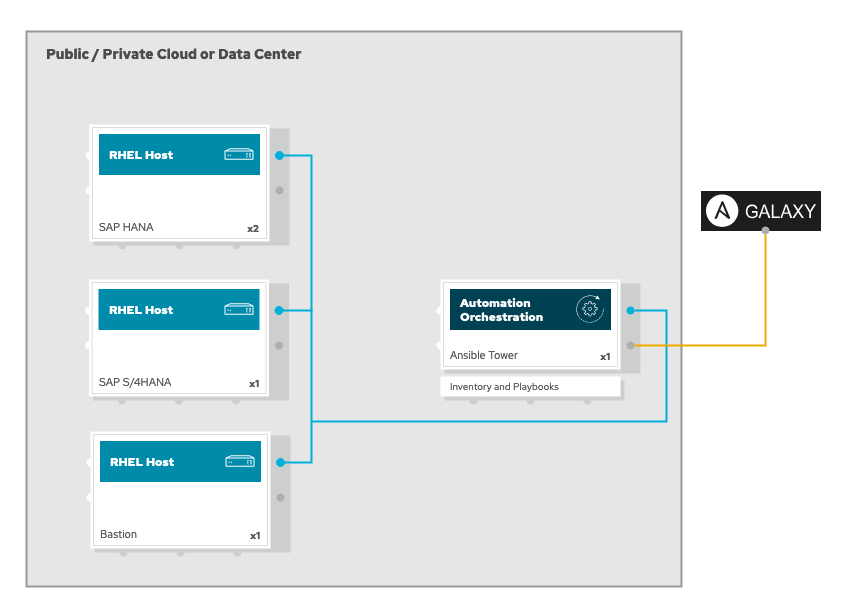
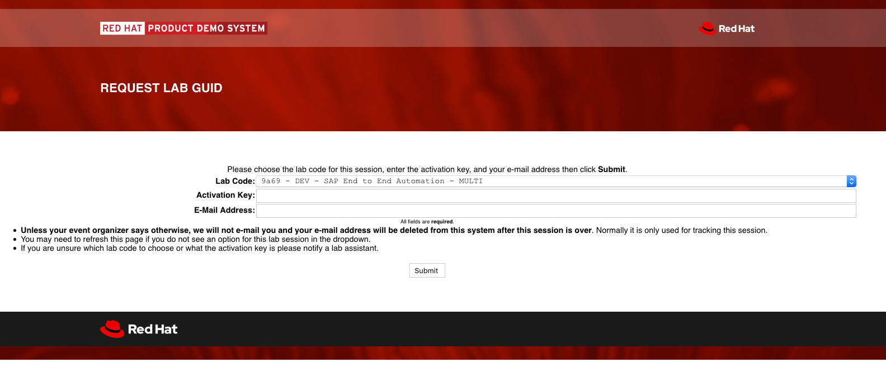
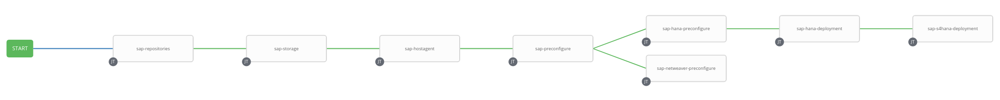
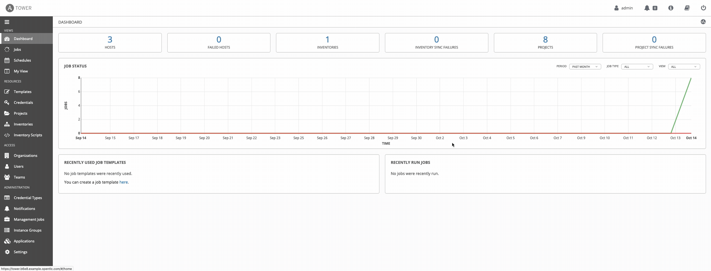
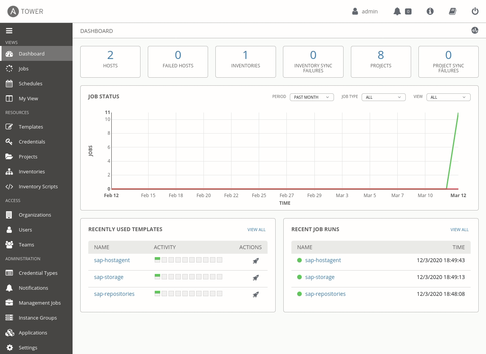
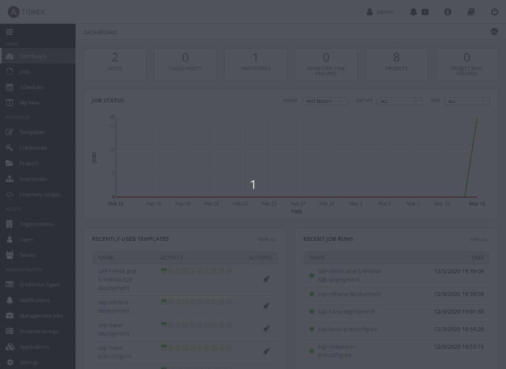
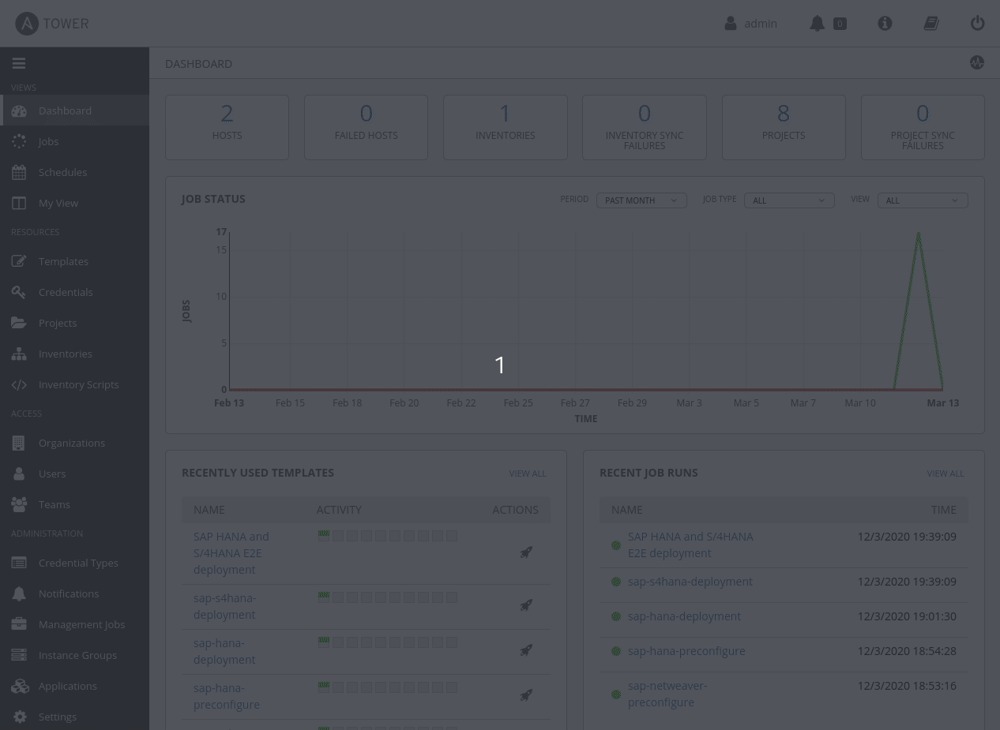
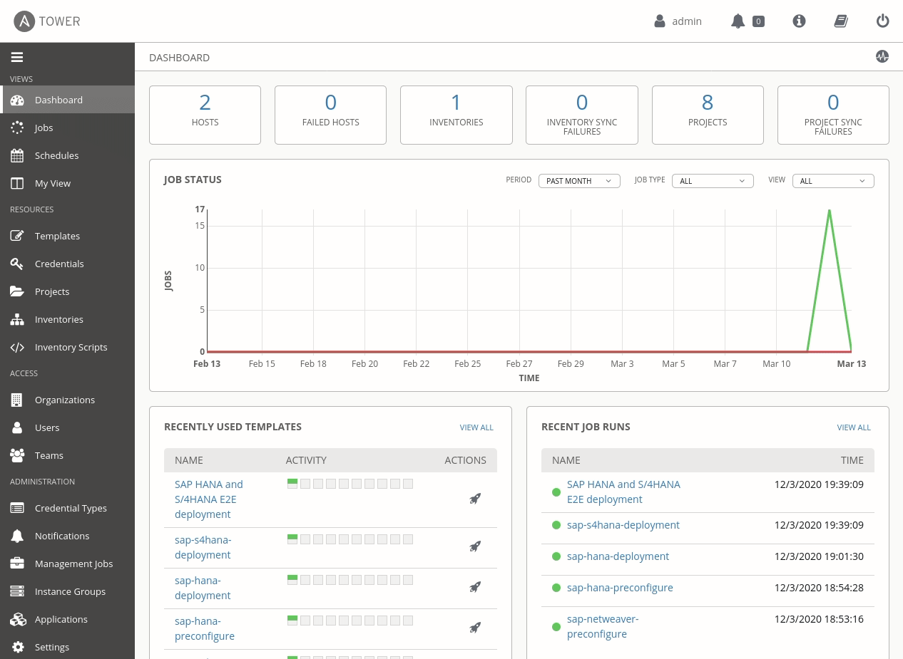
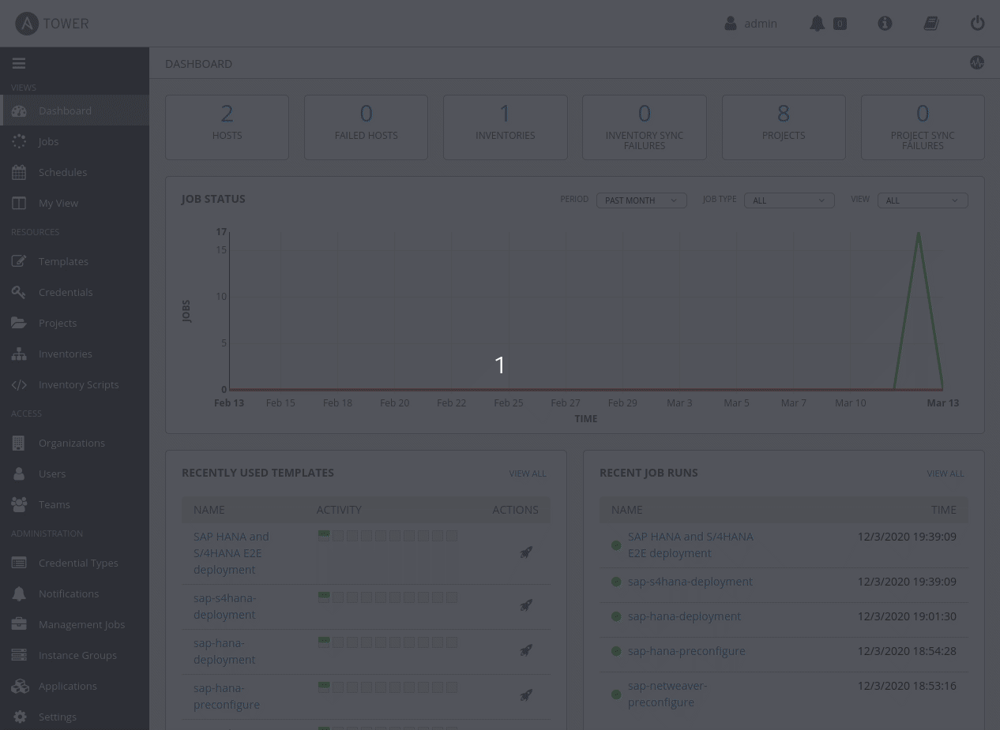

# SAP E2E Automation
> Automating SAP HANA and SAP S/4HANA end to end using Ansible and Ansible Tower

## Intro

Welcome to AnsibleFest (virtual experience) 2020!!! During this lab you are going to learn how to use Ansible and Ansible Tower to end to end automate SAP's Digital Core (SAP HANA and SAP S/4HANA) deployments.

## High-level architecture and components

The high-level architecture consists of 4 different RHEL 8.x servers with the following purposes:

- bastion: this is meant to be used as the jump host for SSH access to the environment
- tower: this is meant to be used as the Ansible and Ansible Tower host where to run the automation from
- hana1: this is meant to be used as the RHEL server where to deploy SAP HANA
- hana2: this is meant to be used as the RHEL server where to deploy SAP HANA
- s4hana: this is meant to be used as the RHEL server where to deploy SAP S/4HANA



## Environment request

This environment is provisioned using the Red Hat internal demo system. We at Red Hat embrace the use of [IaC](https://openpracticelibrary.com/practice/everything-as-code/) (Infrastructure as Code) for any lab/demo set up, that's why we have open-sourced the Framework (based in Ansible) we use for this. If you want to get more information on this topic, check the [AgnosticD](https://github.com/redhat-cop/agnosticd) repository we use to deploy these labs and demos.

To get access to your environment, please click on [this link](https://www.opentlc.com/gg/gg.cgi?profile=generic_mentenza) and add the following information to the form:

[](https://redhat-sap.github.io/sap-workshops//AnsibleFest2020/img/guidgrabber.png)

- **Lab Code:** Use the already selected one
- **Activation Key:** This will be provided by the lab instructor(s) during the session
- **E-Mail Address:** Use the email address you used to register to the event

Use the `Submit` button to send the information and you will be redirected to a page with all the required information for your lab, including:

- SSH information to access the bastion host including:
  - SSH user information
  - Bastion public hostnane information
  - SSH private key to be used
- Ansible Tower information including:
  - Ansible Tower public URL
  - Ansible Tower user
  - Ansible Tower Password

## Running the lab

The goal for this lab is to showcase how we can make SAP Solutions deployments easy and reliable using Ansible automation. To be able to demonstrate this, a Tower Workflow has been configured that will do the following:

1. Enable all the required repositories to be able to deploy SAP software in RHEL
2. Configure all the File Systems and mount points required while installing SAP HANA and SAP S/4HANA
3. Install SAP Host Agent
4. Run all the OS pre-requisites from SAP Notes for RHEL systems while deploying SAP workloads
5. Run all the OS pre-requisites from SAP Notes for RHEL systems while deploying SAP HANA
6. Run all the OS pre-requisites from SAP Notes for RHEL systems while deploying SAP Netweaver software
7. Deploy SAP HANA
8. Deploy S/4HANA by SAP

Just by 'clicking a button' all these steps will be done automatically by Ansible Tower using a Tower Workflow. The final result will be an SAP landscape in RHEL with SAP HANA and SAP S/4HANA installed, configured and running.



### Modify existing workflow and run it

The whole E2E process (running all the stages configured in the Tower Workflow) could take around an hour, depending how busy is the underlaying infrastructure today :-) During that time, you are not going to learn only how to use Tower to put all this automation together but also the existing Ansible roles maintained by Red Hat Engineering teams and our SAP community. 

As an extra (optional) task for this lab, we are going to ask you to extend the existing configuration in Ansible Tower with an additional "task" to enable HANA System Replication automatically in your landscape.

The first thing you need to do now is login into the Ansible Tower web interface and modify the Workflow Template `SAP HANA and S/4HANA E2E deployment` that is already available. The reason to modify this Workflow Template is simple; to reduce the time required to complete it and to reduce the time required to execute the extra (optional) task we are asking you at the end of this lab.

To do this, on Tower's left pane click on `Templates` to see existing Job Templates and Workflow Teplates. Now click on the one called `SAP HANA and S/4HANA E2E deployment` that will show you the details for this Workflow Template. We want to remove the last stage of the Workflow, so click on the `WORKFLOW VISUALIZER` button that will take you to the configuration of the existing stages or nodes of the Workflow. Click on the last node called `sap-s4hana-depployment` and use the icon with the X symbol to remove it. Ensure you click on the `SAVE` button once removed.

[](https://redhat-sap.github.io/sap-workshops//AnsibleFest2020/img/workflow_modify.gif)

Go back to `Templates` and now use the "rocket" icon (first icon starting from the left) from the `SAP HANA and S/4HANA E2E deployment` Workflow Template. This will run the Workflow Template, executing every single stage of the pipeline as configured in the Workflow. Once launched you can see the actual state of the task and inspect every stage to check the progress.

[](https://redhat-sap.github.io/sap-workshops//AnsibleFest2020/img/tower-workflow.gif)


Once you show how the process is run with just 'one-click' you can briefly explain all the required set up to be done in Ansible Tower. As explained before, Ansible Tower will run a collection of different playbooks in the HANA and S/4HANA RHEL hosts to prepare, deploy and configure the software. These are covered by point 1 to 8 as previously mentioned. Ansible Tower needs to be configured the same way we configure a typical Ansible Host that is going to manage remote hosts. Ansible Tower allows the user to add this information from a Web Interface, which is very useful for people with no previous experience with Ansible or people who don't feel comfortable using a terminal. Ansible Tower also provides a very powerful REST API that can be used to configure and performs multiple actions in Ansible Tower remotely from external systems or applications.

For the quick demo, you can navigate through all the required configurations to be done to be able to set up and run the Tower Workflow from the demo.

#### Credentials

In order Tower to run Ansible Playbooks in remote hosts, the credentials required to access these hosts via SSH must be configured. On the left pane click on `Credentials`. This will show you all the actual credentials configured in Ansible Tower. One credential called `ssh-key` is already configured. This is a `Machine Type` credential that will contain the user information and SSH private key to be able to connect to the remote hosts via SSH.



#### Inventories

Ansible inventories are one of the key components required while automating IT. The inventory will contain the logical information of the hosts and all the required variables we need to use with the multiple Ansible Roles and Playbooks. On the left pane click on `Inventories`. This will show you all the actual inventories configured in Ansible Tower. An inventory called `sap-hosts` is already configured. This is the inventory we are using with all the Roles and Playbooks used by the Tower Job Templates.

To see more information about the inventory, click on the `sap-hosts` inventory and this will open another view where to see detailed information about the hosts, groups and variables configured. All the variables required have been configured already and these have been applied on the corresponding levels. Variables that are common to all the inventory hosts can be seen on the first screen when you click on the `sap-host` inventory. Once you are in the screen where this mentioned common variables appear (`sap_domain`, `sap_hostagent_installation_type`, etc...) you can click on the `HOSTS` button all the hosts configured under the inventory appear on the screen, `hana` and `s4hana` in this case.



You can now check the specific variables applied to the host clicking on each one and scrolling or expanding the variables field.


#### Projects

Ansible Tower projects a logical collection of Ansible playbooks. Using Tower projects you can manage playbooks and playbook directories by either placing them manually under the Project Base Path on your Tower server or by placing your playbooks into a source code management (SCM) system supported by Tower. The last is the approach used here, where projects will pull the information from GitHub.

All the projects are pointing to the same [GitHub Repository](https://github.com/redhat-sap/sap-tower-projects). This is a multi-branch repository where each branch is keeping different playbooks using different Ansible Roles.

When configuring SCM based Tower projects, this information (git URL and branch) we have provided is used to pull the information from each branch.

On the left pane click on `Projects`. This will show you all the Tower projects configured. There is an equivalency between the number of projects configured and the Ansible Roles used. Each project will provide a Playbook from the mentioned GitHub repository, and this Playbook will use a Role to run each step of the Tower Workflow.


#### Job Templates

Tower job templates are definitions and set of parameters for running Ansible jobs. In other words, it will use Playbooks from Tower projects explained in the previous step with hosts from selected inventories.

On the left pane click on `Templates`. This will show you all the Tower job templates configured. As previously explained, there was an equivalency between the number of projects and Ansible Roles used here. If you click on any of the configured job templates, you can see that every job template is using the Playbook `play.yml` from a different project, which points to a different branch on the GitHub repository previously explained. That playbook will use a specific Ansible Role (Red Hat Supported System Roles and Community Roles from Red Hat's SAP CoP) to perform the required actions to get the hosts from the inventory to the desired state.


As an example, let's review the whole flow:

- `sap-hostagent` job template is using `play.yml` Playbook from `sap-hostagent` project which includes the `redhat_sap.sap_hostagent` Role as part of the Playbook
- `sap-hostagent` project is using `https://github.com/redhat-sap/sap-tower-projects.git` repository specifically on the `sap-hostagent` branch
- `sap-hostagent` branch from that repository contains the playbook `play.yml` previously mentioned and a `roles` directory containing a `requirements.yml` file
- `requirements.yml` file contains the reference to `redhat_sap.sap_hostagent` Ansible Galaxy Role
- Ansible Tower will automatically pull that Role dring the job template execution, so this can be used by the `play.yml` Playbook

#### Workflow Templates

Tower Workflow job templates link together a sequence of disparate resources that accomplishes the task of tracking the full set of jobs that were part of the release process as a single unit. It allows you to create pipeline-like strategies to automate your IT landscape.

Same as Tower job templates, you can access workflow templates by clicking `Templates` on the left pane link. It is easy to differentiate a `Tower Job Template` from a `Tower Workflow Template`. On a first view, you can already see the tag that Tower adds close to the template name, and these can be `Job Template` and `Workflow Template`. Also, you will see an extra icon for the workflow templates, like a hierarchy chart. This icon represents the visualizer link for the workflow.



As you can see from the animated image, once you click on the workflow visualizer you will get an overview of the existing workflow steps representing all the stages in our automation pipeline. This workflow visualizer can be used as well t modify the existing flow, adding and removing steps or change the logical order and actions happening before and after every step.

#### Showing results

As the final step for this quick demo, we will show the results from the workflow execution we did when we started the demo. Remember that the workflow has been executed in the background while we were showing all the components and by this time it should be completed.

The first thing to show is the workflow results itself. To do that, on the left pane click on `Jobs`, this will show all the Tower jobs that have been executed or are still running. Find the last `Workflow Job` that has been executed, it is called `SAP HANA and S/4HANA E2E deployment` preceded by a number that is used to identify the job id. If you click on this job, it will take you to the job details information, where you can see the status, when it did start and when it did finish. The whole pipeline to prepare the hosts, deploy and configure HANA and S/4HANA should take 30-40 minutes. If you check the right pane from that window you will see the workflow visualizer with all the nodes (steps in the pipeline) in green, representing that correct execution of the whole workflow.



Now we can login into the `hana` and `s4hana` hosts to validate this is true. 
Using the logon instructions email you received, login into the `bastion` host as `cloud-user` or `ec2-user` (check instructions from your email as will differ depending the target infrastructure where the lab has been deployed):

```bash
# Example for AWS environments where user is `ec2-user`
$ ssh -i /path-to-your-ssh-key ec2-user@bastion-<GUID>.<DOMAIN>
[ec2-user@bastion ~]$
```

```bash
# Example for OSP environments where user is `cloud-user`
$ ssh -i /path-to-your-ssh-key cloud-user@bastion-<GUID>.<DOMAIN>
[cloud-user@bastion-<GUID> ~]$
```

Once you have logged into the `bastion` host, ssh to the `hana` hosts:

```bash
# Example for AWS environments where user is `ec2-user`
[ec2-user@bastion ~]$ ssh hana1
[ec2-user@hana1 ~]$ sudo -i
[root@hana1 ~]$ su - rheadm
```

```bash
# Example for OSP environments where user is `cloud-user`
[cloud-user@bastion-<GUID> ~]$ ssh hana-<GUID>
[cloud-user@hana-<GUID> ~]$ sudo -i
[root@hana-<GUID> ~]$ su - rheadm
```

And execute the following as `rheadm` user to check all the SAP HANA processes are running in the system:

```bash
hana:rheadm> HDB info
USER          PID     PPID  %CPU        VSZ        RSS COMMAND
rheadm     140412   140411   0.0     234172       5104 -sh
rheadm     141604   140412   0.0     222712       3332  \_ /bin/sh /usr/sap/RHE/HDB00/HDB info
rheadm     141635   141604   0.0     266920       3932      \_ ps fx -U rheadm -o user:8,pid:8,ppid:8,pcpu:5,vsz:10,rss:10,args
rheadm      34937        1   0.0    4015240      47984 hdbrsutil  --start --port 30003 --volume 3 --volumesuffix mnt00001/hdb00003.00003 --identifier 15840414
rheadm      28661        1   0.0     672908      15932 hdbrsutil  --start --port 30001 --volume 1 --volumesuffix mnt00001/hdb00001 --identifier 1584039495
rheadm      28507        1   0.0      24964       1336 sapstart pf=/hana/shared/RHE/profile/RHE_HDB00_hana
rheadm      28515    28507   0.0     425712      33416  \_ /usr/sap/RHE/HDB00/hana/trace/hdb.sapRHE_HDB00 -d -nw -f /usr/sap/RHE/HDB00/hana/daemon.ini pf=/usr
rheadm      28533    28515   6.8    6692276    3433656      \_ hdbnameserver
rheadm      28869    28515   0.3     674884      93748      \_ hdbcompileserver
rheadm      28872    28515   4.5     724868     151048      \_ hdbpreprocessor
rheadm      29276    28515   0.3    1921836     201392      \_ hdbwebdispatcher
rheadm      33961    28515  51.6   49781808   46822336      \_ hdbindexserver -port 30003
rheadm      34037    28515   0.8    3203024    1155388      \_ hdbxsengine -port 30007
rheadm      34040    28515   0.8    4671316    2417044      \_ hdbdocstore -port 30040
rheadm      34043    28515   0.8    3107012    1157632      \_ hdbdpserver -port 30011
rheadm      35423    28515   0.3    1692816     328896      \_ hdbdiserver -port 30025
rheadm      28433        1   0.0     520996      23900 /usr/sap/RHE/HDB00/exe/sapstartsrv pf=/hana/shared/RHE/profile/RHE_HDB00_hana -D -u rheadm
```

Once we have validated SAP HANA is installed and running, login into the `s4hana` hosts:

```bash
# Example for AWS environments where user is `ec2-user`
[ec2-user@bastion ~]$ ssh s4hana
```

```bash
# Example for OSP environments where user is `cloud-user`
[cloud-user@bastion-<GUID> ~]$ ssh s4hana-<GUID>
```

And execute the following to check all SAP S/4HANA processes are running in the system:

```bash
$ ps auxwwf | grep rheadm | grep -v grep
rheadm   32386  0.0  0.2 893884 91780 ?        Ssl  Mar12   0:09 /usr/sap/RHE/ASCS01/exe/sapstartsrv pf=/usr/sap/RHE/SYS/profile/RHE_ASCS01_s4hana -D -u rheadm
rheadm     496  0.0  0.0  62624  3964 ?        Ss   Mar12   0:00 sapstart pf=/usr/sap/RHE/SYS/profile/RHE_ASCS01_s4hana
rheadm     509  0.0  0.0 100016 22248 ?        Ssl  Mar12   0:00  \_ ms.sapRHE_ASCS01 pf=/usr/sap/RHE/SYS/profile/RHE_ASCS01_s4hana
rheadm     510  0.0  2.2 2266592 749396 ?      Ssl  Mar12   0:09  \_ enq.sapRHE_ASCS01 pf=/usr/sap/RHE/SYS/profile/RHE_ASCS01_s4hana
rheadm    2143  0.0  0.1 903668 47508 ?        Ssl  Mar12   0:05 /usr/sap/RHE/D00/exe/sapstartsrv pf=/usr/sap/RHE/SYS/profile/RHE_D00_s4hana -D -u rheadm
rheadm    6637  0.0  0.0  62768  4208 ?        Ss   Mar12   0:00 sapstart pf=/usr/sap/RHE/SYS/profile/RHE_D00_s4hana
rheadm    6652  0.0  0.5 32335464 178100 ?     Ssl  Mar12   0:10  \_ dw.sapRHE_D00 pf=/usr/sap/RHE/SYS/profile/RHE_D00_s4hana
rheadm    6657  0.0  0.1 663840 34116 ?        S    Mar12   0:02  |   \_ gwrd -dp pf=/usr/sap/RHE/SYS/profile/RHE_D00_s4hana
rheadm    6658  0.0  0.4 1833160 146000 ?      Sl   Mar12   0:02  |   \_ icman -attach pf=/usr/sap/RHE/SYS/profile/RHE_D00_s4hana
rheadm    6659  0.0  4.9 32392208 1623068 ?    S    Mar12   0:22  |   \_ dw.sapRHE_D00 pf=/usr/sap/RHE/SYS/profile/RHE_D00_s4hana
rheadm    6660  0.0  1.6 32384420 551340 ?     S    Mar12   0:07  |   \_ dw.sapRHE_D00 pf=/usr/sap/RHE/SYS/profile/RHE_D00_s4hana
rheadm    6661  0.0  2.5 32401640 830196 ?     S    Mar12   0:27  |   \_ dw.sapRHE_D00 pf=/usr/sap/RHE/SYS/profile/RHE_D00_s4hana
rheadm    6662  0.0  2.2 32385604 746780 ?     S    Mar12   0:26  |   \_ dw.sapRHE_D00 pf=/usr/sap/RHE/SYS/profile/RHE_D00_s4hana
rheadm    6663  0.0  1.8 32385988 605064 ?     S    Mar12   0:13  |   \_ dw.sapRHE_D00 pf=/usr/sap/RHE/SYS/profile/RHE_D00_s4hana
rheadm    6664  0.0  1.8 32383096 619660 ?     S    Mar12   0:11  |   \_ dw.sapRHE_D00 pf=/usr/sap/RHE/SYS/profile/RHE_D00_s4hana
rheadm    6665  0.0  2.0 32383956 663848 ?     S    Mar12   0:13  |   \_ dw.sapRHE_D00 pf=/usr/sap/RHE/SYS/profile/RHE_D00_s4hana
rheadm    6666  0.0  1.8 32379024 593920 ?     S    Mar12   0:13  |   \_ dw.sapRHE_D00 pf=/usr/sap/RHE/SYS/profile/RHE_D00_s4hana
rheadm    6667  0.0  1.8 32385948 592028 ?     S    Mar12   0:18  |   \_ dw.sapRHE_D00 pf=/usr/sap/RHE/SYS/profile/RHE_D00_s4hana
rheadm    6668  0.0  2.0 32387128 674740 ?     S    Mar12   0:17  |   \_ dw.sapRHE_D00 pf=/usr/sap/RHE/SYS/profile/RHE_D00_s4hana
rheadm    6669  0.0  0.3 32354428 103696 ?     S    Mar12   0:02  |   \_ dw.sapRHE_D00 pf=/usr/sap/RHE/SYS/profile/RHE_D00_s4hana
rheadm    6670  0.0  1.3 32524396 435252 ?     S    Mar12   0:20  |   \_ dw.sapRHE_D00 pf=/usr/sap/RHE/SYS/profile/RHE_D00_s4hana
rheadm    6671  0.0  2.1 32501108 697152 ?     S    Mar12   0:20  |   \_ dw.sapRHE_D00 pf=/usr/sap/RHE/SYS/profile/RHE_D00_s4hana
rheadm    6672  0.0  1.1 32467288 376772 ?     S    Mar12   0:19  |   \_ dw.sapRHE_D00 pf=/usr/sap/RHE/SYS/profile/RHE_D00_s4hana
rheadm    6673  0.0  1.8 32444420 621832 ?     S    Mar12   0:12  |   \_ dw.sapRHE_D00 pf=/usr/sap/RHE/SYS/profile/RHE_D00_s4hana
rheadm    6674  0.0  1.5 32527136 504376 ?     S    Mar12   0:30  |   \_ dw.sapRHE_D00 pf=/usr/sap/RHE/SYS/profile/RHE_D00_s4hana
rheadm    6675  0.0  1.2 32532704 413528 ?     S    Mar12   0:20  |   \_ dw.sapRHE_D00 pf=/usr/sap/RHE/SYS/profile/RHE_D00_s4hana
rheadm    6676  0.0  0.3 32357480 125284 ?     S    Mar12   0:04  |   \_ dw.sapRHE_D00 pf=/usr/sap/RHE/SYS/profile/RHE_D00_s4hana
rheadm    6677  0.0  0.3 32354428 104068 ?     S    Mar12   0:02  |   \_ dw.sapRHE_D00 pf=/usr/sap/RHE/SYS/profile/RHE_D00_s4hana
rheadm    6653  0.0  0.0  63720  9416 ?        Ss   Mar12   0:00  \_ ig.sapRHE_D00 -mode=profile pf=/usr/sap/RHE/SYS/profile/RHE_D00_s4hana
rheadm    6654  0.0  0.0 1288252 28256 ?       Sl   Mar12   0:10      \_ /usr/sap/RHE/D00/exe/igsmux_mt -mode=profile -restartcount=0 -wdpid=6653 pf=/usr/sap/RHE/SYS/profile/RHE_D00_s4hana
rheadm    6655  0.0  0.2 1150676 80808 ?       Sl   Mar12   0:06      \_ /usr/sap/RHE/D00/exe/igspw_mt -mode=profile -no=0 -restartcount=0 -wdpid=6653 pf=/usr/sap/RHE/SYS/profile/RHE_D00_s4hana
rheadm    6656  0.0  0.2 1150680 81356 ?       Sl   Mar12   0:06      \_ /usr/sap/RHE/D00/exe/igspw_mt -mode=profile -no=1 -restartcount=0 -wdpid=6653 pf=/usr/sap/RHE/SYS/profile/RHE_D00_s4hana
```

We should see all the `sapstart` processes running along `dw` processes that will handle user requests.

We have demonstrated that we can use Ansible to automate SAP HANA and SAP S/4HANA deployments end to end **with just one click!!**

### Running as a Workshop

When running as a workshop, the steps are very similar to the quick demo steps, but since this will be a workshop format, we should spend more time on each step explaining in detail how it works and going deeper into the technical components that are required to achieve the end to end automation for SAP HANA and S/4HANA.

Depending on the workshop length you may want to start launching the Workflow Template `SAP HANA and S/4HANA E2E deployment` as explained in the quick demo instructions. This will run the end to end process to automate SAP HANA and SAP S/4HANA deployment on the target hosts. You can review the workflow progress at any time clicking on the `Job` link from the left pane and checking the last job called `SAP HANA and S/4HANA E2E deployment` as explained in the quick demo steps.

The flow for the workshop will be very similar to the quick demo. Please review the quick demo guide as we are going to focus here only in the differences, which is giving a bit more context of the process itself, external resources (Ansible Roles) used to achieve the end to end automation and building the end to end Tower workflow from scratch.

#### Ansible Roles

As you could imagine at this point, all the automation used for this process is built using Ansible. We are going to use 2 different types of Ansible Roles here, Red Hat supported Ansible Roles and Community supported Ansible Roles.

##### Red Hat Supported Ansible Roles

[Red Hat Supported Ansible Roles](https://access.redhat.com/articles/4488731) (a.k.a System Roles) will prepare the RHEL hosts to deploy SAP software as well follow all the SAP Notes required to deploy SAP HANA and SAP S/4HANA. To do this, Tower projects have been configured to consume these roles:

- Project `storage` is pointing to branch `storage` from the following [GitHub repository](https://github.com/redhat-sap/sap-tower-projects/tree/storage)
- Project `sap-preconfigure` is pointing to branch `sap-preconfigure` from the following [GitHub repository](https://github.com/redhat-sap/sap-tower-projects/tree/sap-preconfigure)
- Project `sap-hana-preconfigure` is pointing to branch `sap-hana-preconfigure` from the following [GitHub repository](https://github.com/redhat-sap/sap-tower-projects/tree/sap-hana-preconfigure)
- Project `sap-netweaver-preconfigure` is pointing to branch `sap-netweaver-preconfigure` from the following [GitHub repository](https://github.com/redhat-sap/sap-tower-projects/tree/sap-netweaver-preconfigure)

All these Tower projects will be consumed by the following Tower job templates:

- Job template `sap-storage` will use `play.yml` playbook that will include the role `storage` that will be pulled automatically on the playbook run from the instructions described in `roles/requirements.yml`
- Job template `sap-preconfigure` will use `play.yml` playbook that will include the role `sap-preconfigure` that will be pulled automatically on the playbook run from the instructions described in `roles/requirements.yml`
- Job template `sap-hana-preconfigure` will use `play.yml` playbook that will include the role `sap-hana-preconfigure` that will be pulled automatically on the playbook run from the instructions described in `roles/requirements.yml`
- Job template `sap-netweaver-preconfigure` will use `play.yml` playbook that will include the role `sap-netweaver-preconfigure` that will be pulled automatically on the playbook run from the instructions described in `roles/requirements.yml`

Check on the following example for one particular Ansible Role so you can understand and explain the flow for the others:


##### Community Supported Ansible Roles

[Community Supported Ansible Roles](https://galaxy.ansible.com/redhat_sap) will subscribe to the RHEL hosts where SAP HANA and S/4HANA will be deployed, as well deploy and configure both. To do this, Tower projects have been configured to consume these roles:

- Project `sap-rhsm` is pointing to branch `sap-rhsm` from the following [GitHub repository](https://github.com/redhat-sap/sap-tower-projects/tree/sap-rhsm)
- Project `sap-hostagent` is pointing to branch `sap-hostagent` from the following [GitHub repository](https://github.com/redhat-sap/sap-tower-projects/tree/sap-hostagent)
- Project `sap-hana-deployment` is pointing to branch `sap-hana-deployment` from the following [GitHub repository](https://github.com/redhat-sap/sap-tower-projects/tree/sap-hana-deployment)
- Project `sap-s4hana-deployment` is pointing to branch `sap-s4hana-deployment` from the following [GitHub repository](https://github.com/redhat-sap/sap-tower-projects/tree/sap-s4hana-deployment)

All these Tower projects will be consumed by the following Tower job templates:

- Job template `sap-repositories` will use `play.yml` playbook that will include the role `redhat_sap.sap_rhsm` that will be pulled automatically on the playbook run from the instructions described in `roles/requirements.yml`
- Job template `sap-hostagent` will use `play.yml` playbook that will include the role `redhat_sap.sap_hostagent` that will be pulled automatically on the playbook run from the instructions described in `roles/requirements.yml`
- Job template `sap-hana-deployment` will use `play.yml` playbook that will include the role `redhat_sap.sap_hana_deployment` that will be pulled automatically on the playbook run from the instructions described in `roles/requirements.yml`
- Job template `sap-s4hana-deployment` will use `play.yml` playbook that will include the role `redhat_sap.sap_s4hana_deployment` that will be pulled automatically on the playbook run from the instructions described in `roles/requirements.yml`

Similar to the previous screen recording, you can browse all these projects and job templates, to understand and show how they are related and how the Ansible roles are pulled from their source repositories to be used during the job template execution.

#### Inventory variables

As explained during the quick demo section, Ansible inventories are key components while using Ansible automation. Now you are familiar with all the Ansible roles that are used for the end to end automation here, you should review the `README.md` file for each role's GitHub repository, where the required variables and more information on how to use the role is explained.

As an example check the `README.md` file for the `sap-hostagent` role [here](https://github.com/redhat-sap/sap-hostagent). Is a good practice to name the variables required for the role prefixing those with the role name, this way we can easily identify these in our inventory. If you click on `Inventories` on the left pane and then click on the `sap-hosts` inventories, you will these variables that apply to every host in the inventory:

```yaml
sap_hostagent_installation_type: "rpm"
sap_hostagent_rpm_remote_path: "/software/SAPHOSTAGENT"
sap_hostagent_rpm_file_name: "saphostagentrpm_44-20009394.rpm"
```

The scope of these variables depends on where are those configured. In the above example, these variables apply to all the Inventory hosts; this is because we want to install SAP Host Agent on every host. But this is not true for all the roles. If we are applying particular roles to particular host or group of hosts, for simplicity and clarity, these variables should be configured on the corresponding scope. As an example, check how we are applying variables for the `sap-hana-deployment` role:


The question now is, how do we limit some roles to be applied to specific hosts or groups of hosts? Let's review this in the next section.

#### Job templates

As explained during the quick demo section, Tower job templates will execute a Playbook that is coming from a Tower Project. While explaining the Ansible roles, we have reviewed already this correspondence between available roles and the playbooks which include these roles from the different GitHub repositories.

Job templates will allow us not only to run those required playbooks but also specify where do we want to run those (using the existing Tower inventories) and provide some extra options including credentials to use, privilege escalation, concurrency and others.

We can see all this information from the job template detail. As an example we are going to check 2 different job templates, `sap-hana-preconfigure` and `sap-hostagent`. The first one is specific for the `hana` host, while the second one needs to be run on every host from our inventory since SAP Host Agent needs to be installed for both SAP HANA and SAP S/4HANA:



As you can see, we are using same inventory for both, but limited to `hana` the first one to ensure `sap-hana-preconfigure` role is only applied to SAP HANA hosts and not SAP S/4HANA hosts.

#### Workflow templates

Now you understand all the pieces from Ansible Tower, the only part we are missing is the how. We have job templates ready to be run in our environment, but how we do this? We could go to each Tower job template and execute them one by one manually. But this is not very useful as we want to automate a process that takes a lot of time and we would need to wait for every job template to finish, check the results and execute the next one if the previous one was a success. Also if we repeat this many times it could be the case we miss some steps.

This is where workflow templates can help. Workflows allow creating complex automation processes that put together multiple job templates in a pipeline style allowing to decide the order these are executed and take decisions based on previous job results.

This setup already includes a Tower workflow that put all these roles together to create an end to end deployment pipeline for both SAP HANA and SAP S/4HANA. By this time, the workflow you executed it should finish already and as we show on the last step from the quick demo, we will end up with the `hana` and `s4hana` hosts running the desired SAP workloads in it.

As the last exercise of the workshop, let's try to create a Tower workflow from scratch that put all the pieces together with the following logic.

1. Register the systems with the required repositories for SAP workloads
2. If previous step success, configure the required file systems and mount points for SAP HANA and SAP S/4HANA
3. If previous step success, install SAP Host Agent on both systems
4. If previous step success, run the required configuration following SAP Notes to support SAP workloads on both systems
5. If previous step success, run in **parallel** the requirements following SAP Notes both for SAP HANA and SAP S/4HANA on each host
6. If previous **parallel** steps success, deploy HANA in the `hana` hosts
7. If previous step success, deploy S/4HANA in the `s4hana` hosts

In case you have the time to test this new Tower workflow, notice it will fail if you have run previously the one which is coming with Tower already. You can request a new instance of this lab to test this, creating this workflow and running it without running the one is coming with Tower.

This is how the process to create the workflow should look like:


