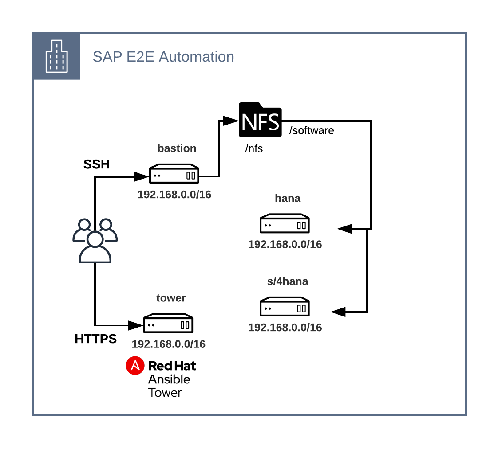
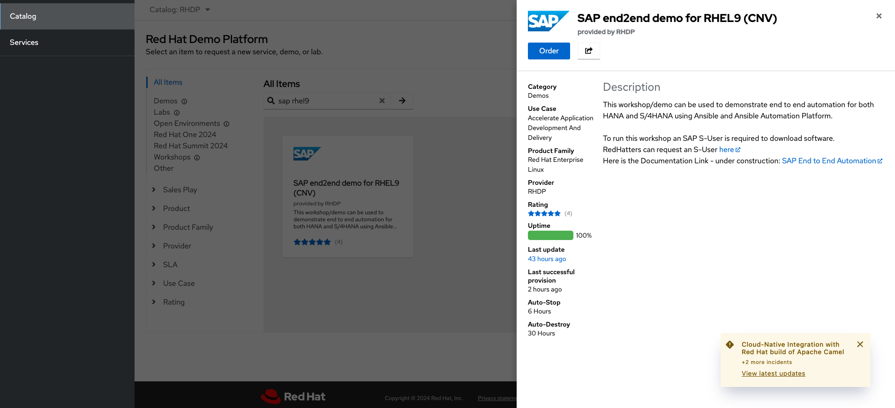
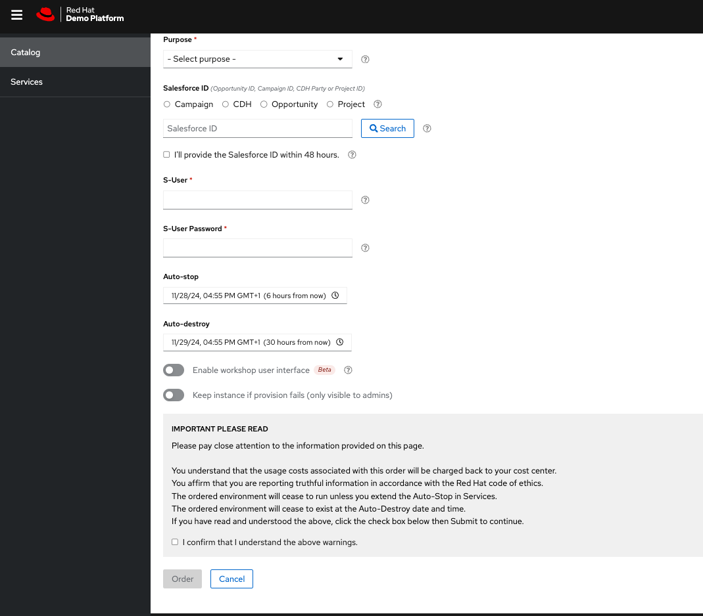
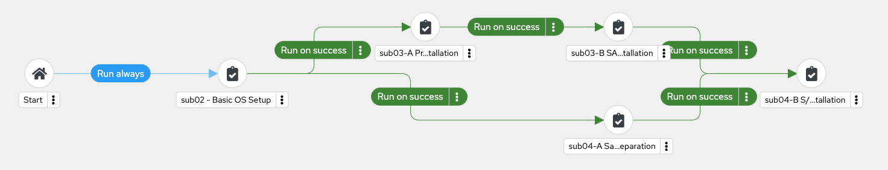
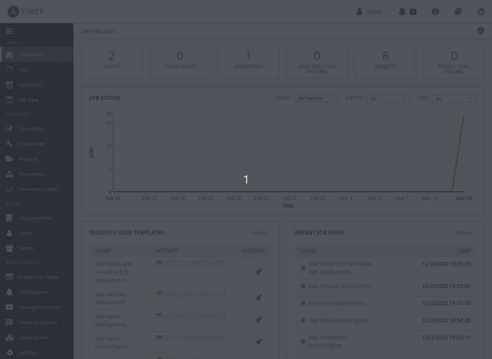
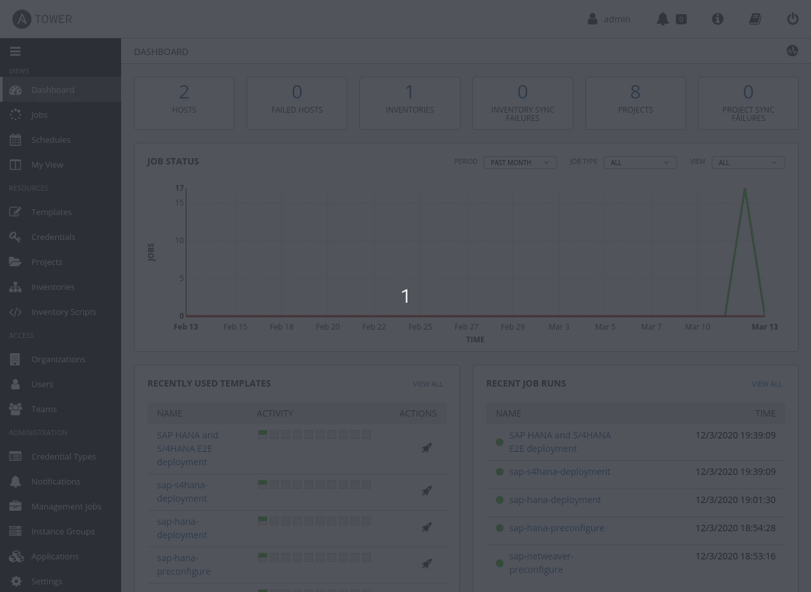
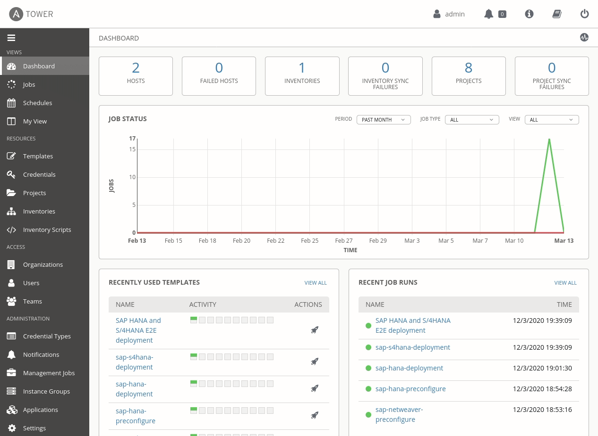

# SAP E2E Automation 
Automating SAP HANA and SAP S/4HANA end to end using Ansible Automation Platform

> You find the old version [here](sap-e2e-rhel8.md)

## Intro

This demo can be used to demonstrate end to end automation for both HANA and S/4HANA using Ansible and Ansible Automation platform.

## High-level architecture and components

The high-level architecture consists of 4 different RHEL 9 servers with the following purposes:

- bastion: this is meant to be used as the jump host for SSH access to the environment
- tower: this is meant to be used as the Ansible and Ansible Tower host where to run the automation from
- hana1 and hana2: this is meant to be used as the RHEL server where to deploy SAP HANA
- s4hana: this is meant to be used as the RHEL server where to deploy SAP S/4HANA

[](https://redhat-sap.github.io/sap-workshops//sap-e2e-ansible/img/infra_layout.png)

## Environment request

This environment is provisioned using the Red Hat internal demo system. We at Red Hat embrace the use of [IaC](https://openpracticelibrary.com/practice/everything-as-code/) (Infrastructure as Code) for any lab/demo set up, that's why we have open-sourced the Framework (based in Ansible) we use for this. If you want to get more information on this topic, check the [AgnosticD](https://github.com/redhat-cop/agnosticd) repository we use to deploy these labs and demos.

### Order catalog item

Login into [Red Hat Product Demo System](https://demo.redhat.com) and navigate to `Catalogs --> Demos`. An item called [`SAP End to End Automation for RHEL9`](https://catalog.demo.redhat.com/catalog?category=Demos&search=sap&item=babylon-catalog-prod%2Fopenshift-cnv.sap-e2e-demo-rhel9-cnv.prod) will be available.



Click on the **order** button, fill out the form, and  check the confirmation box and click on **Submit**.
You will need a SalesForce Number, and an SAP S-User with download permission.



### Environment info and credentials

Once the environment has been provisioned, you will receive an email with some key information:

- SSH information to access the bastion host including:
  - SSH user information
  - Bastion public hostbane information
  - SSH private key to be used
- Ansible Automation Platform (AAP) information including:
  - AAP public URL
  - AAP admin user
  - AAP admin password

## How to run the demo/workshop

The goal for this demo is to showcase the following day-1 and day-2 use cases to SAP customers:

- Simple S/4HANA deployment (no HA)
- HA HANA deployment (planned)
- HA S/4 HANA deployment (planned)
- update OS (planned)
- update HANA (planned)
- update SAP Kernel (planned)
- Cleanup (removing all HANA and S/4 instances)

Thes use cases shoul demonstarte that we can make managent of SAP solutions easy and reliable using Ansible Automation Platform. 
To be able to demonstrate these uses cases, AAP Workflows have been configured.
The following sections describe the use cases in detail.

### Generic Prework

Once the lab is deployed, please do the following:

1. Click on `Templates` and run workflow `90 - Check Hosts`
   This workflow checks the environment, if all hosts are reachable and prints out a number of hostvars of each host, e.g. network configuration, OS, memory etc.
2. Click on `Jobs` and verify that the job `91 - Download SAP Software` has been run successfully. 
   You can use this template to download different versions of SAP software to customize the demo to your needs. (see appendix fro details)

### Simple S/4HANA deployment (no HA)

This Workflow deploys SAP HANA and SAP S/4 HANA into the infrastructure. The Workflow will do the following:

   1. Basic OS Setup 
      1. Enable all the required repositories to be able to deploy SAP software in RHEL with system role `rhc`
      2. configure network if network_connection variable is defined with system role ǹetwork`
      3. Configure all the File Systems and mount points required while installing SAP HANA and SAP S/4HANA with system role storage, as defined in variable server_def depending on the system type
   2. HANA preparation
      1. Run all the OS pre-requisites from SAP Notes for RHEL systems while deploying SAP workloads
      2. Run all the OS pre-requisites from SAP Notes for RHEL systems while deploying SAP HANA
   3. S/4 HANA preparation
      1. Run all the OS pre-requisites from SAP Notes for RHEL systems while deploying SAP workloads
      2. Run all the OS pre-requisites from SAP Notes for RHEL systems while deploying SAP Netweaver software
   4. Deploy SAP HANA
   5. Deploy S/4HANA

Just by 'clicking a button' all these steps will be done automatically by Ansible Automation Platform using a Workflow. The final result will be an SAP landscape on RHEL 9 with SAP HANA and SAP S/4HANA installed, configured and running.



The deployment time of HANA and S/4 HANA is approximately 30 minutes.

The whole lab can be run as a quick demo, to show the end to end automation or as a workshop depending on the audience, the time and the level of detail you want to show from the lab.

Alternatively you can use this pre-recorded demo to show your customer the values of AAP or to learn how to use it:
<!--ARCADE EMBED START-->
<div style="position: relative; padding-bottom: calc(49.895833333333336% + 41px); height: 0; width: 100%;">
  <iframe src="https://demo.arcade.software/VwJyLb3dQ9gs6uGoKsUI?embed&embed_mobile=tab&embed_desktop=inline&show_copy_link=true"
          title="CY24Q4-Ansible-S/4 HANA Deployment with Ansible Automation Platform-PROD"
          frameborder="0" loading="lazy"
          webkitallowfullscreen mozallowfullscreen allowfullscreen allow="clipboard-write"
          style="position: absolute; top: 0; left: 0; width: 100%; height: 100%; color-scheme: light;" >
  </iframe>
</div>
<!--ARCADE EMBED END-->

## Detailed description

The next sections describe the configured items of Ansible Automation Platform. The documentation assumes you have already opened `Automaton execution` onthe left pane.

### Credential Types

In order to download SAP software you need a so called SAP S-User. Therefore a credential type is defined that conatins the user id and password of an SAP S-User. This credential type injects the variables `suser_id` and `suser_password` into a playbook, if an instance of this is added to a job or workflow template.
Click on `Infrastructure` ->`Credentials Types`, search `S-User` and click on it to review the configuration details.

### Credentials

In order to run Ansible Playbooks on remote hosts, the credentials required to access these hosts via SSH must be configured. On the left pane click on `Infrastructure` ->`Credentials`. This will show you all the actual credentials configured in AAP. One credential called `Server Login` is already configured. This is a `Machine Type` credential that will contain the user information and SSH private key to be able to connect to the remote hosts via SSH.

### Inventories

Ansible inventories are one of the key components required while automating IT. The inventory will contain the logical information of the hosts and all the required variables we need to use with the multiple Ansible Roles and Playbooks. On the left pane click on `Infrastructure`->`Inventories`. This will show you all the actual inventories configured in Ansible Tower. An inventory called `SAP Demo` is already configured. This is the inventory we are using with all the ploybooks configured in AAP Job Templates.

To see more information about the inventory, click on the `SAP Demo` inventory and this will open another view where to see detailed information about the hosts, groups and variables configured. All the variables required have been configured already and these have been applied on the corresponding levels. Variables that are common to all the inventory hosts can be seen on the first screen when you click on the `SAP Demo` inventory. Once you are in the screen where this mentioned common variables appear (`sap_domain`). You can click on the `HOSTS` button all the hosts configured under the inventory appear on the screen, `hana` and `s4hana` in this case.

<!--  -->

You can now check the specific variables applied to the host clicking on each one and scrolling or expanding the variables field.
No variables are configured here.

### Projects

AAP projects are a logical collection of Ansible playbooks. Using AAP projects you can manage playbooks and playbook directories by either placing them manually under the Project Base Path on your AAP server or by placing your playbooks into a source code management (SCM) system supported by AAP. The last approach is used here.

The project "SAP DEMO Project" is pointing to a [GitHub Repository](https://github.com/redhat-sap/demo.sap_install). This repository contains example playbooks for different use cases.
In this demo we use playbooks from the generic, tools and misc directory.

### Job Templates

AAP job templates are definitions and set of parameters for running Ansible jobs. In other words, it will use Playbooks from AAP projects explained in the previous step with hosts from selected inventories.

On the left pane click on `Templates`. This will show you all the Tower job templates configured. If you click on any of the configured job templates, you can see that every job template is using a different playbook from a different directory. Each playbook will use specific Ansible Roles to perform the required actions to get the hosts from the inventory to the desired state.

### Workflow Templates

Workflow job templates link together a sequence of disparate resources that accomplishes the task of tracking the full set of jobs that were part of the release process as a single unit. It allows you to create pipeline-like strategies to automate your IT landscape.

Same as job templates, you can access workflow job templates by clicking `Templates` on the left pane link. It is easy to differentiate a `Job Template` from a `Workflow Job Template`. On a first view, you can already see the type that Tower adds to the column beside the template name, and these can be `Job Template` and `Workflow Job Template`. Also, you will see an extra icon for the workflow templates, like a hierarchy chart. This icon represents the visualizer link for the workflow.

<!--  -->

If you click on the workflow name, the configuration parameters of the workflow are displayed. Here you the the storage configuration of the HANA and the netweaver hosts, and all parameters for the roles and playbooks that are used throughout this workflow.

By clicking on Survey you can define an interactive survey which can be used for overwriting previously defined variables, such as passwords, SIDs and instance numbers.

Once you click on the workflow visualizer you will get an overview of the existing workflow steps representing all the stages in our automation pipeline. This workflow visualizer can be used as well to modify the existing flow, adding and removing steps or change the logical order and actions happening before and after every step.

### Showing results

As the final step for this quick demo, we will show the results from the workflow execution we did when we started the demo. Remember that the workflow has been executed in the background while we were showing all the components and by this time it should be completed.

The first thing to show is the workflow results itself. To do that, on the left pane click on `Jobs`, this will show all the AAP jobs that have been executed or are still running. Find the last `Workflow Job` that has been executed, it is called `00 - Simple HANA + S/4 Deploymentt` preceded by a number that is used to identify the job id. If you click on this job, it will take you to the job details information, where you can see the status, when it did start and when it did finish. The whole pipeline to prepare the hosts, deploy and configure HANA and S/4HANA should take 25-30 minutes. You will see the workflow visualizer with all the nodes (steps in the pipeline) in green, representing that correct execution of the whole workflow. By clicking on the steps in the pipeline you will switch to the output of the single jobs.

<!--   -->

Now we can login into the `hana` and `s4hana` hosts to validate this is true. 
Using the logon instructions email you received, login into the `bastion` host as `cloud-user` 

```bash
$ ssh -i /path-to-your-ssh-key cloud-user@bastion-<GUID>.<DOMAIN>
[cloud-user@bastion ~]$
```

Once you have logged into the `bastion` host, ssh to the `hana` hosts:

```bash
[cloud-user@bastion-<GUID> ~]$ sudo ssh hana-<GUID>1
[cloud-user@hana-<GUID> ~]$ sudo -i
[root@hana-<GUID>1 ~]$ su - rhaadm
```

And execute the following as `rhaadm` user to check all the SAP HANA processes are running in the system:

```bash
hana:rheadm> HDB info
USER          PID     PPID  %CPU        VSZ        RSS COMMAND
rheadm     140412   140411   0.0     234172       5104 -sh
rheadm     141604   140412   0.0     222712       3332  \_ /bin/sh /usr/sap/RHE/HDB00/HDB info
rheadm     141635   141604   0.0     266920       3932      \_ ps fx -U rheadm -o user:8,pid:8,ppid:8,pcpu:5,vsz:10,rss:10,args
rheadm      34937        1   0.0    4015240      47984 hdbrsutil  --start --port 30003 --volume 3 --volumesuffix mnt00001/hdb00003.00003 --identifier 15840414
rheadm      28661        1   0.0     672908      15932 hdbrsutil  --start --port 30001 --volume 1 --volumesuffix mnt00001/hdb00001 --identifier 1584039495
rheadm      28507        1   0.0      24964       1336 sapstart pf=/hana/shared/RHE/profile/RHE_HDB00_hana
rheadm      28515    28507   0.0     425712      33416  \_ /usr/sap/RHE/HDB00/hana/trace/hdb.sapRHE_HDB00 -d -nw -f /usr/sap/RHE/HDB00/hana/daemon.ini pf=/usr
rheadm      28533    28515   6.8    6692276    3433656      \_ hdbnameserver
rheadm      28869    28515   0.3     674884      93748      \_ hdbcompileserver
rheadm      28872    28515   4.5     724868     151048      \_ hdbpreprocessor
rheadm      29276    28515   0.3    1921836     201392      \_ hdbwebdispatcher
rheadm      33961    28515  51.6   49781808   46822336      \_ hdbindexserver -port 30003
rheadm      34037    28515   0.8    3203024    1155388      \_ hdbxsengine -port 30007
rheadm      34040    28515   0.8    4671316    2417044      \_ hdbdocstore -port 30040
rheadm      34043    28515   0.8    3107012    1157632      \_ hdbdpserver -port 30011
rheadm      35423    28515   0.3    1692816     328896      \_ hdbdiserver -port 30025
rheadm      28433        1   0.0     520996      23900 /usr/sap/RHE/HDB00/exe/sapstartsrv pf=/hana/shared/RHE/profile/RHE_HDB00_hana -D -u rheadm
```

Once we have validated SAP HANA is installed and running, login into the `s4hana` hosts:

```bash
[cloud-user@bastion-<GUID> ~]$ ssh s4hana-<GUID>
```

And execute the following to check all SAP S/4HANA processes are running in the system:

```bash
$ ps auxwwf | grep rheadm | grep -v grep
rheadm   32386  0.0  0.2 893884 91780 ?        Ssl  Mar12   0:09 /usr/sap/RHE/ASCS01/exe/sapstartsrv pf=/usr/sap/RHE/SYS/profile/RHE_ASCS01_s4hana -D -u rheadm
rheadm     496  0.0  0.0  62624  3964 ?        Ss   Mar12   0:00 sapstart pf=/usr/sap/RHE/SYS/profile/RHE_ASCS01_s4hana
rheadm     509  0.0  0.0 100016 22248 ?        Ssl  Mar12   0:00  \_ ms.sapRHE_ASCS01 pf=/usr/sap/RHE/SYS/profile/RHE_ASCS01_s4hana
rheadm     510  0.0  2.2 2266592 749396 ?      Ssl  Mar12   0:09  \_ enq.sapRHE_ASCS01 pf=/usr/sap/RHE/SYS/profile/RHE_ASCS01_s4hana
rheadm    2143  0.0  0.1 903668 47508 ?        Ssl  Mar12   0:05 /usr/sap/RHE/D00/exe/sapstartsrv pf=/usr/sap/RHE/SYS/profile/RHE_D00_s4hana -D -u rheadm
rheadm    6637  0.0  0.0  62768  4208 ?        Ss   Mar12   0:00 sapstart pf=/usr/sap/RHE/SYS/profile/RHE_D00_s4hana
rheadm    6652  0.0  0.5 32335464 178100 ?     Ssl  Mar12   0:10  \_ dw.sapRHE_D00 pf=/usr/sap/RHE/SYS/profile/RHE_D00_s4hana
rheadm    6657  0.0  0.1 663840 34116 ?        S    Mar12   0:02  |   \_ gwrd -dp pf=/usr/sap/RHE/SYS/profile/RHE_D00_s4hana
rheadm    6658  0.0  0.4 1833160 146000 ?      Sl   Mar12   0:02  |   \_ icman -attach pf=/usr/sap/RHE/SYS/profile/RHE_D00_s4hana
rheadm    6659  0.0  4.9 32392208 1623068 ?    S    Mar12   0:22  |   \_ dw.sapRHE_D00 pf=/usr/sap/RHE/SYS/profile/RHE_D00_s4hana
rheadm    6660  0.0  1.6 32384420 551340 ?     S    Mar12   0:07  |   \_ dw.sapRHE_D00 pf=/usr/sap/RHE/SYS/profile/RHE_D00_s4hana
rheadm    6661  0.0  2.5 32401640 830196 ?     S    Mar12   0:27  |   \_ dw.sapRHE_D00 pf=/usr/sap/RHE/SYS/profile/RHE_D00_s4hana
rheadm    6662  0.0  2.2 32385604 746780 ?     S    Mar12   0:26  |   \_ dw.sapRHE_D00 pf=/usr/sap/RHE/SYS/profile/RHE_D00_s4hana
rheadm    6663  0.0  1.8 32385988 605064 ?     S    Mar12   0:13  |   \_ dw.sapRHE_D00 pf=/usr/sap/RHE/SYS/profile/RHE_D00_s4hana
rheadm    6664  0.0  1.8 32383096 619660 ?     S    Mar12   0:11  |   \_ dw.sapRHE_D00 pf=/usr/sap/RHE/SYS/profile/RHE_D00_s4hana
rheadm    6665  0.0  2.0 32383956 663848 ?     S    Mar12   0:13  |   \_ dw.sapRHE_D00 pf=/usr/sap/RHE/SYS/profile/RHE_D00_s4hana
rheadm    6666  0.0  1.8 32379024 593920 ?     S    Mar12   0:13  |   \_ dw.sapRHE_D00 pf=/usr/sap/RHE/SYS/profile/RHE_D00_s4hana
rheadm    6667  0.0  1.8 32385948 592028 ?     S    Mar12   0:18  |   \_ dw.sapRHE_D00 pf=/usr/sap/RHE/SYS/profile/RHE_D00_s4hana
rheadm    6668  0.0  2.0 32387128 674740 ?     S    Mar12   0:17  |   \_ dw.sapRHE_D00 pf=/usr/sap/RHE/SYS/profile/RHE_D00_s4hana
rheadm    6669  0.0  0.3 32354428 103696 ?     S    Mar12   0:02  |   \_ dw.sapRHE_D00 pf=/usr/sap/RHE/SYS/profile/RHE_D00_s4hana
rheadm    6670  0.0  1.3 32524396 435252 ?     S    Mar12   0:20  |   \_ dw.sapRHE_D00 pf=/usr/sap/RHE/SYS/profile/RHE_D00_s4hana
rheadm    6671  0.0  2.1 32501108 697152 ?     S    Mar12   0:20  |   \_ dw.sapRHE_D00 pf=/usr/sap/RHE/SYS/profile/RHE_D00_s4hana
rheadm    6672  0.0  1.1 32467288 376772 ?     S    Mar12   0:19  |   \_ dw.sapRHE_D00 pf=/usr/sap/RHE/SYS/profile/RHE_D00_s4hana
rheadm    6673  0.0  1.8 32444420 621832 ?     S    Mar12   0:12  |   \_ dw.sapRHE_D00 pf=/usr/sap/RHE/SYS/profile/RHE_D00_s4hana
rheadm    6674  0.0  1.5 32527136 504376 ?     S    Mar12   0:30  |   \_ dw.sapRHE_D00 pf=/usr/sap/RHE/SYS/profile/RHE_D00_s4hana
rheadm    6675  0.0  1.2 32532704 413528 ?     S    Mar12   0:20  |   \_ dw.sapRHE_D00 pf=/usr/sap/RHE/SYS/profile/RHE_D00_s4hana
rheadm    6676  0.0  0.3 32357480 125284 ?     S    Mar12   0:04  |   \_ dw.sapRHE_D00 pf=/usr/sap/RHE/SYS/profile/RHE_D00_s4hana
rheadm    6677  0.0  0.3 32354428 104068 ?     S    Mar12   0:02  |   \_ dw.sapRHE_D00 pf=/usr/sap/RHE/SYS/profile/RHE_D00_s4hana
rheadm    6653  0.0  0.0  63720  9416 ?        Ss   Mar12   0:00  \_ ig.sapRHE_D00 -mode=profile pf=/usr/sap/RHE/SYS/profile/RHE_D00_s4hana
rheadm    6654  0.0  0.0 1288252 28256 ?       Sl   Mar12   0:10      \_ /usr/sap/RHE/D00/exe/igsmux_mt -mode=profile -restartcount=0 -wdpid=6653 pf=/usr/sap/RHE/SYS/profile/RHE_D00_s4hana
rheadm    6655  0.0  0.2 1150676 80808 ?       Sl   Mar12   0:06      \_ /usr/sap/RHE/D00/exe/igspw_mt -mode=profile -no=0 -restartcount=0 -wdpid=6653 pf=/usr/sap/RHE/SYS/profile/RHE_D00_s4hana
rheadm    6656  0.0  0.2 1150680 81356 ?       Sl   Mar12   0:06      \_ /usr/sap/RHE/D00/exe/igspw_mt -mode=profile -no=1 -restartcount=0 -wdpid=6653 pf=/usr/sap/RHE/SYS/profile/RHE_D00_s4hana
```

We should see all the `sapstart` processes running along `dw` processes that will handle user requests.

We have demonstrated that we can use Ansible to automate SAP HANA and SAP S/4HANA deployments end to end **with just one click!!**


<!-- [](https://youtu.be/hfqVozIUH4w "E2E SAP HANA HA Pacemaker cluster creation with Ansible") -->