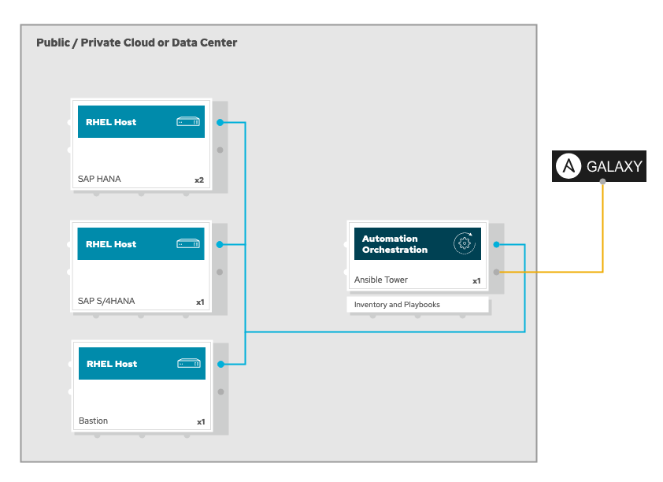

Overview
========

Base Requirements to access and perform this lab
------------------------------------------------

-   A computer with access to Internet :-)

-   SSH client (for Microsoft Windows users
    [Putty](https://www.putty.org/) and
    [WinSCP](https://winscp.net/eng/downloads.php) or
    [MobaXterm](https://mobaxterm.mobatek.net/download.html) is
    recommended)

-   Firefox 17 or higher, or Chromium / Chrome

High-level architecture and components
--------------------------------------

The high-level architecture consists of 4 different RHEL 8.x servers
with the following purposes:

-   bastion: this is meant to be used as the jump host for SSH access to
    the environment

-   tower: this is meant to be used as the Ansible and Ansible Tower
    host where to run the automation from

-   hana1, hana2: this is meant to be used as the RHEL server where to
    deploy SAP HANA

-   s4hana: this is meant to be used as the RHEL server where to deploy
    SAP S/4HANA



Environment request
-------------------

This environment is provisioned using the Red Hat internal demo system.
We at Red Hat embrace the use of
[IaC](https://openpracticelibrary.com/practice/everything-as-code/)
(Infrastructure as Code) for any lab/demo set up, that’s why we have
open-sourced the Framework (based in Ansible) we use for this. If you
want to get more information on this topic, check the
[AgnosticD](https://github.com/redhat-cop/agnosticd) repository we use
to deploy these labs and demos.

If you are a Red Hat Advanced or Premium Partner, you can immediately
deploy this environment yourself, following the next steps.

### Order catalog item

Login into [Red Hat Product Demo System](https://rhpds.redhat.com) and
navigate to
`Services -→ Catalogs -→ All Services -→ RHEL Platform Demo`. An item
called `SAP End to End Automation OSP` will be available.


Click on the **order** button, check the confirmation box, select a purpose (e.g. `Training - As part of a course`) and click on **Submit**.


### Environment info and credentials

Once the environment has been provisioned, you will receive an email
with some key information:

-   SSH information to access the bastion host including:

    -   SSH user information

    -   Bastion public hostbane information

    -   SSH private key to be used

-   Ansible Tower information including:

    -   Ansible Tower public URL

    -   Ansible Tower user

    -   Ansible Tower Password

### Working the Labs

You might have guessed by now this lab is pretty commandline-centric…​
:-)

-   Don’t type everything manually, use copy & paste from the browser
    when appropriate. But don’t stop to think and understand…​ ;-)

-   All labs where prepared using vi, but feel free to use your
    favourite editor.

- We will not use the Ansible Controller installation in this Lab

> **Tip**
>
> In the lab guide commands you are supposed to run are shown with or
> without the expected output, whatever makes more sense in the context.

> **Tip**
>
> The command line can wrap on the web page from time to time. Therefor
> the output is separated from the command line for better readability
> by an empty line. **Anyway, the line you should actually run should be
> recognizable by the prompt.** :-)

Prepare Access to Lab environment
=================================

Before you provision your lab environment you want to make sure that you
can connect to your servers after the provisioning. This can be achieved
via ssh public-keys.

Setup SSH on Linux and macOS
----------------------------

To access the jumphost via SSH, open a terminal, locate the provided
private SSH key, and store it in e.g.`~/.ssh/mylabkey` and change the
rights to user read-only:

    $ chmod 600 ~/.ssh/mylabkey

> **Note**
>
> You need to copy all the lines incl. the header and footer line, so
> that the content looks like this:

```
$ cat ~/.ssh/mylabkey
----BEGIN RSA PRIVATE KEY-----
Ofu9VdWCBNm4XJiruBFpZMyz1fY8hs28u3xKQeFf utVjbXS6SH1eYve34IDtm4Z
WYUVFVLU30mLnEZ8laZTYFS53gMO6CAhvKFt7h2DH16OwZ9e155kKuHYnri5J28O
lkpW2mf4fHiAXY2ORmKBa2xMFjqZs9hCvtEMA5s939IILC9oEAQkvO15WOLMvEYu
FuoMu0gaS3NhkILLvgt3tJToHz2Mzv4GYlNSOy6bsojM0ZqtHPByIPpF0NFEgMx5
8JvdwoETVMOoJack43Db6OulOWWA3k0bnTsNEDrvDR8a0O8p9KtjvJwteSleoCgX
C6Hrh62mtxQtXrqLNYA1ZZIbKYHim3K5CkEmAMrsO0qHwDRe5iGo8bAC8hrVe8Cx
Cgr0Dktx7lfoZ8d6tV5ViSzaqQk1SrAKk0LRiiTbyimzsaJouLF4a1TcVsp3k4g2
HFmONZNdR1XvQBmap62bJBErGAZru5bQmi755q8wwAJkyW6clZ4RSO8lDnksKlYw
4ikQ1OkPndE5SId0bQ1g3szdOoB42LwlY7RilIap5P54TTbPim0oeEL1kbFlLhE2
tFP0mGsVKA49AwXFH585HgopQZAd4J331Gh0yetNVKvljzmfKyjNYlda5jPgpNRA
JObXb4CEeW5kzz6GZUTva2YzSl6uhGebXKtrPD8WCmxOMwm5HyaxLnmaWN55kigc
kx8B5vPelnqZTxcx9RWRoCzprJATodqzWG1VvX2tZBamfgxt5WSSQQy4DmPzXYsJ
Rd8l0HLRKfZQ7K8oF13jVoDgEk1FRADa2YMmZfcDg7zyqouUuksqVen5V78s5qX1
U1gVsq0Tl4GDvxjdPO7yzTaps0gtzOrVvWLuUwlJCipk4FnaBovRBRALMPlf7Iz7
JvzE5aB88tTJG9iJ02bUaDVG2lIM4wy1bNe0PE8axxq4lhji7GLP6jXcZVCxmB9J
NWpNcNcGPPbF0tsaqGYIDjVG2VwxjJjDoh6cr5oFKCtyaUFDOBxjtHsGNNPl33SB
GzYC8OvgertwNIxUI4f145rBerFzj0FCndZQsd4wyUQxKuiGFc5dbu0GR6m2dkHT
ZEqsXZajUz5MrH5AZ3xOiwHKtBtcAcmTBIGUnEnBfo67GJU7kQXYBBhvubNVM4Ja
XWZFQ6RiScQr4y1aOQrMfVzeOibU8AOcf5oskqVb2mdOKXpuk82CQdRR1wb0ODIy
GDCF0yzvpbNiIMsbj6naAcPj2LWELztK9J3mcde9X3bdZUmUAAwCDIvjfXP1hAjP
pIQo2guFzESWPiTDEJFlHz065y61rjr10PK28qtVVXkt8OsIwClZsa3UPhiEObTb
DW5Lo39dZzxYJeQ94Q5thOY4Gn99bV2LIAgsoSfIGwWQJDQEVxyZDqSMs2cghlOl
yzjggpLDFpS6Ezmwx30ORP4cMTg9zFCqumioeGn7Eh0fV6t3WjI8q69pxBZabsGp
qKOruKfZvIoBUfP84y7YD3QfwV8D29puX0WZcE6CJQTivLRZBASaPSv8UiDAdEan
8OKDi6eMQZsbIBZtEIl9tUcAuZBJRNmSEzCpfvXP9gRTVY9iMnHVVK3yGJw3Ilfn
6oMhoaQU6NAaWoo1SbsumJ1VHtWb+WNXrpAESntDaFUStOTu8b84yA==
-----END RSA PRIVATE KEY-----
```

Now use the command in your email to login to the jumphost, e.g.:

    $ ssh  cloud-user@bastion-$GUID.$GUID.dynamic.opentlc.com -i ~/.ssh/mylabkey

To make sure the right key is used, add `-i path/to/your/key` to the
command in the Email.

> **Note**
>
> Unless otherwise noted, you cannot use SSH to connect directly as
> root.

Setup SSH on Microsoft Windows
------------------------------

Analog to Linux/MacOS create a file e.g. named mylabkey.txt on your
Windows PC and copy the content of the private key into that file, incl.
header and footer line (see NOTE above)

### On Windows 10

You can open Powershell or Command window. Check if the ssh command is
available, which is now part of the Windows 10 packages. If you have ssh
available, you can login with

    C:\USERS\name> ssh cloud-user@bastion-$GUID.$GUID.dynamic.opentlc.com -i ~/.ssh/mylabkey.txt

### PuTTY

If you use putty, you cannot directly import the SSH private key file.
You have to generate a so called ppk file to login with putty. To do
this you need the command PuTTYgen which you can download from the
[PuTTY download
page](http://www.chiark.greenend.org.uk/~sgtatham/putty/latest.html)

1.  run PuTTYgen

2.  Click "Load" after "Load an existing private key file" and load the
    previously created keyfile

3.  Click the Save private key button to create the ppk file.

4.  Now you can Open PuTTY

5.  Add the generated ppk file to Connection → SSH → Auth → Private key
    file for authentication

see also: <https://my.justhost.com/hosting/help/putty#puttygen>

### MobaXterm

1.  open mobaXterm

2.  Click Session → SSH

3.  Enter Remote Host bastion.GUID.example.opentlc.com and User cloud-user

4.  click on Advanced SSH settings and enter the keyfile at "Use private
    key"

5.  click OK

SAP on RHEL with Ansible
=========================

To get value out of this workshop you should already be familiar with ansible
and the concept of ansible roles and collections

An ansible role is a number of tasks that are parameterized with
variables. Compared to programming languages they can be seen as
functions, that make playbooks more readable.
Ansible collections are directory structures that can contain plugins, modules,
roles etc. which can be installed with a single command.

More information on Ansible collections can be found in [the Ansible
User guide](https://docs.ansible.com/ansible/latest/user_guide/collections_using.html)

Red Hat is developing and supporting roles to make system admin tasks
easier and reproducable.
You will learn how to use these roles in your playbooks e.g. to
configure

-   [Timeserver
    (chrony)](https://github.com/linux-system-roles/timesync)

-   [storage](https://github.com/linux-system-roles/storage)

-   and more

Find a complete list of Red Hat supported roles in this [Red Hat knowledgebase article](https://access.redhat.com/articles/3050101)

Find additional roles build by the community here on the [SAP Linuxlab homepage](https://sap-linuxlab.github.io)

The following diagram explains a typical SAP installation workflow.


In the deployed workshop, the lab deployment takes care for Step1.
This workshop will cover Steps 2 to 4 in the environment described above.

Setup  the lab environment
----------------------

If not mentioned otherwise you will perform all tasks from the bastion-host as
`cloud-user`. So please login to your bastion host as described in the lab email.
```
ssh  cloud-user@bastion-$GUID.$GUID.dynamic.opentlc.com -i ~/.ssh/mylabkey
```

Run the following commands to setup your lab environment on the bastion host

1.  Run the following command as `cloud-user` on the bastion host
    ```
    $ curl https://raw.githubusercontent.com/sap-linuxlab/demo.sap-install/main/tools/setup-cli.sh | bash
    ```
    Output:
    ```
    % Total    % Received % Xferd  Average Speed   Time    Time     Time  Current
                               Dload  Upload   Total   Spent    Left  Speed
    100  2582  100  2582    0     0   6569      0 --:--:-- --:--:-- --:--:--  6569
    create virtual python ennvironment at /home/cloud-user/.new-ansible-core
    Updating pip
    Installing ansible 4.10 (ansible-core 2.11)
    Adding Virtual Python environment to /home/cloud-user/.bashrc
    create ansible navigator config

    Ansible Core 2.11 (ansible 4.10) is installed in a virtual python environmnet
    run "source /home/cloud-user/.new-ansible-core/bin/activate" to activate the new ansible or log in again
    ```
    This installs ansible-core 2.11 in a separate virtual python environment

2. Activate the new python virtual environment to get access to the new ansible version
   ```
   $ source /home/cloud-user/.new-ansible-core/bin/activate
   ```

3.  Check that Ansible-core is installed and working correctly:

    ```
    $ ansible --version
    ansible [core 2.11.9]
      config file = /etc/ansible/ansible.cfg
      configured module search path = ['/home/cloud-user/.ansible/plugins/modules', '/usr/share/ansible/plugins/modules']
      ansible python module location = /home/cloud-user/.new-ansible-core/lib64/python3.6/site-packages/ansible
      ansible collection location = /home/cloud-user/.ansible/collections:/usr/share/ansible/collections
      executable location = /home/cloud-user/.new-ansible-core/bin/ansible
      python version = 3.6.8 (default, Oct 11 2019, 15:04:54) [GCC 8.3.1 20190507 (Red Hat 8.3.1-4)]
      jinja version = 3.0.3
      libyaml = True
    ```


Check the Prerequisites
-----------------------

> **Note**
>
> Ansible is keeping configuration management simple. Ansible requires
> no database or running daemons and can run easily on a laptop. On the
> managed hosts it needs no running agent.


Check that the environment variable GUID is set (xxxx is replaced
bei your id):
```
$ env| grep GUID
GUID=xxxx
```
This enables you to copy paste commands from this guide.

Verify that the managed hosts accept password-less connections with key
authentication from bastion as user cloud-user, e.g.:

    $ ssh hana-${GUID}1
    $ exit

    $ ssh s4hana-$GUID
    $ exit


To allow user `cloud-user` to execute commands on these servers as root
`sudo` has been configured on the managed hosts.

You can test that the configuration allows cloud-user to run commands using `sudo`
on hana-${GUID}1 or s4hana-$GUID without a password, e.g.:

    $ ssh hana-${GUID}1
    $ sudo cat /etc/shadow
    $ exit

> **Note**
>
> **In all subsequent exercises you should work as the user cloud-user on
> the bastion host (jumphost) if not explicitly told differently.**

Create a working directory for playbooks and configuration files
----------------------------------------------------------------

Make sure you are user cloud-user on bastion. Create a directory for your
ansible files and change to that directory:

    $ mkdir ansible-files
    $ cd ansible-files

Check the inventory
-----------------------

In this Lab the inventory is already configured globally in
`/etc/ansible/hosts` . The hana servers are in the group `hana`, the
S/4HANA server is named `s4hana`

-   Run `ansible all --list-hosts` — You will see an output similar to
    this:

        [cloud-user@bastion ansible-files]$ ansible all --list-hosts
        hosts (3):
           s4hana-${GUID}
           hana-${GUID}1
           hana-${GUID}2

-   Use ansible ping to check the connections from your management hosts

        [cloud-user@bastion ansible-files]$ ansible -m ping all
        s4hana-${GUID} | SUCCESS => {
            "ansible_facts": {
                "discovered_interpreter_python": "/usr/bin/python"
            },
            "changed": false,
            "ping": "pong"
        }
        hana-${GUID}2 | SUCCESS => {
            "ansible_facts": {
                "discovered_interpreter_python": "/usr/bin/python"
            },
            "changed": false,
            "ping": "pong"
        }
        hana-${GUID}1 | SUCCESS => {
            "ansible_facts": {
                "discovered_interpreter_python": "/usr/bin/python"
            },
            "changed": false,
            "ping": "pong"
        }

Install SAP HANA with ansible roles
-----------------------------------

### Check available roles for SAP deployment

On [Ansible Galaxy](http://galaxy.ansible.com) a lot of community provided
collections exits.
With a valid support subscription of Ansible Automation Platform 2 you get
access to Red Hat Automation Hub which provides the Red Hat supported collections.

See the follwoing pages for more details:

-   [Ansible Automation Platform](https://www.redhat.com/en/technologies/management/ansible)

-   [Red Hat Enterprise Linux (RHEL) System Roles](https://access.redhat.com/articles/3050101)

-   [Linux System Roles (upstream)](https://galaxy.ansible.com/linux-system-roles/)

-   [Roles for SAP deployments (community)](https://sap-linuxlab.github.io)

This workshop uses the collections from ansible galaxy.
Change to your ansible_files folder, create a directory `collections` and create
a file name `requirements.yml` with the following content:

```
---
collections:
        - name: fedora.linux_system_roles
          version: 1.15.2
        - name: community.general
          version: 3.8.3
          # we use latest versions in this lab
        - name: https://github.com/sap-linuxlab/community.sap_launchpad.git
          type: git
        - name: https://github.com/sap-linuxlab/community.sap_install.git,dev
          type: git
        - name: https://github.com/sap-linuxlab/community.sap_operations.git
          type: git
```

Install the required collections:

```
$ ansible-galaxy collection install -r collections/requirements.yml
```

> **Note:**
> We use Ansible without a dedicated Ansible Execution Environment (EE)
> If you use Ansivke Execution Environments you can use ansible-builder
> to create an EE which includes the above collections_using

You can now verify, that the collections are installed by running
```
ansible-navigator collections
```

> **Note**
>
> Global roles can be installed (as root) to `/usr/share/ansible/roles`
> or `/etc/ansible/roles` using the -p option, per default roles are
> installed to `${HOME}/.ansible/roles`. You might need to set your
> roles\_path in `ansible.cfg` appropriately

For the installation of SAP HANA in this course we need the following
roles:

1. [Linux System Roles Collection](https://galaxy.ansible.com/fedora/linux_system_roles)

  -   [linux-system-roles.storage](https://galaxy.ansible.com/linux-system-roles/storage)
  -   [linux-system-roles.timesync](https://galaxy.ansible.com/linux-system-roles/timesync)
2. [community.sap_install](https://github.com/sap-linuxlab/community.sap_install)
  - [sap_general_preconfigure](https://github.com/sap-linuxlab/community.sap_install/tree/main/roles/sap_general_preconfigure)
  - [sap_hana_preconfigure](https://github.com/sap-linuxlab/community.sap_install/tree/dev/roles/sap_hana_preconfigure)
  - [sap_netweaver_preconfigure](https://github.com/sap-linuxlab/community.sap_install/tree/main/roles/sap_netweaver_preconfigure)
  - [sap_hana_install](https://github.com/sap-linuxlab/community.sap_install/tree/main/roles/sap_hana_install)
  - [sap_swpm](https://github.com/sap-linuxlab/community.sap_install/tree/main/roles/sap_swpm)


Click on each role above and read the README on how to use the roles and
study some example playbooks.

Before you start implmenting your playbooks, we want to agree on the following
standards.
- All variable defininitions will be done in `host_vars` and `group_vars` directories
-

Create your variable directories
```
$ pwd
/home/cloud-user/ansible_files
$ mkdir host_vars group_vars
```
Workflow Step 1: Create VMs:
----------------------------


This step has already been done when you have ordered your lab. So no need to execute it

Workflow Step 2: Prepare the basic OS
--------------------


In this workflow step we perform the following tasks:

 - configure time
 - configure storage

The setup routine has properly subscribed the servers to the required repositories and locked the RHEL 8 minor release
If this is not the case the role [`sap_rhsm`](https://github.com/sap-linuxlab/community.sap_operations/tree/main/roles/sap_rhsm) might be useful from the `community.sap_operations` collection.

### Timeserver Configuration

SAP requires proper time synchronisation. So the linux system role is a
proper way to set the time correctly

Use the
[`rhel-system-roles.timesync`](https://github.com/linux-system-roles/timesync/blob/master/README.md)
to configure your timeserver.  
Use the following parameter:

```
timesync_ntp_servers:
      - hostname: 0.rhel.pool.ntp.org
        iburst: yes
timesync_ntp_provider: chrony
```

> **Note**
>
> The timeserver module throws a couple errors that are ok to ignore

This should be done for all hosts. So set these variables in `group_vars/all`

### Disk configuration

If you login to the servers you will realize that the disks are not
configured. Use `lsblk` to identify unconfigured disks. For the
configuration of the disks use
[`linux-system-roles.storage`](https://github.com/linux-system-roles/storage/blob/master/README.md).  


Use the following parameters for the hana servers (`group_vars/hanas`):
```
storage_pools:
      - name: sap
        disks:
          - sdb
        volumes:
          - name: data
            size: "128 GiB"
            mount_point: "/hana/data"
            fs_type: xfs
            state: present
          - name: log
            size: "64 GiB"
            mount_point: "/hana/log"
            fs_type: xfs
            state: present
          - name: shared
            size: "256 GiB"
            mount_point: "/hana/shared"
            fs_type: xfs
            state: present
          - name: sap
            size: "50 GiB"
            mount_point: "/usr/sap"
            state: present
```
Use the following parameters for the application servers (`group_vars/s4hanas`)

```
storage_pools:
  - name: sap
    disks:
      - sdb
    volumes:
      - name: sap
        size: "50 GiB"
        mount_point: "/usr/sap"
        state: present
      - name: sapmnt
        size: "20 GiB"
        mount_point: "/usr/sapmnt"
        state: present
      - name: swap
        size: "21 GiB"
        fs_type: swap
        state: present
```
> **Note**
>
> If you happen to misconfigure the disk, take your config and change
> the state to `absent`. Then rerun the storage configuration role to
> remove your setting, correct your entry, change the state to `present`
> again and rerun the storage configuration once more


Create the playbook `02-basic-os-setup.yml` with the following content:
```
---
- name: Phase 2 - basic OS Setup
  hosts: all
  become: true

  tasks:
    - name: Ensure storage is configured correctly
      include_role:
        name: fedora.linux_system_roles.timesync

    - name: Ensure storage is configured correctly
      include_role:
        name: fedora.linux_system_roles.storage
```
Now run the playbook with
```
$ ansible-navigator run 02-basic-os-setup.yml
```

> **Note**
> You can add the option `-m stdout` to get the same behaviour
> as previous ansible-playbook command

Workflow Step 3: Install SAP HANA
--------------------------------------------


In this lab we only focus on workflow steps 3A and 3B

To install SAP HANA with an ansible playbook you need to create
playbooks which complete the following steps:

- Step 3A: prepare the host for SAP HANA installation
- Step 3B: Install SAP HANA

At this time you should be familiar with writing playbooks in ansible,
so that you just find the name of the role and the important variables
to set. You may modify the playbook from Step 2 accordingly.

Take some time to think about, if you define variables at a host or group level.

> **Tip**
>
> You can click on the role names to display the documentation of the
> roles

Here are the infos on the two roles you need in Step 3A:

### SAP general preconfiguration

SAP requires a couple of base settings that are described in [SAP Note
2369910](https://launchpad.support.sap.com/#/notes/2369910) and other
SAP notes. The role
[`sap-general-preconfigure`](https://github.com/sap-linuxlab/community.sap_install/blob/main/roles/sap_general_preconfigure/README.md)
will set the parameters that have to be set for all SAP software.

The role is designed to be used without parameters to produce a valid
output.

Please note that one requirement for SAP is, that the DNS setup is done
correctly. This is checked by the role and can also be fixed by the
role. As this can be destructive or if customers have other ways to
ensure proper DNS setup, the default is, that the role checks DNS only
and prints warnings if it is not set according to SAP requirements.

In our demo environment we want the role to update /etc/hosts with the
correct configuration. Hence we need to set the following variable:
```
sap_general_preconfigure_modify_etc_hosts: true
```

In addition, if the public interface is different to the admin interface
the following variables can be set (not the case here):

-   `sap_hostname`: The hort hostname of the public IP of the SAP
    server. It defaults to *ansible\_hostname*

-   `sap_domain`: The DNS Domain of the SAP server. It defaults to
    *ansible\_fqdn*.

-   `sap_ip` : The IP address of the SAP server. It defaults to
    *ansible\_default\_ipv4.address*

In our demo environment the default domain settings are not ok.
So you need to set the following variable for all SAP hosts:
```
sap_domain: example.com
```

The role is designed not to update a server and to stop with an error message in
case something has happened that requires a reboot. The
reason for this is to properly react to the reboot situation and not to
reboot a production system by accident after updating.

When installing a fresh system, like we do in this lab, we want the system to be updated and
rebooted prior to the SAP software installation. To enable this behaviour set the follwoing
variables
```
sap_general_preconfigure_update: true
sap_general_preconfigure_fail_if_reboot_required: false
sap_general_preconfigure_reboot_ok: true
```

> **Caution**
>
> The DNS setup of the servers is only tested and might not be
> completely correct. The role is not failing if DNS stup is not
> correct. It is recommended to have proper DNS in production, but it
> can work without it in test envrionments. In this environment you will
> see the following errors in the output after a reboot, if you didn’t
> make the resolv.conf persistent:

    TASK [sap-preconfigure : Check resolv.conf settings] **************************************************************************************************************************************************************
    fatal: [hana1]: FAILED! => {"changed": false, "cmd": "test \"$(dig hana1 +search +short)\" = \"192.168.0.138\"", "delta": "0:00:00.012347", "end": "2021-03-16 17:13:17.953316", "msg": "non-zero return code", "rc": 1, "start": "2021-03-16 17:13:17.940969", "stderr": "", "stderr_lines": [], "stdout": "", "stdout_lines": []}
    ...ignoring
    fatal: [hana2]: FAILED! => {"changed": false, "cmd": "test \"$(dig hana2 +search +short)\" = \"192.168.0.130\"", "delta": "0:00:00.013704", "end": "2021-03-16 17:13:18.069518", "msg": "non-zero return code", "rc": 1, "start": "2021-03-16 17:13:18.055814", "stderr": "", "stderr_lines": [], "stdout": "", "stdout_lines": []}
    ...ignoring
    fatal: [s4hana]: FAILED! => {"changed": false, "cmd": "test \"$(dig s4hana +search +short)\" = \"192.168.0.156\"", "delta": "0:00:00.014595", "end": "2021-03-16 17:13:18.163004", "msg": "non-zero return code", "rc": 1, "start": "2021-03-16 17:13:18.148409", "stderr": "", "stderr_lines": [], "stdout": "", "stdout_lines": []}
    ...ignoring

    TASK [sap-preconfigure : Check dns reverse settings] **************************************************************************************************************************************************************
    fatal: [hana1]: FAILED! => {"changed": false, "cmd": "test \"$(dig -x 192.168.0.138 +short)\" = \"hana1.d031.internal.\"", "delta": "0:00:00.012936", "end": "2021-03-16 17:13:18.744562", "msg": "non-zero return code", "rc": 1, "start": "2021-03-16 17:13:18.731626", "stderr": "", "stderr_lines": [], "stdout": "", "stdout_lines": []}
    ...ignoring
    fatal: [hana2]: FAILED! => {"changed": false, "cmd": "test \"$(dig -x 192.168.0.130 +short)\" = \"hana2.d031.internal.\"", "delta": "0:00:00.013366", "end": "2021-03-16 17:13:18.856884", "msg": "non-zero return code", "rc": 1, "start": "2021-03-16 17:13:18.843518", "stderr": "", "stderr_lines": [], "stdout": "", "stdout_lines": []}
    ...ignoring
    fatal: [s4hana]: FAILED! => {"changed": false, "cmd": "test \"$(dig -x 192.168.0.156 +short)\" = \"s4hana.d031.internal.\"", "delta": "0:00:00.013046", "end": "2021-03-16 17:13:18.950928", "msg": "non-zero return code", "rc": 1, "start": "2021-03-16 17:13:18.937882", "stderr": "", "stderr_lines": [], "stdout": "", "stdout_lines": []}
    ...ignoring

### SAP HANA preconfiguration

To do all preconfiguration steps for SAP HANA which are described in a
couple of applicable SAP Notes use
[`sap_hana_preconfigure`](https://github.com/sap-linuxlab/community.sap_install/blob/main/roles/sap_hana_preconfigure/README.md).

This role can be used without any additional parameters, although there
are some that might tweaked in production. e.g. some kernel parameters.
[SAP NOTE 238241](https://launchpad.support.sap.com/#/notes/238241),
defines a lot of kernel parameter options, that can be set, in the
variable `sap_hana_preconfigure_kernel_parameters`.

To get more information on the parameters read the description of the
role or have a look at the roles [default variable definitions](https://raw.githubusercontent.com/sap-linuxlab/community.sap_install/main/roles/sap_hana_preconfigure/defaults/main.yml).

For our lab the follwoing variables should be set:
```
sap_hana_preconfigure_update: true
sap_hana_preconfigure_fail_if_reboot_required: false
sap_hana_preconfigure_reboot_ok: true
```
The purpose of these variables are identical to those in `sap_general_preconfigure`.

Now create and run a playbook that executes these two roles to finish step 3A.

If your playbook has executed successfully, it is now time to install SAP HANA.

### SAP HANA Installation

Finally to install SAP HANA database, use the role
[`sap_hana_install`](https://github.com/sap-linuxlab/community.sap_install/blob/main/roles/sap_hana_install/README.md).

This role creates the configuration file for an unattended install of
SAP HANA with `hdblcm` and kicks-off the installation process.

The minimum number of parameters you need to set for this role are the
following:
```
sap_hana_install_software_directory: /software/HANA_installation
sap_hana_install_common_master_password: "R3dh4t$123"
sap_hana_install_sid: "RHE"
sap_hana_install_instance_number: "00"
```
Add these variables to your `groups_var/hanas` file.

The role expects the SAPCAR*.EXE in the directory defined in `sap_hana_install_software_directory`.
If it is places somewhere else, like in this lab you need to define the  variable `sap_hana_install_sapcar_filename`.

So for this lab please also add the follwoing variable to `groups_var/hanas`
```
sap_hana_install_sapcar_filename: ../SAPCAR/SAPCAR_1311-80000935.EXE
```
If the SAPCAR*.EXE file is located in `sap_hana_install_software_directory` it can be omitted

> **Caution**
>
> There are cleartext passswords, which is OK for a training
> environment like this. In production environments these variables
> should be defined in an ansible vault file or as encrypted credentials
> in Ansible Controller.

Now update your variables file and create a playbook to run the installation.

> **Tip**
>
> Take your time and add the variables to hostvars and groupvars
> directories accordingly

After the installation has finished, log into **hana1-${GUID}** and assume user
**rheadm** to see if SAP HANA is running. Your output should look
similar to this:

    [cloud-user@hana1 ~]# sudo su - rheadm
    Last login: Fri May 11 18:26:48 EDT 2018
    rheadm@hana1:/usr/sap/RHE/RHE00> HDB info
    USER          PID     PPID  %CPU        VSZ        RSS COMMAND
    rheadm      60667    60666   0.0      24420       4988 -sh
    rheadm      60768    60667   0.0      12960       3336  \_ /bin/sh /usr/sap/RHE/HDB00/HDB info
    rheadm      60799    60768   0.0      57184       3940      \_ ps fx -U rheadm -o user:8,pid:8,ppid:8,pcpu:5,vsz:10,rss:10,args
    rheadm       4409        1   0.0     448788      29172 /usr/sap/RHE/HDB00/exe/sapstartsrv pf=/usr/sap/RHE/SYS/profile/RHE_HDB00_hana1 -D -u rheadm
    rheadm       4343        1   0.0      93232       9596 /usr/lib/systemd/systemd --user
    rheadm       4345     4343   0.0     173324       2836  \_ (sd-pam)


Workflow Step 4: Create a playbook to install S/4 Hana
-------------------------------------


In this lab we only focus on workflow steps 4A and 4B

You have now the Hana database running and your are ready to install S/4HANA using this database.
To install SAP S/4HANA with an ansible playbook you need to create
playbooks which complete the following steps:

- Step 4A: prepare the host for SAP S/4HANA installation
- Step 4B: Install SAP S/4HANA

### Step 4A: prepare the system for execution of `sapinst`

For step 4A you need to run the following Roles
 - [sap_general_preconfigure](https://github.com/sap-linuxlab/community.sap_install/blob/main/roles/sap_general_preconfigure/README.md)
 - [sap_netweaver_preconfigure](https://github.com/sap-linuxlab/community.sap_install/blob/main/roles/sap_netweaver_preconfigure/README.md)

The good news is, there is no additional variable configuration needed. The configuration for `sap_general_preconfigure` is the same as for HANA. If you have put this configuration to `group_vars/all` you do not need to change any variables.

Now you just need to create a playbook to execute the above two roles.

### Step 4B: Install S/4HANA

Now the the system is prepared for S/4HANA and the HANA Database is running on the database host.
With the role
[sap_swpm](https://github.com/sap-linuxlab/community.sap_install/blob/main/roles/sap_swpm/README.md)
you can now install SAP S/4HANA on the server s4hana-${GUID}

The role automatically unpacks the SAP software and runs the swpm installer
with a preconfigured configuration file. In this case we prepare a
single node S/4HANA 2019 instance. For more customization options see the [README](https://github.com/sap-linuxlab/community.sap_install/blob/main/roles/sap_swpm/README.md) and the [default variables](https://raw.githubusercontent.com/sap-linuxlab/community.sap_install/main/roles/sap_swpm/defaults/main.yml).

The following variables need to be defined to install S/4HANA in `group_vars/s4hanas`:

```
# sap_swpm
#----------
# Product ID for New Installation
sap_swpm_product_catalog_id: "NW_ABAP_OneHost:S4HANA1909.CORE.HDB.ABAP"
# Software
sap_swpm_software_path: "/software/S4HANA_installation"
sap_swpm_sapcar_path: "/software/SAPCAR"
sap_swpm_swpm_path: "{{ sap_swpm_software_path }}"
# NW Passwords
sap_swpm_master_password: "R3dh4t$123"
sap_swpm_ddic_000_password: "{{ sap_swpm_master_password }}"
# HDB Passwords
sap_swpm_db_system_password: "{{ sap_swpm_master_password }}"
sap_swpm_db_systemdb_password: "{{ sap_swpm_master_password }}"
sap_swpm_db_schema_abap_password: "{{ sap_swpm_master_password }}"
sap_swpm_db_sidadm_password: "{{ sap_swpm_master_password }}"
# Defined as Default Value
# sap_swpm_db_schema_abap: "SAPHANADB"
# NW Instance Parameters
sap_swpm_sid: RHE
sap_swpm_pas_instance_nr: "01"
sap_swpm_ascs_instance_nr: "02"
sap_swpm_ascs_instance_hostname: "{{ ansible_hostname }}"
sap_swpm_fqdn: "{{ ansible_domain }}"
# HDB Instance Parameters
# For dual host installation, change the db_host to appropriate value
sap_swpm_db_host: "hana-${GUID}1"
sap_swpm_db_sid: RHE
sap_swpm_db_instance_nr: "00"
```
> **Note**
> The directories have to contain the files you need to use for a particular Installation
> In this lab setup we have a little misconfiguration. To fix this assume `root` on the bastion
> host and remove the following files:
> - `/nfs/S4HANA_installation/SAPEXE_201-80003386.SAR`
> - `/nfs/S4HANA_installation/SAPEXEDB_201-80003385.SAR`

Now you can create a playbook executing just this role.

```
---
- name: Install S4
  hosts: s4hanas
  become: true

  roles:
    - community.sap_install.sap_swpm
```

If the role fails for whatever reason, the error is very often not passed correctly to
the ansible output.  As the execution of the role takes a while and to get the corect error
message, you can login to `s4hana-${GUID}` and run the following command as root:

```
#  tail -f /tmp/sapinst_instdir/S4HANA1909/CORE/HDB/INSTALL/STD/ABAP/sapinst.log
```

These variables work fine with S/4HANA2020 , but we have S/4JHANA1909 in the lab. If you use these variables, you will notice, that the installation fails with the following error message:

```
ERROR 2022-03-21 21:11:31.350 (root/sapinst) id=nw.usernameNotUnique errno=CJS-30207
<html> <head> </head> <body> The name <b>SAPHANADB</b> for user <b>DBACOCKPIT</b> is not unique. It is already used for user <b>SAPSID</b>. <br>SOLUTION: Choose a different username. </body></html>

ERROR 2022-03-21 21:11:31.481 (root/sapinst) id=controller.stepExecuted errno=FCO-00011
The step replicateSchemaPasswordsForExistingDatabase with step key |NW_ABAP_OneHost|ind|ind|ind|ind|0|0|NW_Onehost_System|ind|ind|ind|ind|onehost|0|NW_CreateDBandLoad|ind|ind|ind|ind|createdbandload|0|NW_CreateDB|ind|ind|ind|ind|createdb|0|NW_HDB_DB|ind|ind|ind|ind|nw_hdb_db|0|replicateSchemaPasswordsForExistingDatabase was executed with status ERROR (Last error reported by the step: <html> <head> </head> <body> The name <b>SAPHANADB</b> for user <b>DBACOCKPIT</b> is not unique. It is already used for user <b>SAPSID</b>. <br>SOLUTION: Choose a different username. </body></html>).
```

Watch the output of the `sap_swpm`. You will find a place where the logfiles of the SWPM execution go.
You may want to copy the created `ìnifile.params` on `s4hana-${GUID}` for further investigation.
To make the installation successful, we need to add some parameters into this config file, which cannot be done with the default method.
The good news is that the `sap_swpm` role is able to perform any execution scenarion that SAP SWPM is capable of doing. For that reason the role can be run in the following modes:
- default (the method we used before)
- default_templates
- advanced
- advanced_templates
- inifile_reuse

To make the role execution successful we switch to the advanced mode. In the advanced mode we can create a custom inifile. So run the playbook again using the follwoing variables:

```
# sap_swpm
#----------
sap_swpm_ansible_role_mode: advanced
sap_swpm_sapcar_path: "/software/SAPCAR"
sap_swpm_software_path: "/software/S4HANA_installation"
sap_swpm_swpm_path: "/software/S4HANA_installation"

# Do not touch /etc/hosts
sap_swpm_update_etchosts: false

sap_swpm_master_password: "R3dh4t$123"

sap_swpm_inifile_custom_values_dictionary:
   '# Custom Config file created for SAP Workshop': ''
   '# Product catalog ID': ''
   '# NW_ABAP_OneHost:S4HANA1909.CORE.HDB.ABAP': ''
   HDB_Schema_Check_Dialogs.schemaPassword:  "{{ sap_swpm_master_password }}"
   HDB_Schema_Check_Dialogs.validateSchemaName:  "false"
   NW_CI_Instance.ascsInstanceNumber:  ""
   NW_CI_Instance.ascsVirtualHostname :  ""
   NW_CI_Instance.ciInstanceNumber :  ""
   NW_CI_Instance.ciVirtualHostname :  ""
   NW_CI_Instance.scsVirtualHostname :  ""
   NW_DDIC_Password.ddic000Password :  ""
   NW_Delete_Sapinst_Users.removeUsers :  "true"
   NW_GetMasterPassword.masterPwd : "{{ sap_swpm_master_password }}"
   NW_GetSidNoProfiles.sid :  RHE
   NW_HDB_DB.abapSchemaName :  ""
   NW_HDB_DB.abapSchemaPassword :  "{{ sap_swpm_master_password }}"
   NW_HDB_DB.javaSchemaName :  ""
   NW_HDB_DB.javaSchemaPassword :  ""
   NW_HDB_getDBInfo.dbhost : "hana-{{ guid }}1.example.com"
   NW_HDB_getDBInfo.dbsid :  RHE
   NW_HDB_getDBInfo.instanceNumber :  '00'
   NW_HDB_getDBInfo.systemDbPassword :  "{{ sap_swpm_master_password }}"
   NW_HDB_getDBInfo.systemPassword :  "{{ sap_swpm_master_password }}"
   NW_HDB_getDBInfo.systemid :  RHE
   NW_Recovery_Install_HDB.extractLocation :  /usr/sap/RHE/HDB00/backup/data/DB_RHE
   NW_Recovery_Install_HDB.extractParallelJobs :  '30'
   NW_Recovery_Install_HDB.sidAdmName :  rheadm
   NW_Recovery_Install_HDB.sidAdmPassword :  "{{ sap_swpm_master_password }}"
   NW_SAPCrypto.SAPCryptoFile :  '{{ sap_swpm_software_path }}'
   NW_getFQDN.FQDN : ''
   NW_getFQDN.setFQDN :  "true"
   NW_getLoadType.loadType :  SAP
   archives.downloadBasket :  '{{ sap_swpm_software_path }}'
   hdb.create.dbacockpit.user :  "true"
   hostAgent.sapAdmPassword :  "{{ sap_swpm_master_password }}"
   nwUsers.sidadmPassword :  "{{ sap_swpm_master_password }}"
```

> **Note**
>
> Please be patient. In this environment the deployment takes a while

Overview of the playbooks and variable configurations
--------

Please replace `${GUID}` with your local guid.

### Variable files

#### group_vars/all

```
---
## timesync
timesync_ntp_servers:
      - hostname: 0.rhel.pool.ntp.org
        iburst: yes
timesync_ntp_provider: chrony

## sap_general_preconfigure
sap_general_preconfigure_modify_etc_hosts: true
sap_general_preconfigure_update: true
sap_general_preconfigure_fail_if_reboot_required: false
sap_general_preconfigure_reboot_ok: true
sap_domain: example.com
```

#### group_vars/hanas

```
---
storage_pools:
      - name: sap
        disks:
          - sdb
        volumes:
          - name: data
            size: "128 GiB"
            mount_point: "/hana/data"
            fs_type: xfs
            state: present
          - name: log
            size: "64 GiB"
            mount_point: "/hana/log"
            fs_type: xfs
            state: present
          - name: shared
            size: "256 GiB"
            mount_point: "/hana/shared"
            fs_type: xfs
            state: present
          - name: sap
            size: "50 GiB"
            mount_point: "/usr/sap"
            state: present

# sap_hana_preconfigure
#----------------------
sap_hana_preconfigure_update: true
sap_hana_preconfigure_fail_if_reboot_required: false
sap_hana_preconfigure_reboot_ok: true

# sap_hana_install
#------------------
sap_hana_install_software_directory: /software/HANA_installation
sap_hana_install_sapcar_filename: ../SAPCAR/SAPCAR_1311-80000935.EXE
sap_hana_install_common_master_password: "R3dh4t$123"
sap_hana_install_sid: 'RHE'
sap_hana_install_instance_number: "00"
```

#### group_vars/s4hanas
```
---
storage_pools:
  - name: sap
    disks:
      - sdb
    volumes:
      - name: sap
        size: "50 GiB"
        mount_point: "/usr/sap"
        state: present
      - name: sapmnt
        size: "20 GiB"
        mount_point: "/usr/sapmnt"
        state: present
      - name: swap
        size: "21 GiB"
        fs_type: swap
        state: present

# sap_netweaver_preconfigure
#---------------------------
# No definition needed

# sap_swpm
#----------
sap_swpm_ansible_role_mode: advanced
sap_swpm_sapcar_path: "/software/SAPCAR"
sap_swpm_software_path: "/software/S4HANA_installation"
sap_swpm_swpm_path: "/software/S4HANA_installation"
# Do not touch /etc/hosts
sap_swpm_update_etchosts: false
sap_swpm_master_password: "R3dh4t$123"
sap_swpm_inifile_custom_values_dictionary:
   '# Custom Config file created for SAP Workshop': ''
   '# Product catalog ID': ''
   '# NW_ABAP_OneHost:S4HANA1909.CORE.HDB.ABAP': ''
   HDB_Schema_Check_Dialogs.schemaPassword:  "{{ sap_swpm_master_password }}"
   HDB_Schema_Check_Dialogs.validateSchemaName:  "false"
   NW_CI_Instance.ascsInstanceNumber:  ""
   NW_CI_Instance.ascsVirtualHostname :  ""
   NW_CI_Instance.ciInstanceNumber :  ""
   NW_CI_Instance.ciVirtualHostname :  ""
   NW_CI_Instance.scsVirtualHostname :  ""
   NW_DDIC_Password.ddic000Password :  ""
   NW_Delete_Sapinst_Users.removeUsers :  "true"
   NW_GetMasterPassword.masterPwd : "{{ sap_swpm_master_password }}"
   NW_GetSidNoProfiles.sid :  RHE
   NW_HDB_DB.abapSchemaName :  ""
   NW_HDB_DB.abapSchemaPassword :  "{{ sap_swpm_master_password }}"
   NW_HDB_DB.javaSchemaName :  ""
   NW_HDB_DB.javaSchemaPassword :  ""
   NW_HDB_getDBInfo.dbhost : "hana-{{ guid }}1.example.com"
   NW_HDB_getDBInfo.dbsid :  RHE
   NW_HDB_getDBInfo.instanceNumber :  '00'
   NW_HDB_getDBInfo.systemDbPassword :  "{{ sap_swpm_master_password }}"
   NW_HDB_getDBInfo.systemPassword :  "{{ sap_swpm_master_password }}"
   NW_HDB_getDBInfo.systemid :  RHE
   NW_Recovery_Install_HDB.extractLocation :  /usr/sap/RHE/HDB00/backup/data/DB_RHE
   NW_Recovery_Install_HDB.extractParallelJobs :  '30'
   NW_Recovery_Install_HDB.sidAdmName :  rheadm
   NW_Recovery_Install_HDB.sidAdmPassword :  "{{ sap_swpm_master_password }}"
   NW_SAPCrypto.SAPCryptoFile :  '{{ sap_swpm_software_path }}'
   NW_getFQDN.FQDN : ''
   NW_getFQDN.setFQDN :  "true"
   NW_getLoadType.loadType :  SAP
   archives.downloadBasket :  '{{ sap_swpm_software_path }}'
   hdb.create.dbacockpit.user :  "true"
   hostAgent.sapAdmPassword :  "{{ sap_swpm_master_password }}"
   nwUsers.sidadmPassword :  "{{ sap_swpm_master_password }}"

```

### playbook files:

####  02-basic-os-setup.yml
```
####################################################
#
# Phase 2: Basic OS Setup
#
# This playbook covers the following configuration steps
#  - timesync
#  - storage customization

- name: Phase 2 - basic OS Setup
  hosts: all
  become: true

  tasks:
    - name: Ensure storage is configured correctly
      include_role:
        name: fedora.linux_system_roles.timesync

    - name: Ensure storage is configured correctly
      include_role:
        name: fedora.linux_system_roles.storage
```


#### 03-A-sap-hana-prepare.yml
```
---
# Phase 3 - step A
#
# This playbook configures all systems in the
# HANA Group for consumption of SAP HANA software

- name: Phase 3-A - Prepare system for SAP HANA Installation
  hosts: hanas
  become: true

  roles:
     - community.sap_install.sap_general_preconfigure
     - community.sap_install.sap_hana_preconfigure
```

#### 03-B-sap-hana-install.yml
```
---
# Phase 3 - step B
#
# The role sap_hana_install unpacks the software in {{ sap_hana_install_software_directory }}
# Then it calls the installation of SAP HANA with the configured paramters

- name: Phase 3-B - Install Hana
  hosts: hana-${GUID}1
  become: true

  tasks:

    - name: execute the SAP Hana Installation
      include_role:
        name: community.sap_install.sap_hana_install
```
#### 04-A-sap-netweaver-prepare.yml
```
---
# Phase 4 - step A
#
# This playbook configures all systems in S4 group
# for consumption of SAP Netweaver software

- name: Prepare for SAP Netweaver Installation
  hosts: s4hana-${GUID}
  become: true
  roles:
               - community.sap_install.sap_general_preconfigure
               - community.sap_install.sap_netweaver_preconfigure
```
#### 04-B-S4-deployment.yml
```
---
# Phase 4 - step B
#
# The role sap_swpm unpacks thes software found in {{ sap_swpm_software_path }}
# Then it calls the installation of sapinst with the configured paramters
#

- name: Install S4
  hosts: s4hanas
  become: true

  tasks:
    - name: execute the SWPM Installation
      include_role:
        name: community.sap_install.sap_swpm
```

### Running the playbooks

Now kick off the installation as user cloud-user on bastion:

> **Tip**
>
> run with -vv to increase debuglevel to get more information whats
> happening

1.  run the playbook to prepare the basic OS (Corporate Standard Build)
    ```
    ansible-navigator run 02-basic-os-setup.yml -m stdout
    ```

2.  Install SAP HANA
    ```
    ansible-navigator run 03-A-sap-hana-prepare.yml -m stdout
    ansible-navigator run 03-B-sap-hana-install.yml -m stdout
    ```
3.  Install SAP S/4hana
    ```
    ansible-navigator run 04-A-sap-netweaver-prepare.yml -m stdout
    ansible-navigator run 04-B-S4-deployment.yml -m stdout
    ```

You finished your Lab deploying SAP HANA and S/4 HANA fully automated.
You now know the basics and should be able to integrate this with
Satellite or AnsibleTower. To learn more about these tools join us for
another ILT training or login to the [Partner
Portal](https://partnercenter.redhat.com) and look for appropriate OPEN
trainings

Bonus Labs
----------

### Upgrade HANA Server

Do you know how to upgrade SAP HANA servers

1.  with new RHEL patches?

2.  to a new RHEL minor release?

> **Warning**
>
> **Solution Below**

### Manual steps to update the OS of a HANA server

The following steps will update the OS of a single HANA server within a
RHEL major release. If the Server is using System Replication obiously
more steps are required but with the failover technology a fully
automated, near-zero downtime update can be achieved.

1.  Login as root to hana1

2.  Update the system to the latest patches in the current RHEL minor
    release:

    -   Make sure you have your release set to the current minor
        release:

            [root@hana1 ~]# subscription-manager release
            Release: 8.1

    -   OPTIONAL: If you want to update to a newer minor release you
        need to do this command additionally (see
        `subscription-manager release --list` for available releases):

            [root@hana1 ~]# subscription-manager release --set 8.2
            Release set to: 8.2

    -   Now you can update the system

            [root@hana1 ~]# yum -y update

3.  Now stop the HANA database

        [root@hana1 ~]# su - hxeadm
        hxeadm@hana1:/usr/sap/HXE/HDB90> HDB stop

4.  And reboot, if necessaey (e.g. new kernel)

        [root@hana1 ~]# reboot

5.  After reboot is finished, login and start HANA again (in case it is
    not started automatically)

        [root@bastion ~]# ssh hana1
        [root@hana1 ~]# su - hxeadm
          hxeadm@hana1:/usr/sap/HXE/HDB90> HDB start

### Automate these steps with Ansible

Do you really want to do this manually? If not, here is a playbook that
covers both upgrade scenarios. If you change `os_upgrade_release`, an
upgrade to another RHEL release will be performed.

1.  To use this playbook you need to install
    [`mk-ansible-roles.check_reboot`](https://galaxy.ansible.com/mk-ansible-roles/check_reboot)
    role:

        cloud-user@bastion $ sudo ansible-galaxy install mk-ansible-roles.check_reboot -p /usr/share/ansible/roles

2.  Playbook for updating a HANA server

        - name: Update Hana Server
          hosts: hana1
          become: yes

          vars:
                      os_release: 8.2
                      sid: RHE

          pre_tasks:
                      - name: Ensure correct OS release is set
                        shell: subscription-manager release --set "{{ os_release}}" && yum clean all
                        when: os_release != ansible_distribution_version

                      - name: ensure the the system is updated
                        yum: name=* state=latest

                      - name: ensure HANA is stopped
                        command: su - "{{ sid|lower + 'adm' }}" -c "HDB stop"

          roles:
                      - { role: mk-ansible-roles.check_reboot }

          tasks:
                      - name: ensure HANA is started
                        command: su - "{{ sid|lower + 'adm' }}" -c "HDB start"

> **Tip**
>
> You could also think about converting this playbook into separate
> roles, that can be reused in different playbooks, such as:
>
> -   Stop HANA instances (in development)
>
> -   Start HANA instances (in development)
>
> -   Update Server
>
> -   Reboot Server (already a role).
>
> Or extend the playbook to do a rolling update of the HANA cluster

Troubleshooting
===============

This section gives some hints on how to handle common problems

Check if HANA is running
------------------------

Please note, that after a reboot HANA is not started automatically,
which is by intention, login into the HANA host, assume the sidadm user
(which in our case is rheadm) and run `HDB info`

Start SAP HANA
--------------

Login into the HANA host, assume the sidadm user (which in our case is
rheadm) and run `HDB start`

Stop SAP HANA
-------------

Login into the HANA host, assume the sidadm user (which in our case is
rheadm) and run `HDB stop`

Check if an SAP system is installed
-----------------------------------

Login to an SAP system an run the following command
`/usr/sap/hostctrl/exe/saphostctrl -function GetCIMObject -enuminstances SAPInstance`

Or you can run the following playbook against your servers:

    - name: Check for SAP Instances
      hosts: all
      become: True
      tasks:
        - name:  Search for installed SAP Systems
          shell: |
            if [ -x /usr/sap/hostctrl/exe/saphostctrl ]; then
                  /usr/sap/hostctrl/exe/saphostctrl -function GetCIMObject -enuminstances SAPInstance
            fi
          register: sap_hana_deployment_sap_systems_list

        - name: Display installed SAP Systems
          debug:
              var: sap_hana_deployment_sap_systems_list

        - set_fact:
            installed_sid: "{{ item.split(',').2|trim }}"
          loop: "{{ sap_hana_deployment_sap_systems_list.stdout_lines|list }}"
          when: item is search("^ SID")

        - set_fact:
            installed_num: "{{ item.split(',').2|trim }}"
          loop: "{{ sap_hana_deployment_sap_systems_list.stdout_lines|list }}"
          when: item is search("^ SystemNumber")

        - set_fact:
            installed_typ: "{{ item.split(',').2|trim }}"
          loop: "{{ sap_hana_deployment_sap_systems_list.stdout_lines|list }}"
          when: item is search("^ InstanceName")


        - name: Display SID
          debug:
            msg: "SID is {{ installed_sid }}, Number {{ installed_num }}\nTyp {{ installed_typ}}"
          when: installed_sid is defined

        - name: Fail if you try to install HANA with same SID/Instance than other SAP system
          fail:
              msg: "There is a non-HANA software with the same SID/instance number running"
          when:
             - installed_typ is defined
             - installed_sid == sap_hana_deployment_hana_sid
             - installed_num == sap_hana_deployment_hana_instance_number
             - installed_typ != "HDB"+sap_hana_deployment_hana_instance_number

The End
=======

Congratulations, you finished your labs! We hope you enjoyed your first
steps deploying SAP with Ansible as much as we enjoyed creating the
labs.

If you happen to run into new issues or have additional requests or
tipps, please report them
[here](https://github.com/rhmk/sap-workshops/issues). Please name the
"sap-enablement-ansible" workshop", when you open an issue
