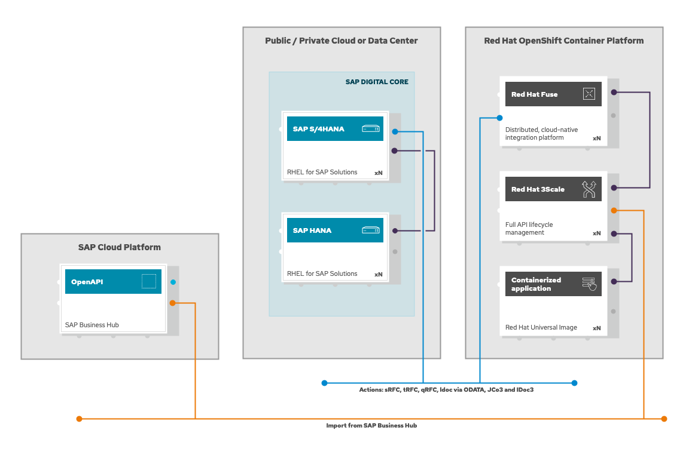

# SAP GitOps and CI/CD !!!!!!!!!------- IN PROGRESS -------!!!!!!!!!
> Using Red Hat OpenShift GitOps and Red Hat OpenShift Pipelines to implement GitOps and CI/CD for the side-by-side backend and frontend demo applications.
## Intro

This workshop can be used to demonstrate the automation capabilities while building and deploying cloud-native microservices in OpenShift that integrates with SAP.

## High-level architecture and components

And an OpenShift 4.x cluster with the following components deployed:

## Use cases

This workshop will cover the following use cases:

- 

## Environment request

This environment is provisioned using the Red Hat internal demo system. We at Red Hat embrace the use of [IaC](https://openpracticelibrary.com/practice/everything-as-code/) (Infrastructure as Code) for any lab/demo set up, that's why we have open-sourced the Framework (based in Ansible) we use for this. If you want to get more information on this topic, check the [AgnosticD](https://github.com/redhat-cop/agnosticd) repository we use to deploy these labs and demos.

### Order catalog item

Login into [Red Hat Product Demo System](https://rhpds.redhat.com) and navigate to `Services --> Catalogs --> All Services --> Workshops`. An item called `SAP side-by-side Integration` will be available.

You will find 2 different Catalog Items for this workshops, prefixed with the target infrastructure where this will be deployed, this is 'OSP' or 'AWS'. Please **use always the OSP version** and only use AWS if the OSP version fails to deploy.

Click on the **order** button, check the confirmation box and click on **Submit**.

## Environment info and credentials

Once the environment has been provisioned, you will receive an email with some key information:

- OpenShift information including:
  - OpenShift web-console public URL
  - OpenShift web-console user
  - OpenShift web-console password

## How to run the workshop

