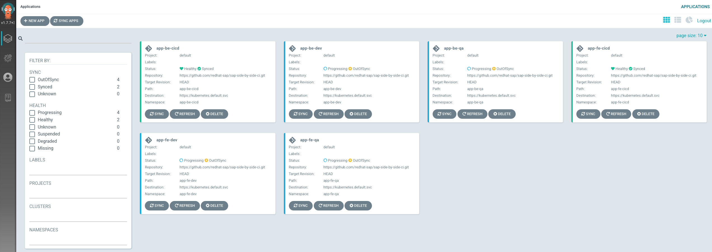
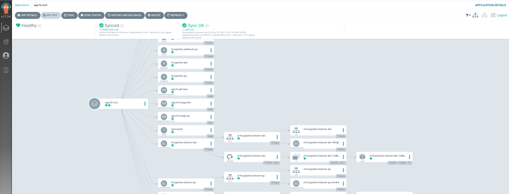
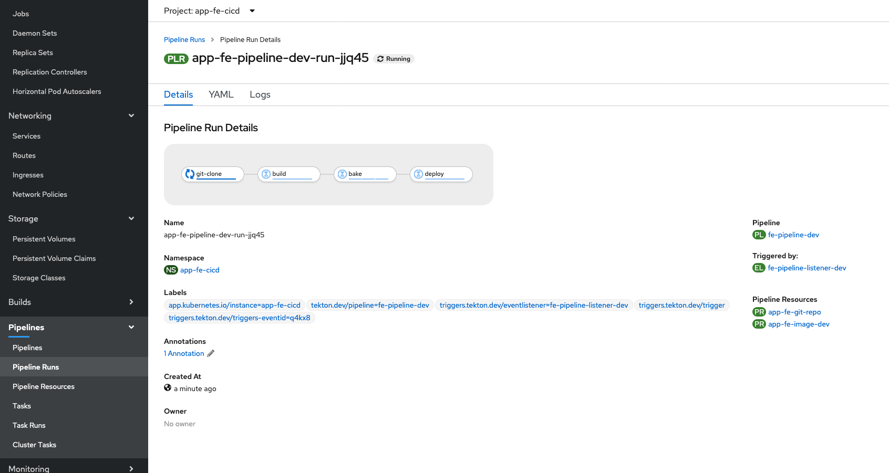

## Intro

This workshop can be used to demonstrate the automation capabilities while building and deploying cloud-native microservices in OpenShift that integrates with SAP.

## High-level architecture and components

And an OpenShift 4.x cluster with the following components deployed:


[](https://redhat-sap.github.io/sap-workshops//sap-integration/img/infra_layout.png)

## Use cases

This workshop will cover the following use cases:

- 

## Environment request

This environment is provisioned using the Red Hat internal demo system. We at Red Hat embrace the use of [IaC](https://openpracticelibrary.com/practice/everything-as-code/) (Infrastructure as Code) for any lab/demo set up, that's why we have open-sourced the Framework (based in Ansible) we use for this. If you want to get more information on this topic, check the [AgnosticD](https://github.com/redhat-cop/agnosticd) repository we use to deploy these labs and demos.

### Order catalog item

Login into [Red Hat Product Demo System](https://rhpds.redhat.com) and navigate to `Services --> Catalogs --> All Services --> Workshops`. An item called `SAP side-by-side Integration` will be available.

You will find 2 different Catalog Items for this workshops, prefixed with the target infrastructure where this will be deployed, this is 'OSP' or 'AWS'. Please **use always the OSP version** and only use AWS if the OSP version fails to deploy.

[](https://redhat-sap.github.io/sap-workshops//sap-integration/img/rhpds01.png)

Click on the **order** button, check the confirmation box and click on **Submit**.

[](https://redhat-sap.github.io/sap-workshops//sap-integration/img/rhpds02.png)

## Environment info and credentials

Once the environment has been provisioned, you will receive an email with some key information:

- OpenShift information including:
  - OpenShift web-console public URL
  - OpenShift web-console user
  - OpenShift web-console password

## How to run the workshop

All the required files to deploy and configure Argo CD and OpenShift Pipelines are included on [this repo](https://github.com/rickgcv/sap-side-by-side-ci). The very first thing you must do is to fork and clone the repo as you will need to commit some changes into your own fork to check all the features in action.

First log on to your OpenShift Cluster using the `oc` command provided in the login details and change to the project `openshift-gitops`.

```bash
oc project openshift-gitops
```

All the Tekton pipelines and required objects will be managed by Argo CD and these are part of the Argo CD Applications deployed by the instructions below. Different Tekton Pipelines will be automatically configured for dev and qa branches of the following repositories which contain the application code:

- [Backend Microservice](https://github.com/redhat-sap/sap-side-by-side-be)
- [Frontend Microservice](https://github.com/redhat-sap/sap-side-by-side-fe)

To test all the capabilities included on this demo you will need to fork and clone both repositories as you will need to configure different Hooks in your forked repositories so you can test how changes on the `dev` or `qa` branches of those repositories go from there to a running microservice in OpenShift with your code.

The following files must be changed to point to your own repositories:

- app-fe-cicd/dev-webhook.yml
- app-fe-cicd/pipeline-resources.yml
- app-fe-cicd/qa-webhook.yml
- app-be-cicd/dev-webhook.yml
- app-be-cicd/pipeline-resources.yml
- app-be-cicd/qa-webhook.yml

Also you will need to change the following files to match your own repo for Argo CD so you can test changes in your configuration and see how Argo CD automatically syncs the information from GitHub into OpenShift:

- argocd/argo-app-be-qa.yml
- argocd/argo-app-be-cicd.yml
- argocd/argo-app-be-dev.yml
- argocd/argo-app-fe-dev.yml
- argocd/argo-app-fe-qa.yml
- argocd/argo-app-fe-cicd.yml

### Deploy Argo CD Operator

This can be done using the OpenShift Console as well, installing `Argo CD` from OperatorHub. 


This can be done using the OpenShift Console as well, installing `Red Hat OpenShift Pipelines Operator` from OperatorHub. If you want to use the terminal instead, just execute the following instructions.

```bash
oc create -f tekton/subscription.yml
```


### Create an Argo CD Deployment

Go to your clone of the `sap-side-by-side-ci` repo and from the parent directory run the following commands:

```bash
oc create -f argocd/argocd.yml -n argocd
oc create -f argocd/cluster-role-bind.yml
```

### Create new Applications in Argo CD

From the same directory of your cloned repo run:

```bash
oc create -f argocd/argo-app-be-dev.yml
oc create -f argocd/argo-app-be-qa.yml
oc create -f argocd/argo-app-fe-dev.yml
oc create -f argocd/argo-app-fe-qa.yml
oc create -f argocd/argo-app-be-cicd.yml
oc create -f argocd/argo-app-fe-cicd.yml
```

### Get Argo CD credentials for `admin` user

```
oc get secret sap-argocd-cluster -o jsonpath='{.data.admin\.password}' | base64 -d
```

You can also obtain the credentials from the OpenShift console and:


### Check results

Use the credential for Argo CD `admin` user to login into Argo webconsole and you should see something similar to this, whith all the applications managed by Argo CD started to sync their objects into OpenShift.



If you click on any of the Applications you can see more details on the objects that have been synced already and the actual status.




If you check the existing Pipelines on any of the `cicd `Projects that have been created in OpenShift you will see the Pipeline status and the results from the first PipelineRun once you have committed any code to your GitHub `dev` or `qa` branches. This will not happen until you follow the last step explained below configuring your GitHub hooks to notify the EventListeners configured for your Pipelines.



### Configure your GitHub hook

On each GitHub repository you need to configure 2 different hooks. Use the following command to get the endpoint information for each one:

- Frontend microservices hook endpoitns

    ```bash
     oc get routes -n app-fe-cicd fe-pipeline-webhook-dev -o jsonpath='{.spec.host}'
     oc get routes -n app-fe-cicd fe-pipeline-webhook-qa -o jsonpath='{.spec.host}'
    ```

- Backend microservices hook endpoitns

    ```bash
     oc get routes -n app-be-cicd be-pipeline-webhook-dev -o jsonpath='{.spec.host}'
     oc get routes -n app-be-cicd be-pipeline-webhook-qa -o jsonpath='{.spec.host}'
     ```

You can also get the routes from the OpenShift console:


Now go to your cloned repositories `sap-side-by-side-fe` and `sap-side-by-side-be` and add the routes you have obtained. in both you can see that there is a `dev` and a `qa` branch so we need one webhook per branch.

### Make a modification in your repositories

In order to check how the Tekton pipelines are created and they apply the modifications that we make in our repositories directly to the applications that we have deployed in our OpenShift cluster we will go to our cloned GitHub repositories `sap-side-by-side-fe` and `sap-side-by-side-be` and modify one of the files, for example `README.md` in both the `dev` and `qa` branches so that we can see in the OpenShift console how the respective pipelines in the correspondent CI/CD projects (`app-be-cicd` and `app-fe-cicd`) are run.


