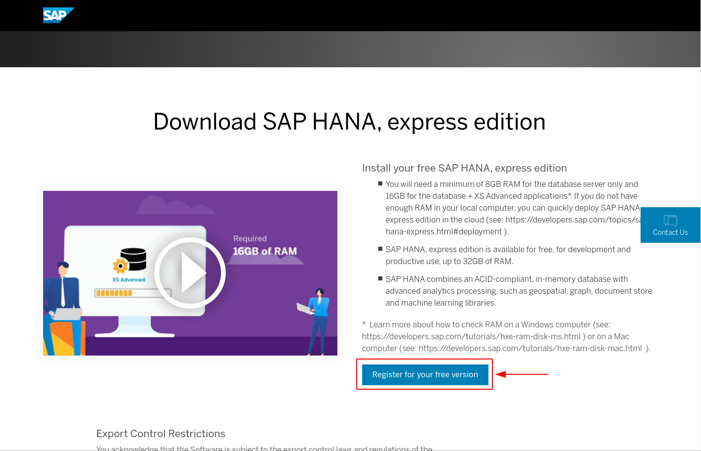
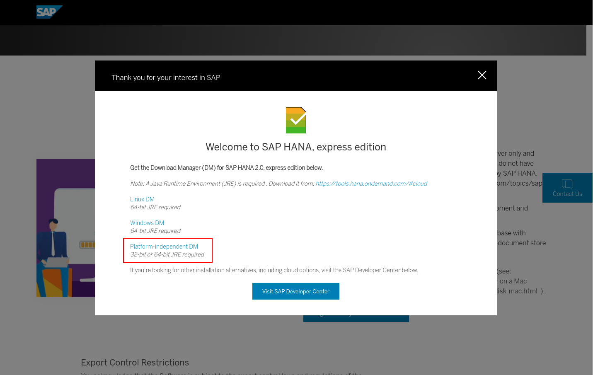
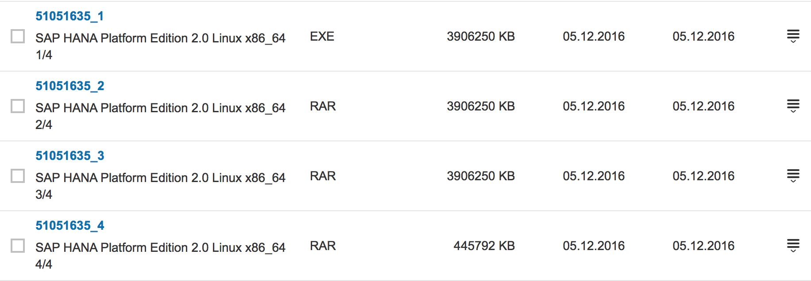

# SAP HANA on RHEL 8.x with Ansible
> Deploying SAP HANA on Red Hat Enterprise Linux 8.x using Ansible automation

## Environment Setup Lab

This lab has two parts. In the first part, you set up the lab environment. In the second part, which is optional, you download the installation media for SAP HANA<sup>(R)</sup>, platform edition or SAP HANA, express edition, and then upload it to the lab environment.

If you plan to install SAP HANA, Red Hat<sup>(R)</sup> recommends that you begin the process now so that you can continue with the course while the download proceeds in the background. See the [Download](#download-sap-hana-installation-media) section for the steps you need to get started.

**Goals**

- Review lab prerequisites
- Set up and access the lab environment
- Download the SAP HANA software

**Prerequisites**

You need the following accounts to access important information and necessary software:

- **SAP S user account:** This account allows you to download software and generate license keys from [SAP Service Marketplace](http://service.sap.com). You need this account to download SAP HANA, platform edition.

- **Red Hat Customer Portal account:** The Red Hat Customer Portal account is also known as a Red Hat Network Classic or RHN account. This account allows you to download Red Hat software and access support articles from [Red Hat Customer Portal](http://access.redhat.com).

**IMPORTANT NOTES**

- **If you do not have an SAP S user account, contact your company's SAP administrator and request an account with `software download` authorization. It may take up to two days to process your account request. You can also register and download the SAP HANA, express edition for this lab if you do not obtain an SAP S user account in time.**

- **You can create a Red Hat Customer Portal account at [redhat.com](http://www.redhat.com).**

**Lab Environment**

In this course, you do most of the hands-on practice exercises and lab work with a single dedicated computer system. This system is preinstalled with a Red Hat Enterprise Linux<sup>(R)</sup> (RHEL) base server. A Red Hat Enterprise Linux for SAP Solutions subscription is provided on the system, as well as disk partitions with enough space to install SAP HANA. The entire environment is hosted in the cloud, but the system configuration resembles a bare-metal environment.

### Provision Lab Environment

**This section is extremely important. Please read and understand it before continuing with the course.**

- Log in to the [OPENTLC lab portal](http://labs.opentlc.com).
- Go to **Services -> Catalogs -> All Services -> OPENTLC Datacenter Infrastructure Labs**.
- On the left side of the screen, click **THIS CI DOES NOT EXIST YET**.
- On the right, click **Order**.
- At the bottom right, click **Submit**.

You will receive an email with information about how to access your lab environment. It takes about 30 minutes for your lab to completely load and be accessible.

### Access System via SSH

Your lab environment consists of a bastion host and a Red Hat Enterprise Linux server. You must log in to `bastion host` first and then log in to the RHEL server.

You access your bastion using an SSH client pointed to the host name that you received in your provisioning email. You must log in using the provided credentials and keys in the email instructions.


- Log in to `workstation` using SSH:

    ```bash
    $ ssh -i /path-to-your-ssh-key cloud-user@bastion-<GUID>.<DOMAIN>
    ```

- Log in to the RHEL server using SSH:

    ```bash
    [cloud-user@bastion-<GUID> ~]# ssh hana-<GUID>
    ```

- Become root in the RHEL server:

    ```bash
    [cloud-user@hana-<GUID> ~]# sudo -i
    [root@hana-<GUID> ~]#
    ```

**Unless noted otherwise, you execute all of the command line instructions in the lab as the `root` user.**

## Download SAP HANA Installation Media

Due to End User License Agreement (EULA) restrictions, Red Hat OPEN cannot provide the installation media for SAP HANA in this training course. You must download the media yourself. You have two options to get the installation media in the environment:

- **Option 1**: Register for SAP HANA, express edition, download the installer, and start the download in the environment. Download time is about 5 minutes and you do not need an SAP S user account for it.

- **Option 2**: Download the SAP HANA, platform edition software from the SAP Service Marketplace. You need an SAP S user account and a couple of hours to upload the installation media.

### Option 1: Download SAP HANA Express Edition

The fastest and easiest way to access SAP HANA is to download SAP HANA, express edition.

SAP HANA, express edition is a streamlined version of SAP HANA, platform edition and requires fewer resources. It lacks the following features (among others):

- Smart data integration (SDI)
- Smart data streaming
- System replication (HSR)
- Dynamic tiering

For a comprehensive list, see the [SAP HANA express edition FAQ page](http://news.sap.com/germany/files/2017/01/SAP-HANA-Express-Edition-FAQ-extern.pdf.

For this lab, you need to download the binary installer as described in detail on the [express edition installation page](https://www.sap.com/developer/tutorials/hxe-ua-installing-binary.html).

As the SAP tutorial only describes the graphical interface, which is not feasible for the training server in the cloud, you need to do the following:

- Register for the express edition at ["https://www.sap.com/sap-hana-express](https://www.sap.com/sap-hana-express)

    

- Download the platform-independent installer, `HXEDownloadManager.jar`:

    

- Copy the installer to `bastion`:

    ```bash
    $ scp HXEDownloadManager.jar cloud-user@bastion-<GUID>.<DOMAIN>:/nfs/
    HXEDownloadManager.jar                             100%  561KB 971.1KB/s   00:00
    ```

- If you use MobaXterm on Windows, log in to `bastion` and drag the JAR file to the dialog box on the left, or use `winscp` to upload the files.

- Log in to `bastion`, change to the `/nfs` directory, and confirm that the file is there:

    ```bash
    $ ssh cloud-user@bastion-<GUID>.<DOMAIN>
    [cloud-user@bastion-<GUID> ~]$ ls /nfs
    HXEDownloadManager.jar
    ```

- Download the express edition:

    ```bash
    [cloud-user@bastion-<GUID> ~]$ cd /nfs
    [cloud-user@bastion-<GUID> nfs]$ java -jar HXEDownloadManager.jar -d . linuxx86_64 installer hxe.tgz
    Connecting to download server...

    SAP HANA, express edition version: 2.00.040.00.20190729.1

    WARNING: The package(s) you chose to download require a minimum of 8 GB of memory to install.  You only have 1 GB on this system.
    Downloading "Server only installer"...
    hxe.tgz : 100%
    Concatenate download files to ./hxe.tgz...
    ./hxe.tgz created.
    Verify ./hxe.tgz file checksum...
    ./hxe.tgz file checksum is OK.
    ```

### Option 2: Download SAP HANA Platform Edition

You must download the installation media from the SAP Service Marketplace using your SAP S user account. If you do not have an SAP S user account, contact your company's SAP administrator and request an account with _software download_ authorization. It may take up to two days to process your account request.

IMPORTANT: Start the download as soon as possible. It may take a while to complete.

You can either download the full installation media or, to save time, download the much smaller service pack.

**1.- Download the full installation media from the SAP Service Marketplace:**

- Point your browser to [https://launchpad.support.sap.com/#/softwarecenter](https://launchpad.support.sap.com/#/softwarecenter).
- Select **Installations and Upgrades**.
- Select **A-Z Index -> H**.
- Select **SAP In-Memory (SAP HANA) -> HANA Platform Edition -> SAP HANA PLATFORM EDITION -> SAP HANA PLATFORM EDITION 2.0**.
- Select **Installation**.

Here is an example of the download media. The media's object number may change when SAP releases updates, so use the description to confirm the version instead of the object number:



**2.- Alternatively, download the SAP HANA 2.0 service pack from the SAP Service Marketplace:**

- Point your browser to [https://launchpad.support.sap.com/#/softwarecenter](https://launchpad.support.sap.com/#/softwarecenter).
- Select **SUPPORT PACKAGES AND PATCHES**.
- Select **A-Z Index -> H**.
- Select **SAP HANA PLATFORM EDITION -> SAP HANA PLATFORM EDITION 2.0**.
- Select **SAP HANA DATABASE 2.0 -> LINUX ON X86_64 64BIT**.
- Navigate to **SUPPORT PACKAGES AND PATCHES -> A-Z -> S -> SAPCAR -> SAPCAR 7.21 -> Linux on x86_64 64bit -> SAPCAR_712-80000935.EXE** to download `SAPCAR`

Here is an example of the download media. The media's object number may change when SAP releases updates, so use the description to confirm the version instead of the object number:


Upload the SAP HANA software from your client to the `/nfs` directory on `bastion`:

```bash
$ scp IMDB_SERVER20_00_0-80002031.SAR cloud-user@bastion-<GUID>.<DOMAIN>:/nfs/
$ scp SAPCAR_712-80000935.EXE cloud-user@bastion-<GUID>.<DOMAIN>:/nfs/
```

**IMPORTANT**

- Make sure you upload the SAP HANA software to the `/nfs` directory on `bastion`, which is mounted to the RHEL server, so you do not have to transfer the file to the RHEL server.

- Start the upload as soon as you have access to the system. The upload may take several hours depending on the speed of your network connection.

- While the software upload is in progress, open another terminal, log in to the server, and prepare the system in parallel.

## Subscribe to RHEL for SAP Solutions EUS Channel

The lab environment has a version of Red Hat Enterprise Linux 8 base server already installed and is subscribed to the proper RHEL for SAP Solutions repositories.

NOTE: you do not need subscription-manager to subscribe or set the OS release for this enviroment. Follow the KB-Article [How to subscribe SAP HANA systems to the Update Services for SAP Solutions](https://access.redhat.com/solutions/3075991)

- Login as root to your hana Server

    ```bash
    [cloud-user@bastion-<GUID> ~]# ssh hana-<GUID>
    [cloud-user@hana-<GUID> ~]# sudo -i
    [root@hana-<GUID> ~]#
    ```

- Check that the systems are subscribed to the correct channels

```bash
[root@hana-<GUID> ~]# yum repolist
Geladene Plugins: search-disabled-repos
Repo-ID                                                     Repo-Name:                                                                                                 Status
rhel-7-server-e4s-optional-rpms                             Red Hat Enterprise Linux 7 Server - Update Services for SAP Solutions - Optional (RPMs)                    5.148
rhel-7-server-e4s-rpms                                      Red Hat Enterprise Linux 7 Server - Update Services for SAP Solutions (RPMs)                               5.380
rhel-sap-hana-for-rhel-7-server-e4s-rpms                    RHEL for SAP HANA (for RHEL 7 Server) Update Services for SAP Solutions (RPMs)                                 6
repolist: 10.534
```

## Deploy SAP HANA using Ansible

Once we have updloaded all the required installation files to deploy SAP HANA, we can now work in the Ansible automation we are going to use to deploy SAP HANA in the RHEL host. We are going to use the `bastion` host where Ansible Engine is already installed as the automation host where to create the Ansible inventory and Ansible playbook required to fully automate SAP HANA deployment.

### Create the Ansible Inventory

The `bastion` host is configured already with a simple Ansible inventory where the `hana` hosts has been included. Check the inventory content to review how the `hana` host is included and do a simple test to validate we can connect with the host:

```bash

[cloud-user@bastion-<GUID> ~]# sudo -i
[root@bastion-<GUID> ~]# cat /etc/ansible/hosts
COPY OUTPUT HERE
..
..
[root@bastion-<GUID> ~]# ansible -i /etc/ansible/hosts hana -m ping
COPY OUTPUT HERE
..
..
```

Once we have tested the inventory, we need to extend it with all the required variables that are going to be consumed by the multiple Ansible roles we are going to use to automate the SAP HANA deployment process.

Ansible is very flexible when it comes to inventory definition. For this particual use case we are going to add all the required variables to the `hana` host YAML file. To do this, we need first to create the directory tha will contain the hosts variables for our inventory, and then a specific YAML file for the `hana` host:

```bash
[root@bastion-<GUID> ~]# mkdir /etc/ansible/host_vars
[root@bastion-<GUID> ~]# touch /etc/ansible/host_vars/hana-<GUID>.yml
```

As mentioned before, we are going to use multiple Ansible roles, and some of these roles require variables to be defined with valid values. You can check each Ansible role documentation to understand what are these requirements and what values are expected. For these use case these are the variables we need to add with the values to the `/etc/ansible/host_vars/hana-<GUID>.yml` file:

```yaml
## Variables required for `sap_hostagent` role
sap_hostagent_installation_type: "rpm"
sap_hostagent_rpm_remote_path: "/software/SAPHOSTAGENT"
sap_hostagent_rpm_file_name: "saphostagentrpm_44-20009394.rpm"

## Variables reqiured for `sap_preconfigure` role
sap_preconfigure_modify_etc_hosts: true
sap_domain: "lab.local"

## Variables required for 'storage' role
storage_pools:
  - name: sap
    disks:
      - vdb
    volumes:
      - name: data
        size: "200 GiB"
        mount_point: "/hana/data"
        state: present
      - name: log
        size: "100 GiB"
        mount_point: "/hana/log"
        state: present
      - name: shared
        size: "512 GiB"
        mount_point: "/hana/shared"
        state: present
      - name: sap
        size: "50 GiB"
        mount_point: "/usr/sap"
        state: present

## Variables required for 'sap_hana_deployment' role
sap_hana_deployment_bundle_path: /software/HANA_installation
sap_hana_deployment_bundle_sar_file_name: IMDB_SERVER20_046_0-80002031.SAR
sap_hana_deployment_sapcar_path: /software/SAPCAR
sap_hana_deployment_sapcar_file_name: SAPCAR_1311-80000935.EXE
sap_hana_deployment_root_password: "MyS3cr3tP4ssw0rd"
sap_hana_deployment_sapadm_password: "MyS3cr3tP4ssw0rd"
sap_hana_deployment_hana_sid: RH1
sap_hana_deployment_hana_instance_number: "00"
sap_hana_deployment_hana_env_type: development
sap_hana_deployment_hana_mem_restrict: "n"
sap_hana_deployment_common_master_password: "MyS3cr3tP4ssw0rd"
sap_hana_deployment_sidadm_password: "MyS3cr3tP4ssw0rd"
sap_hana_deployment_hana_db_system_password: "MyS3cr3tP4ssw0rd"
sap_hana_deployment_ase_user_password: "MyS3cr3tP4ssw0rd"
sap_hana_deployment_apply_license: false
```

Now we have defined the Ansible inventory, the next thing we need to create is an Ansible playbook that will use this inventory.

### Create the Ansible Playbook

As we are using already available Ansible roles to automa the process of deploying SAP HANA, we don't need to create a complex playbook. The playbook we are going to create is basically going to consume these roles and use those with the inventory we just have created. The first thing we are going to do before creating the playbook, is to pull the required Ansible roles. In order to do this, Ansible comes with a CLI we can use for this, `ansible-galaxy`.

This CLI can use a requirements file where we will add all the required roles. Let's create this file and manually pull the roles:

```bash
[root@bastion-<GUID> ~]# cd /etc/ansible
[root@bastion-<GUID> ansible ~]# touch requirements.yml
```

The following content will be added to the `requirements.yml` file:

```yaml
# From Ansible Galaxy 'Community Roles'
- name: redhat_sap.sap_hostagent
- name: redhat_sap.sap_hana_deployment

# From upstream 'RHEL System Roles'
- src: https://github.com/linux-system-roles/sap-preconfigure.git
- src: https://github.com/linux-system-roles/sap-hana-preconfigure.git
- src: https://github.com/linux-system-roles/storage.git 
```

Once added, we can manually pull these roles:

```bash
[root@bastion-<GUID> ansible ~]# ansible-galaxy install -r requirements.yml -p roles
- downloading role 'sap_hostagent', owned by redhat_sap
- downloading role from https://github.com/redhat-sap/sap-hostagent/archive/master.tar.gz
- extracting redhat_sap.sap_hostagent to /Users/mak/GIT/sap-blog-part-4/sap-automation/plays/roles/redhat_sap.sap_hostagent
- redhat_sap.sap_hostagent (master) was installed successfully
- downloading role 'sap_hana_deployment', owned by redhat_sap
- downloading role from https://github.com/redhat-sap/sap-hana-deployment/archive/master.tar.gz
- extracting redhat_sap.sap_hana_deployment to /Users/mak/GIT/sap-blog-part-4/sap-automation/plays/roles/redhat_sap.sap_hana_deployment
- redhat_sap.sap_hana_deployment (master) was installed successfully
- extracting sap-preconfigure to /Users/mak/GIT/sap-blog-part-4/sap-automation/plays/roles/sap-preconfigure
- sap-preconfigure was installed successfully
- extracting sap-hana-preconfigure to /Users/mak/GIT/sap-blog-part-4/sap-automation/plays/roles/sap-hana-preconfigure
- sap-hana-preconfigure was installed successfully
- extracting storage to /Users/mak/GIT/sap-blog-part-4/sap-automation/plays/roles/storage
- storage was installed successfully
```

We can now create the Ansible playbook to consume these roles with the inventory:

```bash
[root@bastion-<GUID> ansible ~]# touch hana-deploy.yml
```

And add the following content to the playbook:

```yaml
- hosts: hana-<GUID>
  roles:
    - { role: storage }
    - { role: redhat_sap.sap_hostagent }
    - { role: sap-preconfigure }
    - { role: sap-hana-preconfigure }
    - { role: redhat_sap.sap_hana_deployment }
```

### Deploy SAP HANA with Ansible


## Test SAP HANA Database

**Check the status of the SAP HANA database:**

```bash
[root@hana-<GUID> SAP_HANA_DATABASE]# su - hxeadm
hxeadm@hana-<GUID>:/usr/sap/HXE/HDB90> HDB info
USER          PID     PPID  %CPU        VSZ        RSS COMMAND
hxeadm       6673     6672   0.4     116220       2804 -bash
hxeadm       6786     6673   0.0     113304       1680  \_ /bin/sh /usr/sap/HXE/HDB90/HDB info
hxeadm       6817     6786   0.0     155356       1868      \_ ps fx -U hxeadm -o user:8,pid:8,ppid:8,pcpu:5,vsz:10,rss:10,args
hxeadm       2854        1   0.0      28552       1880 sapstart pf=/hana/shared/HXE/profile/HXE_HDB90_hana1.example.com
hxeadm       2867     2854   0.3     368260      47884  \_ /usr/sap/HXE/HDB90/hana1.example.com/trace/hdb.sapHXE_HDB90 -d -nw -f /usr/sap/HXE/HDB90/hana1.example.com/daemon.
hxeadm       2885     2867  48.5    4564644    1921104      \_ hdbnameserver
hxeadm       3474     2867   2.7    1363304     212628      \_ hdbcompileserver
hxeadm       3511     2867  52.6    4284616    1859432      \_ hdbindexserver -port 39003
hxeadm       4326     2867   3.2    1397416     277040      \_ hdbwebdispatcher
hxeadm       2591        1   0.6     511028      24440 /usr/sap/HXE/HDB90/exe/sapstartsrv pf=/hana/shared/HXE/profile/HXE_HDB90_hana1.example.com -D -u hxeadm
```

**Stop the SAP HANA database:**

```bash
[root@hana-<GUID> ~]# su - hxeadm
hxeadm@hana-<GUID>:/usr/sap/HXE/HDB90> HDB stop
hdbdaemon will wait maximal 300 seconds for NewDB services finishing.
Stopping instance using: /usr/sap/HXE/SYS/exe/hdb/sapcontrol -prot NI_HTTP -nr 90 -function Stop 400

17.10.2019 10:36:07
Stop
OK
Waiting for stopped instance using: /usr/sap/HXE/SYS/exe/hdb/sapcontrol -prot NI_HTTP -nr 90 -function WaitforStopped 600 2

17.10.2019 10:36:41
WaitforStopped
OK
hdbdaemon is stopped.
```

**Start the SAP HANA database:**

```bash
[root@hana-<GUID> ~]# su - hxeadm
hxeadm@hana-<GUID>:/usr/sap/HXE/HDB90> HDB start


StartService
Impromptu CCC initialization by 'rscpCInit'.
  See SAP note 1266393.
OK
OK
Starting instance using: /usr/sap/HXE/SYS/exe/hdb/sapcontrol -prot NI_HTTP -nr 90 -function StartWait 2700 2


17.10.2019 10:37:16
Start
OK

17.10.2019 10:38:47
StartWait
OK
```