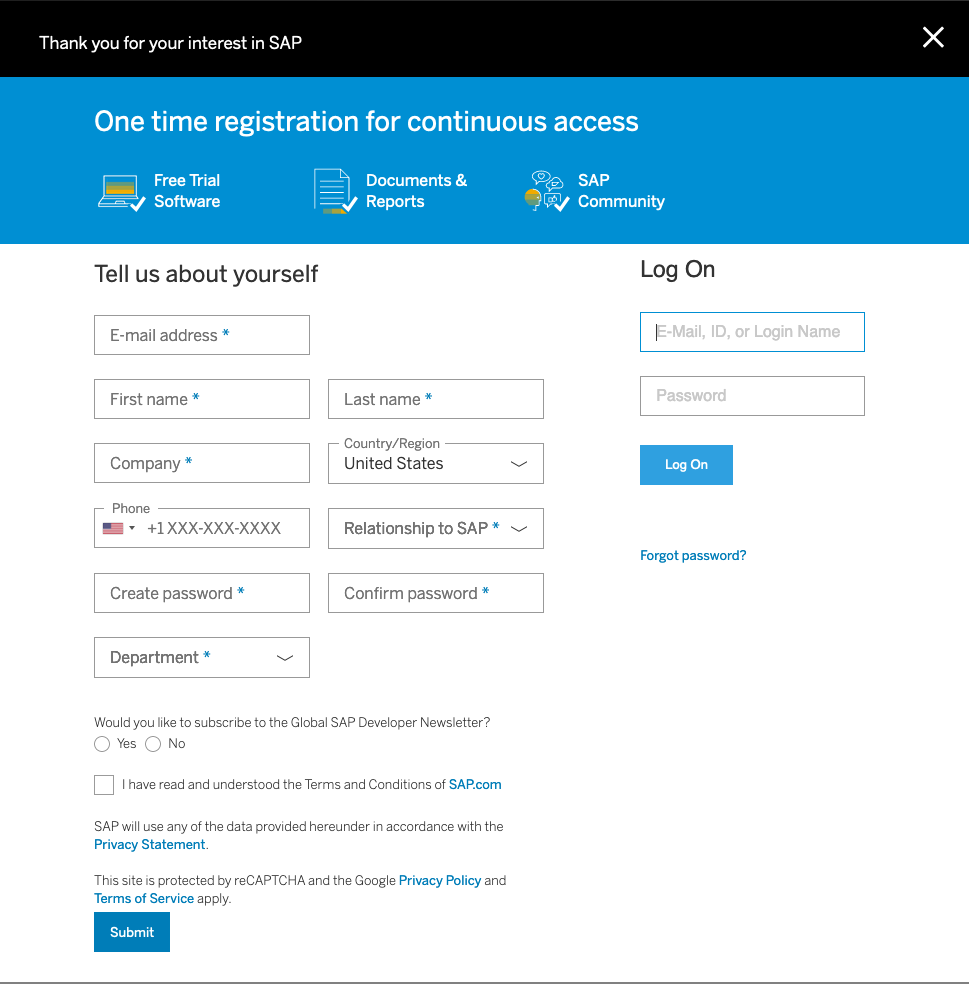
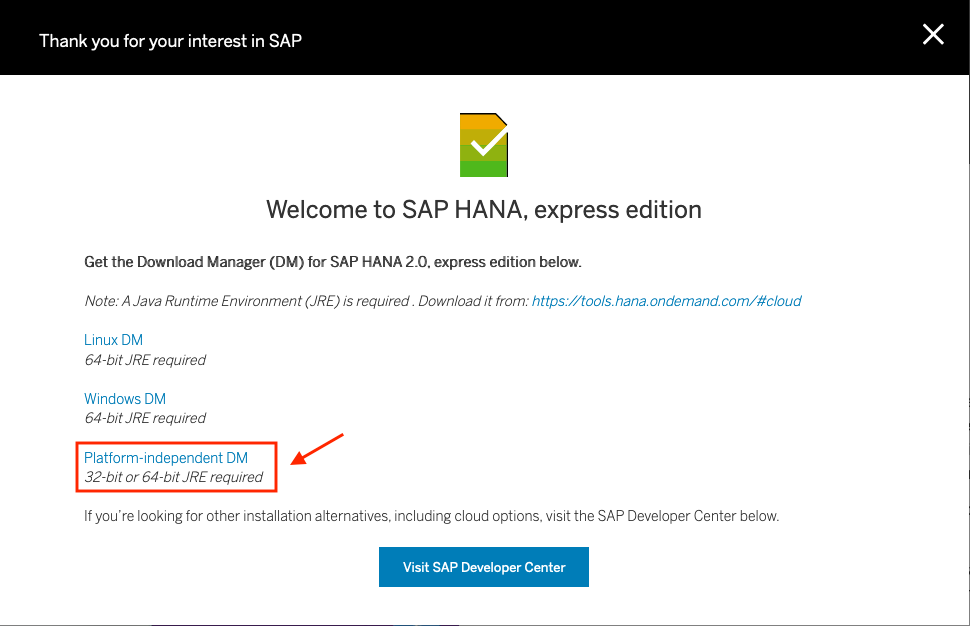

# SAP HANA on RHEL 8.x
> Deploying SAP HANA on Red Hat Enterprise Linux 8.x

## Environment Setup Lab

This lab has two parts. In the first part, you will provision the lab environment. In the second part, which is optional, you will download the installation media for SAP HANA<sup>(R)</sup> platform edition or SAP HANA express edition, and then upload it to the lab environment.

If you plan to download SAP HANA, we recommend to start the process now so you can continue with the course while the download proceeds in the background. See the [download](#download-sap-hana-installation-media) section for the steps you need to get started.

**Goals**

- Review lab prerequisites
- Provision and access the lab environment
- Download the SAP HANA software

**Prerequisites**

You need the following accounts to access important information and necessary software:

- **SAP S user account:** This account allows you to download software and generate license keys from [SAP Service Marketplace](http://service.sap.com). You need this account to download SAP HANA, platform edition.

- **Red Hat Customer Portal account:** The Red Hat Customer Portal account is also known as a Red Hat Network Classic or RHN account. This account allows you to download Red Hat software and access support articles from [Red Hat Customer Portal](http://access.redhat.com).

**IMPORTANT NOTES**

- **If you do not have an SAP S user account, contact your company's SAP administrator and request an account with `software download` authorization. It may take up to two days to process your account request. You can also register and download the SAP HANA, express edition for this lab if you do not obtain an SAP S user account in time.**

- **You can create a Red Hat Customer Portal account at [redhat.com](http://www.redhat.com).**

**Lab Environment**

In this course, you will do most of the hands-on practice exercises in a dedicated pre-built environment for this purpose. This environment is preinstalled with a Red Hat Enterprise Linux<sup>(R)</sup> (RHEL) base server. A Red Hat Enterprise Linux for SAP Solutions subscription is provided on the environment, as well as disk partitions with enough space to install SAP HANA. The entire environment is hosted in IBM Cloud on Bare Metal servers.

### Provision the Lab Environment

**This section is extremely important. Please read and understand it before continuing with the course.**

- Log in to the [OPENTLC lab portal](http://labs.opentlc.com).
- Go to **Services -> Catalogs -> All Services -> OPENTLC Datacenter Infrastructure Labs**.
- On the left side of the screen, click **THIS CI DOES NOT EXIST YET**.
- On the right, click **Order**.
- At the bottom right, click **Submit**.

You will receive an email with information about how to access your lab environment. It takes about 30 minutes for your lab to completely load and be accessible.

### Access System via SSH

Your lab environment consists of a bastion host and a Red Hat Enterprise Linux server. You must log in to `bastion host` first and then log in to the RHEL server.

You can access your `bastion host` via SSH following the instructions received in your provisioning email. You must log in using the provided user and SSH key in the email instructions.


- Log in to `bastion host` using SSH:

    ```bash
    $ ssh -i /path-to-your-ssh-key cloud-user@bastion-<GUID>.<DOMAIN>
    ```

- Log in to the RHEL server using SSH:

    ```bash
    [cloud-user@bastion-<GUID> ~]$ ssh hana-<GUID>
    ```

- Become root in the RHEL server:

    ```bash
    [cloud-user@hana-<GUID> ~]$ sudo -i
    [root@hana-<GUID> ~]#
    ```

**Unless noted otherwise, you execute all of the command line instructions in the lab as the `root` user.**

## Download SAP HANA Installation Media

Due to End User License Agreement (EULA) restrictions, Red Hat OPEN cannot provide the installation media for SAP HANA in this training course. You must download the media yourself. You have two options to get the installation media in the environment:

- **Option 1**: Register for SAP HANA, express edition, download the installer, and start the download in the environment. Download time is about 5 minutes and you do not need an SAP S user account for it.

- **Option 2**: Download the SAP HANA, platform edition software from the SAP Service Marketplace. You need an SAP S user account and a couple of hours to upload the installation media.

### Option 1: Download SAP HANA Express Edition

The fastest and easiest way to access SAP HANA is to download SAP HANA, express edition.

SAP HANA, express edition is a streamlined version of SAP HANA, platform edition and requires fewer resources. It lacks the following features (among others):

- Smart data integration (SDI)
- Smart data streaming
- System replication (HSR)
- Dynamic tiering

For a comprehensive list, see the [SAP HANA express edition FAQ page](http://news.sap.com/germany/files/2017/01/SAP-HANA-Express-Edition-FAQ-extern.pdf.

For this lab, you need to download the binary installer as described in detail on the [express edition installation page](https://www.sap.com/developer/tutorials/hxe-ua-installing-binary.html).

As the SAP tutorial only describes the graphical interface, which is not feasible for this environment, you need to do the following:

- Register for the express edition at ["https://www.sap.com/sap-hana-express](https://www.sap.com/sap-hana-express) selecting the `Register for your free version` button and completing the following form:

    

- Download the platform-independent installer, `HXEDownloadManager.jar`:

    

- Copy the installer to `bastion`:

    ```bash
    $ scp -i /path-to-your-ssh-key HXEDownloadManager.jar cloud-user@bastion-<GUID>.<DOMAIN>:/nfs/
    HXEDownloadManager.jar                             100%  735KB 971.1KB/s   00:00
    ```

- If you use MobaXterm on Windows, log in to `bastion` and drag the JAR file to the dialog box on the left, or use `winscp` to upload the files.

- Log in to `bastion`, change to the `/nfs` directory, and confirm that the file is there:

    ```bash
    $ ssh -i /path-to-your-ssh-key cloud-user@bastion-<GUID>.<DOMAIN>
    [cloud-user@bastion-<GUID> ~]$ ls -ltrh /nfs/HXEDownloadManager.jar
    -rw-r--r--. 1 cloud-user cloud-user 735K Apr 14 18:27 /nfs/HXEDownloadManager.jar
    ```

- Download the express edition:

    ```bash
    [cloud-user@bastion-<GUID> ~]$ cd /nfs
    [cloud-user@bastion-<GUID> nfs]$ java -jar HXEDownloadManager.jar -d . linuxx86_64 installer hxe.tgz
    Connecting to download server...

    SAP HANA, express edition version: 2.00.045.00.20200121.1

    Downloading "Server only installer"...
    hxe.tgz : 100%
    Concatenate download files to ./hxe.tgz...
    ./hxe.tgz created.
    Verify ./hxe.tgz file checksum...
    ./hxe.tgz file checksum is OK.
    ```

### Option 2: Download SAP HANA Platform Edition

You must download the installation media from the SAP Service Marketplace using your SAP S user account. If you do not have an SAP S user account, contact your company's SAP administrator and request an account with _software download_ authorization. It may take up to two days to process your account request.

IMPORTANT: Start the download as soon as possible. It may take a while to complete.

You can either download the full installation media or, to save time, download the much smaller service pack.

**1.- Download the full installation media from the SAP Service Marketplace:**

- Point your browser to [https://launchpad.support.sap.com/#/softwarecenter](https://launchpad.support.sap.com/#/softwarecenter).
- Select **Installations and Upgrades**.
- Select **A-Z Index -> H**.
- Select **SAP In-Memory (SAP HANA) -> HANA Platform Edition -> SAP HANA PLATFORM EDITION -> SAP HANA PLATFORM EDITION 2.0**.
- Select **Installation**.

Here is an example of the download media. The media's object number may change when SAP releases updates, so use the description to confirm the version instead of the object number:


**2.- Alternatively, download the SAP HANA 2.0 service pack from the SAP Service Marketplace:**

- Point your browser to [https://launchpad.support.sap.com/#/softwarecenter](https://launchpad.support.sap.com/#/softwarecenter).
- Select **SUPPORT PACKAGES AND PATCHES**.
- Select **A-Z Index -> H**.
- Select **SAP HANA PLATFORM EDITION -> SAP HANA PLATFORM EDITION 2.0**.
- Select **SAP HANA DATABASE 2.0 -> LINUX ON X86_64 64BIT**.
- Navigate to **SUPPORT PACKAGES AND PATCHES -> A-Z -> S -> SAPCAR -> SAPCAR 7.21 -> Linux on x86_64 64bit -> SAPCAR_712-80000935.EXE** to download `SAPCAR`

Here is an example of the download media. The media's object number may change when SAP releases updates, so use the description to confirm the version instead of the object number:


Upload the SAP HANA software from your client to the `/nfs` directory on `bastion`:

```bash
$ scp IMDB_SERVER20_00_0-80002031.SAR cloud-user@bastion-<GUID>.<DOMAIN>:/nfs/
$ scp SAPCAR_712-80000935.EXE cloud-user@bastion-<GUID>.<DOMAIN>:/nfs/
```

**IMPORTANT**

- Make sure you upload the SAP HANA software to the `/nfs` directory on `bastion`, which is mounted to the RHEL server, so you do not have to transfer the file to the RHEL server.

- Start the upload as soon as you have access to the system. The upload may take several hours depending on the speed of your network connection.

- While the software upload is in progress, open another terminal, log in to the server, and prepare the system in parallel.

## Subscribe to RHEL for SAP Solutions

The lab environment has a version of Red Hat Enterprise Linux 8 base server already installed and is subscribed to the proper RHEL for SAP Solutions repositories.

NOTE: you do not need subscription-manager to subscribe or set the OS release for this enviroment. Follow the KB-Article [How to subscribe SAP HANA systems to the Update Services for SAP Solutions](https://access.redhat.com/solutions/3075991) to get more information about this process.

- Login as root to your hana Server

    ```bash
    [cloud-user@bastion-<GUID> ~]# ssh hana-<GUID>
    [cloud-user@hana-<GUID> ~]# sudo -i
    [root@hana-<GUID> ~]#
    ```

- Check that the systems are subscribed to the correct channels

```bash
[root@hana-<GUID> ~]# yum repolist
Updating Subscription Management repositories.
Last metadata expiration check: 0:01:19 ago on Tue 14 Apr 2020 19:00:59 EDT.
repo id                                            repo name                                                                   status
ansible-2-for-rhel-8-x86_64-rpms                   Red Hat Ansible Engine 2 for RHEL 8 x86_64 (RPMs)                              20
rhel-8-for-x86_64-appstream-rpms                   Red Hat Enterprise Linux 8 for x86_64 - AppStream (RPMs)                    8,820
rhel-8-for-x86_64-baseos-rpms                      Red Hat Enterprise Linux 8 for x86_64 - BaseOS (RPMs)                       3,801
rhel-8-for-x86_64-sap-netweaver-rpms               Red Hat Enterprise Linux 8 for x86_64 - SAP NetWeaver (RPMs)                   16
rhel-8-for-x86_64-sap-solutions-rpms               Red Hat Enterprise Linux 8 for x86_64 - SAP Solutions (RPMs)                   10                                                                                                               10
```

## Prepare Red Hat Enterprise Linux OS

RedHat Enterprise Linux (RHEL) 7 introduced RHEL System Roles for SAP to assist with remotely or locally configuring RHEL7.6 and later, before installing SAP HANA or SAP NetWeaver software.

RHEL System Roles for SAP development is based on the ​[Linux System Roles ​upstream project](https://linux-system-roles.github.io/).

In this exercise you are going to use those System Roles to prepare the RHEL system to deploy SAP HANA.


REPLACE THIS TO BE DONE FROM THE BASTION HOST
**Install Ansible Engine, RHEL System Roles and RHEL System Roles for SAP**

```bash
[root@hana-<GUID> ~]# yum install -y ansible rhel-system-roles rhel-system-roles-sap
```

**Create an Ansible inventory**

For this use case we are creating a very simple inventory only with the local server. While using System Roles in Production environment, there is usually an external Ansible Host or Ansible Tower Host that manages all the SAP systems and others.

```bash
[root@hana-<GUID> ~]# > /etc/ansible/hosts
```

**Create an Ansible playbook**

Similar to the inventory, we are creating a very small playbook to use the System Roles for SAP. These roles will ensure the RHEL server has followed all the required pre-requisites to run SAP workloads and SAP HANA.

```bash
[root@hana-<GUID> ~]# touch /etc/ansible/hana-play.yml
```

Add the following info to this new file:

```yaml

```


## Extract SAP HANA Installation Media

If you downloaded SAP HANA, express edition, unpack `hxe.tgz`:

```bash
[root@hana-<GUID> ~]# cd /software
[root@hana-<GUID> software ~]# tar xzvf hxe.tgz
setup_hxe.sh
HANA_EXPRESS_20/change_key.sh
HANA_EXPRESS_20/hxe_gc.sh
HANA_EXPRESS_20/hxe_optimize.sh
[...]
[root@hana-<GUID> software ~]# ln -s HANA_EXPRESS_20/DATA_UNITS/HDB_LCM_LINUX_X86_64 SAP_HANA_DATABASE
```

If you downloaded the SAP HANA service pack, use the `SAPCAR` utility to unpack the SAP HANA service pack:

```bash
[root@hana-<GUID> ~]# cp /software/SAPCAR_712-80000935.EXE /bin/SAPCAR
[root@hana-<GUID> ~]# chmod a+x /bin/SAPCAR
[root@hana-<GUID> ~]# cd /software
[root@hana-<GUID> software ~]# SAPCAR -manifest SIGNATURE.SMF -xvf IMDB_SERVER20_00_0-80002031.SAR
[root@hana-<GUID> software ~]# mv SIGNATURE.SMF SAP_HANA_DATABASE/
[root@hana-<GUID> software ~]# chmod 644 SAP_HANA_DATABASE/SIGNATURE.SMF
```

NOTE: If you use SAP HANA express edition, expect to find the installation utilities in `/software/HANA_EXPRESS_20/DATA_UNITS/HDB_LCM_LINUX_X86_64`. If you use the service pack, the installation utilities are in `/software/SAP_HANA_DATABASE`. The above link is created to keep the installation instructions identical for both methods.

## Install SAP HANA

Before installing SAP HANA, make sure that you have the data listed below and check the installation guide for special requirements.

The following table lists the SAP HANA installation parameters:

|Parameter |Value|
|----------|-----|
|Database Usage Type |All components: `server`, `client`, etc.|
|HANA System ID |`HXE`|
|Instance Number |`90`|
|Database Mode |`Single-Container`|
|System Usage |`custom`|
|Restrict Maximum Memory Allocation |`24GB`|
|System Administrator Login Shell |`/bin/bash`|
|System Administrator UID |`1001`|
|ID of User Group (`sapsys`) |`79`|
|Restart after Reboot |`N`|
|SAP Host Agent User (`sapadm`) Password |`rhel4saphana`|
|System Administrator (`anaadm`) Password |`rhel4saphana`|
|Database User (`SYSTEM`) Password |`Rhel4saphana`|


NOTE: The SID `HXE` and instnace number `90` are required for the free HANA Express License

**Launch the SAP HANA installer:**

NOTE: please select only to install server components, due to low memory of this server

The example below shows the installation of the service pack.

```bash
[root@hana-<GUID> ~]# cd /software/SAP_HANA_DATABASE/
[root@hana-<GUID> SAP_HANA_DATABASE]]# ./hdblcm --action=install


SAP HANA Lifecycle Management - SAP HANA Express Edition 2.00.045.00.1575639312
*******************************************************************************


SAP HANA Database version '2.00.045.00.1575639312' will be installed.

Select additional components for installation:

  Index | Components | Description
  ---------------------------------------------------------------------------------------------
  1     | all        | All components
  2     | server     | No additional components
  3     | afl        | Install SAP HANA AFL (incl.PAL,BFL,OFL) version 2.00.045.0000.1575663037
  4     | epmmds     | Install SAP HANA EPM-MDS version 2.00.045.0000.1575663037

Enter comma-separated list of the selected indices [1]: 2
Enter Installation Path [/hana/shared]:
Enter Local Host Name [hana-{GUID}]:
Enter SAP HANA System ID [HXE]:
Enter Instance Number [90]:
Enter Master Password: R3dh4t1!
Confirm Master Password: R3dh4t1!
Enter ID of User Group (sapsys) [79]:

Summary before execution:
=========================

SAP HANA Express Edition System Installation
   Installation Parameters
      SAP HANA System ID: HXE
      Instance Number: 90
      Local Host Worker Group: default
      System Usage: development
      Location of Data Volumes: /hana/shared/data/HXE
      Location of Log Volumes: /hana/shared/log/HXE
      Directory containing custom configurations: /software/HANA_EXPRESS_20/DATA_UNITS/HDB_SERVER_LINUX_X86_64/configurations/custom
      Certificate Host Names: hana-{GUID} -> hana-{GUID}
      System Administrator Home Directory: /usr/sap/HXE/home
      System Administrator Login Shell: /bin/bash
      System Administrator User ID: 1001
      ID of User Group (sapsys): 79
      Restart system after machine reboot?: Yes
      Inter Service Communication Mode: ssl
      Remote Execution: ssh
      Use single master password for all users, created during installation: Yes
      Database Isolation: low
      Install Execution Mode: standard
      Installation Path: /hana/shared
      Local Host Name: hana-{GUID}
   Software Components
      SAP HANA Database
         Install version 2.00.045.00.1575639312
         Location: /software/HANA_EXPRESS_20/DATA_UNITS/HDB_SERVER_LINUX_X86_64/server
      SAP HANA AFL (incl.PAL,BFL,OFL)
         Do not install
      SAP HANA EPM-MDS
         Do not install
   Log File Locations
      Log directory: /var/tmp/hdb_HXE_hdblcm_install_2020-04-14_20.06.52
      Trace location: /var/tmp/hdblcm_2020-04-14_20.06.52_31828.trc

Do you want to continue? (y/n): y

Installing components...
Installing SAP HANA Database...
  Preparing package 'Saphostagent Setup'...
  Preparing package 'Python Support'...
  Preparing package 'Python Runtime'...
  Preparing package 'Product Manifest'...
  Preparing package 'Binaries'...
  Preparing package 'Krb5 Runtime'...
  Preparing package 'Installer'...
  Preparing package 'Ini Files'...
  Preparing package 'Documentation'...
  Preparing package 'Delivery Units'...
  Preparing package 'Offline Cockpit'...
  Preparing package 'DAT Languages (EN, DE)'...
  Preparing package 'DAT Configfiles (EN, DE)'...
  Creating System...
  Extracting software...
  Installing package 'Saphostagent Setup'...
  Installing package 'Python Support'...
  Installing package 'Python Runtime'...
  Installing package 'Product Manifest'...
  Installing package 'Binaries'...
  Installing package 'Krb5 Runtime'...
  Installing package 'Installer'...
  Installing package 'Ini Files'...
  Installing package 'Documentation'...
  Installing package 'Delivery Units'...
  Installing package 'Offline Cockpit'...
  Installing package 'DAT Languages (EN, DE)'...
  Installing package 'DAT Configfiles (EN, DE)'...
  Creating instance...
  Configuring instance...
  Installing SAP Host Agent version 7.21.42...
  Starting SAP HANA Database system...
    Starting 4 processes on host 'hana-{GUID}' (worker):
      Starting on 'hana-{GUID}' (worker): hdbdaemon, hdbcompileserver, hdbnameserver, hdbwebdispatcher
    Starting 5 processes on host 'hana-{GUID}' (worker):
      Starting on 'hana-{GUID}' (worker): hdbdaemon, hdbcompileserver, hdbnameserver, hdbwebdispatcher, hdbindexserver (HXE)
      Starting on 'hana-{GUID}' (worker): hdbdaemon, hdbwebdispatcher, hdbindexserver (HXE)
      Starting on 'hana-{GUID}' (worker): hdbdaemon, hdbwebdispatcher
    All server processes started on host 'hana-{GUID}' (worker).
Installing Resident hdblcm...
Updating SAP HANA Express Edition Instance Integration on Local Host...
  Regenerating SSL certificates...
  Deploying SAP Host Agent configurations...
Creating Component List...
SAP HANA Express Edition System installed
You can send feedback to SAP with this form: https://hana-{GUID}.example.com:1129/lmsl/HDBLCM/HXE/feedback/feedback.html
Log file written to '/var/tmp/hdb_HXE_hdblcm_install_2020-04-14_20.06.52/hdblcm.log' on host 'hana-{GUID}'.
```

## Test SAP HANA Database

**Check the status of the SAP HANA database:**

```bash
[root@hana-<GUID> SAP_HANA_DATABASE]# su - hxeadm
hana-{GUID}:hxeadm>  HDB info
USER          PID     PPID  %CPU        VSZ        RSS COMMAND
hxeadm      33997    33996   0.0     234320       5208 -bash
hxeadm      34093    33997   0.0     222748       3420  \_ /bin/sh /usr/sap/HXE/HDB90/HDB info
hxeadm      34124    34093   0.0     266968       4036      \_ ps fx -U hxeadm -o user:8,pid:8,ppid:8,pcpu:5,vsz:10,rss:10,args
hxeadm      32301        1   0.0      24952       3028 sapstart pf=/hana/shared/HXE/profile/HXE_HDB90_hana-0d46
hxeadm      32329    32301   0.1     378016      69832  \_ /usr/sap/HXE/HDB90/hana-0d46/trace/hdb.sapHXE_HDB90 -d -nw -f /usr/sap/HXE/HDB90/hana-0d46/daemon.ini pf=/usr/sap/HXE/SYS/profile/HXE_HDB90_hana-0d46
hxeadm      32347    32329  23.4    4951608    2378908      \_ hdbnameserver
hxeadm      32528    32329   0.4     810744     112944      \_ hdbcompileserver
hxeadm      32552    32329  26.4    4278380    2272656      \_ hdbindexserver -port 39003
hxeadm      32763    32329   1.0    1681624     364828      \_ hdbwebdispatcher
hxeadm      32156        1   0.4     520340      30688 /usr/sap/HXE/HDB90/exe/sapstartsrv pf=/hana/shared/HXE/profile/HXE_HDB90_hana-0d46 -D -u hxeadm
```

**Stop the SAP HANA database:**

```bash
hana-{GUID}:hxeadm> HDB stop
hdbdaemon will wait maximal 300 seconds for NewDB services finishing.
Stopping instance using: /usr/sap/HXE/SYS/exe/hdb/sapcontrol -prot NI_HTTP -nr 90 -function Stop 400

14.04.2020 20:19:54
Stop
OK
Waiting for stopped instance using: /usr/sap/HXE/SYS/exe/hdb/sapcontrol -prot NI_HTTP -nr 90 -function WaitforStopped 600 2


14.04.2020 20:20:22
WaitforStopped
OK
hdbdaemon is stopped
```

**Start the SAP HANA database:**

```bash
hana-{GUID}:hxeadm>  HDB start


StartService
Impromptu CCC initialization by 'rscpCInit'.
  See SAP note 1266393.
OK
OK
Starting instance using: /usr/sap/HXE/SYS/exe/hdb/sapcontrol -prot NI_HTTP -nr 90 -function StartWait 2700 2


14.04.2020 20:21:18
Start
OK

14.04.2020 20:21:50
StartWait
OK
```