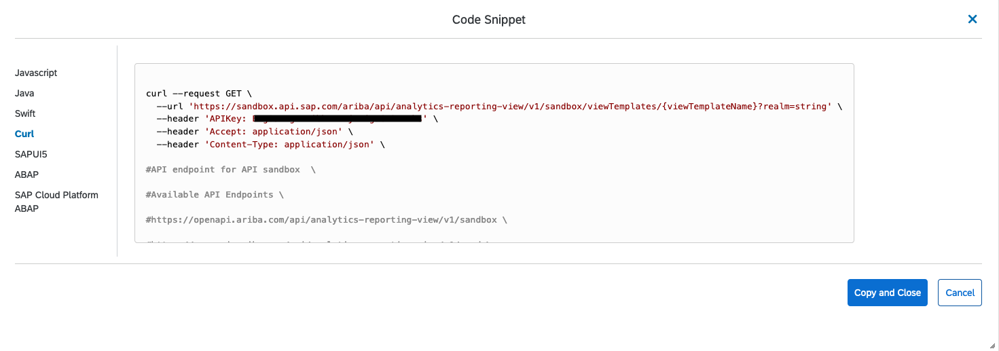
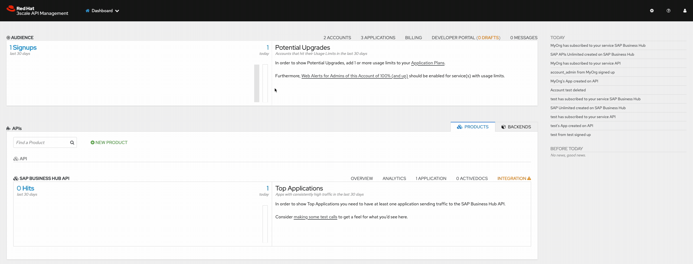
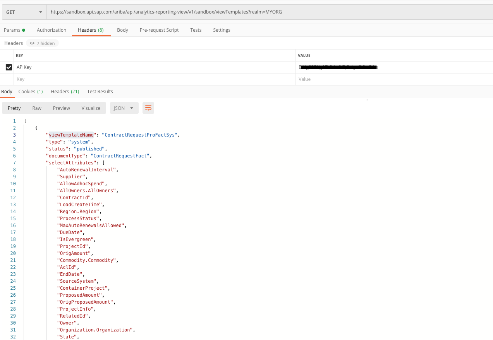

# SAP side by side Integration (**WORK IN PROGRESS**)
> Using Red Hat Integration Portfolio and Red Hat Openshift to integrate with SAP side by side

## Intro

This workshop can be used to demonstrate the integration capabilities for Red Hat Integration portfolio with SAP's Digital Core. 

## High-level architecture and components

The high-level architecture consists of 3 different RHEL 8.x servers:

- **bastion**: this is meant to be used as the jump host for SSH access to the environment and where to run SAP GUI from if required.
- **hana**: this is meant to be used as the RHEL server where to deploy SAP HANA.
- **s4hana**: this is meant to be used as the RHEL server where to deploy SAP S/4HANA.
  
And an OpenShift 4.x cluster with the following components deployed:

- **OpenShift Container Storage**: used for multi-purpose container storage backend.
- **Fuse Online**: used to demonstrate out of the box easy to implement integration capabilities with SAP S/4HANA and multi purpose integrations.
- **3scale**: used to demonstrate API managament capabilities for both SAP API Business Hub APIs and custom APIs deployed as microservices in OpenShift.

[](https://redhat-sap.github.io/sap-workshops//sap-integration/img/infra_layout.png)

## Use cases

This workshop will cover the following use cases:

- API management using 3scale, centralizing APIs from both SAP API Business Hub APIs and custom APIs deployed as microservices in OpenShift.
- Consuming S/4HANA RFCs via SAP JCo and ODATA, using a Red Hat Fuse microservice configuring Camel Routes.
- Deploy a small Angular Front end microservice that will consume the APIs exposed in Fuse to present and manage data from SAP HANA.

## Environment request

This environment is provisioned using the Red Hat internal demo system. We at Red Hat embrace the use of [IaC](https://openpracticelibrary.com/practice/everything-as-code/) (Infrastructure as Code) for any lab/demo set up, that's why we have open-sourced the Framework (based in Ansible) we use for this. If you want to get more information on this topic, check the [AgnosticD](https://github.com/redhat-cop/agnosticd) repository we use to deploy these labs and demos.

### Order catalog item

Login into [Red Hat Product Demo System](https://rhpds.redhat.com) and navigate to `Services --> Catalogs --> All Services --> Workshops`. An item called `SAP side-by-side Integration` will be available.

[](https://redhat-sap.github.io/sap-workshops/sap-integration/img/rhpds01.png)

Click on the **order** button, check the confirmation box and click on **Submit**.

[](https://redhat-sap.github.io/sap-workshops/sap-integration/img/rhpds02.png)

## Environment info and credentials

Once the environment has been provisioned, you will receive an email with some key information:

- OpenShift information including:
  - OpenShift web-console public URL
  - OpenShift web-console user
  - OpenShift web-console password
- 3scale information including:
  - 3scale namespace in OpenShift
  - 3scale API Management Portal user
  - 3scale API Management Portal password
- Fuse Online information including:
  - Fuse Online namespace in OpenShift

## How to run the workshop

## Use Case 1: Using 3scale to manage APIs from SAP's Business Hub

This scenario will show how to configure 3scale to centralize API management from SAP Business Hub and enrich those APIs with all the capabilities 3scale can offer. To demonstrate this, you are going to use the [Analytical reporting APIs from SAP Ariba](https://api.sap.com/api/analytics_reporting_view/overview), but this same procedure can apply to any other API from SAP Business Hub.

A user in https://api.sap.com is required to complete this configuration. A free account can be created, using the `Log On` button on the top right and using the `Register` option when prompted for your login details.

[](https://redhat-sap.github.io/sap-workshops/sap-integration/img/sap_api_register.png)

Once you have created a user for SAP Business Hub, you can now login into **Red Hat 3scale API Management** which has been deployed already in your environment using the `Red Hat Integration - 3scale` Operator in the `3scale` Namespace.

[](https://redhat-sap.github.io/sap-workshops/sap-integration/img/3scale_operator.png)

You can find all the exposed Routes for 3scale under `Networking - Routes` in the `3scale` Project. If you filter by `zync-3scale-provider` both the 3scale API Management and Developer Portal URLs info will be shown. You will receive this information as well in the email you will get with all the environment information.

[](https://redhat-sap.github.io/sap-workshops/sap-integration/img/3scale_routes.png)

Credentials for 3scale API Management are provided in the email you will get with all the environment information, but you can check those anytime in the `system-seed` secret in your `3scale` Namespace under `Workloads - Secrets`.

[](https://redhat-sap.github.io/sap-workshops/sap-integration/img/3scale_secrets.png)

The first time you open the 3scale API Management portal you will be asked for these credentials. Enter the information required and you will be presented with the assistant to configure your APIs. We are going to skip this part using the **`X`** symbol on the top right and configure all the required information manually afterwards.

[](https://redhat-sap.github.io/sap-workshops/sap-integration/img/3scale_assistant.png)

After skipping the assistant, you will be presented to the 3scale API Management **Dashboard**. You will create a new **PRODUCT** using the `NEW PRODUCT` link on the bottom section, adding the following values when prompted:

- Name: SAP Business Hub
- System name: sap_business_hub
- Description: SAP Business Hub

[](https://redhat-sap.github.io/sap-workshops/sap-integration/img/3scale_new_product.gif)

Once the new Product has been created, you need to create a **BACKEND** that will be used for this Product. This Backend will be used to define our API configuration, including the Private Base URL, Methods and Mapping Rules. At this point, you will go back to `Analytical Reporting - View Management API` definition in [SAP Business Hub](https://api.sap.com/api/analytics_reporting_view/overview) to understand the existing API References and Specifications for that particular API. As you can see there are 4 different methods available for this API.

[](https://redhat-sap.github.io/sap-workshops/sap-integration/img/api_methods.png)

If you click on the `Code Snippet` link for any of these methods, you can see the URL used to call this method (you will get the information from the Sandbox System URL, for production purposes another one from the available list will be used, but not for this demo) as well as values that can be parametrized or a custom header that needs to be added to this request which requires authentication.

[](https://redhat-sap.github.io/sap-workshops/sap-integration/img/api_call.png)

Once you have captured all this information, you can go back to the 3scale API Management's dashboard, where you will create a new **BACKEND** adding the following values when prompted:

- Name: Analytical Reporting
- System Name: analytical_reporting
- Description: SAP Bussines Hub Analytical Reporting
- Private Base URL: https://sandbox.api.sap.com:443/ariba/api/analytics-reporting-view/v1/sandbox

[](https://redhat-sap.github.io/sap-workshops/sap-integration/img/3scale_new_backend.gif)

You have successfully created a Product and a Backend. You need to link those now, adding the Backend you created to the Product, and specify a `Public Path` for this one. To do this, browse to the top menu and select the `SAP Business Hub` Product you have created. From the left menu, click on `Integration - Backends`. The list of Backends associated to this Product will be empty. Click on `Add Backend` link on the right and select the `Analytical Reporting` Backend from the dropdown menu. In the `Path` field you will add **/reporting** as the path to match the Backend for this Product.

[](https://redhat-sap.github.io/sap-workshops/sap-integration/img/3scale_link_backend.gif)

Now the Backend has been added to the Product, you need to configure a new Policy for the Product. You are going to use this Policy to add a custom header to every request is made to SAP Business Hub. While examining the API References and Specifications for the `Analytical Reporting - View Management API`, on the `Code Snippet` for each method you could see an authentication header required to authenticate every request. This information is the API Key for the user who is making the request. Taking as an example who a `curl` command should look like for one of the methods exposed, this looked like this:

```bash
curl --request GET \
  --url 'https://sandbox.api.sap.com/ariba/api/analytics-reporting-view/v1/sandbox/viewTemplates?realm=string' \
  --header 'APIKey: XXXXXXXXXXXXXXXXXXXXXXXXXXX' \
  --header 'Accept: application/json' \
  --header 'Content-Type: application/json'
```

You need to use that APIKey information now and add it to the new Policy you are going to create for your `SAP Business Hub` Product in 3scale. To do this, browse to the top menu and select the `SAP Business Hub` Product you have created. From the left menu, click on `Integration - Policies`. Select `Add Policy` link, and from the list of policies you will be presented, select `Header Modification`. This will be added automatically to the Product policies but is not configured yet. To do this, click on the `Header Modification` Policy from the Policy Chain list, and use the **`+`** button from the **REQUEST** section. Add the following information for this Policy:

- op: Create the header when not set, add the value when setting
- header: APIKey
- value_type: Evaluate 'value' as plain text
- value: XXXXXXXXXXXXXXXXXXXXXXXXXXX (this value must contain the real value for your API Key in SAP Business Hub)

[](https://redhat-sap.github.io/sap-workshops/sap-integration/img/3scale_policy.gif)

The Product has now the required Policy configured to authenticate a request to SAP Business HUB's APIs. The next thing to do is to create an `Application Plan` to enable developers and users to consume your API. An Application Plan will be used to establish the rules (limits, pricing, features) for using your API. By default, your API will require every request to be authenticated using an API Key. You are going to create later an Account containing one Application linked to this Application Plan that will contain the required API Key for authentication. This way the metrics for who is consuming you API can be measured and apply things as billing or limits peruse.

To create an Application Plan for your Product, browse to the top menu and select the `SAP Business Hub` Product you have created. From the dashboard, on the `Published Application Plans` section, use the `Create Application Plan` link to create one. Add the following information to this Application Plan, leaving the rest of the fields with the defaults values:

- Name: Free Unlimited
- System name: free_unlimited

Once created, the Application Plan will be in `hidden` state. To publish it, click on the `Publish` link for that Application Plan.

[](https://redhat-sap.github.io/sap-workshops/sap-integration/img/3scale_application_plan.gif)

The next thing you need to do is to create a new Account. This Account will be the top-level information for the API consumers and can contain multiple objects like Applications, Users or Subscriptions. To create an Account, select `Dashboard` from the top menu and click on the `ACCOUNT` link on the top. An Account called 'Developer' already exists in the system, but you are going to create a new one using the `Create` link from the right providing the following information:

- Username: account_admin
- Email: admin@myorg.com
- Password: (use any random password)
- Organization/Group Name: MyOrg

Once the Account is created, you will see different links to objects linked to the Account like Application, Users or Service Subscriptions on the top. You need to create an Application for this Account now, which will generate the API Key required for authentication. Click on the `Application` link from the menu on the top, and then use the `Create Application` link on the right. Add the following information to create the Application:

- Application Plan: SAP Business Hub - Free Unlimited
- Service Plan: Default
- Name: SAP APIs Unlimited
- Description: SAP APIs Free Unlimited

Once the Application has been created, you will be able to see the API Key required to authenticate a request for this Application for this Account.

[](https://redhat-sap.github.io/sap-workshops/sap-integration/img/3scale_new_account.gif)

At this point, you should be able to use your **SAP Business Hub** Product you have created in 3scale. There is only one step missing, as the APIcast has not been promoted yet to Staging or Production. This capability will allow you to make changes in your Product, promote those changes to your Stage environment and once validated promote it to Production.

Let's promote your APIcast configuration to Stage, validate you can use any of the methods exposed by the `Analytical Reporting - View Management API` and promote this to Production if everything is working as expected. To do this, browse to the top menu and select the `SAP Business Hub` Product. From the left menu go to `Integration - Configuration` and click on the `Promote to Staging APIcast` link.

[](https://redhat-sap.github.io/sap-workshops/sap-integration/img/3scale_stage_promotion.gif)

Once the APIcast has been promoted to Stage you can test it. From the same window where you have promoted to Stage, check the `Staging APIcast` section and get the URL from `Example curl for testing`. There are different ways to check this. You can use your browser, or you can use `curl` or a tool like `Postman`, which is the option selected for this demo. Check the `Analytical Reporting` backend configuration on the `APIcast Configuration` section form the same window you did the promotion. You will see the initial configuration done for the `Analytical Reporting` Backend you did when configuring the Backend. The `Public Path` configured for this one, in particular, is `/reporting`, and this is the path we need to add to the Stagging URL to test our API.

[](https://redhat-sap.github.io/sap-workshops/sap-integration/img/apicast_path.png)

Let's test one of the methods supported for this API in `SAP Business Hub`. You can check the Swagger Specification [here](https://api.sap.com/api/analytics_reporting_view/resource). You can use the GET /viewTemplates method as an example or any other of the available methods for this API. When checking this method, we can see the request should look like the following when using the SAP Bussiness Hub Sandbox directly:

```bash
curl --request GET \
  --url 'https://sandbox.api.sap.com/ariba/api/analytics-reporting-view/v1/sandbox/viewTemplates?realm=string' \
  --header 'APIKey: XXXXXXXXXXXXXXXXXXX' \
  --header 'Accept: application/json' \
  --header 'Content-Type: application/json' 
```

Your test in Postman should look like this:

[](https://redhat-sap.github.io/sap-workshops/sap-integration/img/postman01.png)

You should see that a list of Templates will be retrieved from that call. Let's try to reproduce this now, but using the Backend you have configured in 3scale. Your test in Postman should look like this:

[](https://redhat-sap.github.io/sap-workshops/sap-integration/img/postman02.png)

As you can notice, you don't need to provide the `APIKey` Header to authenticate with SAP Business Hub anymore, as this is automatically added through the Policy you have configured for your Product in 3scale. Try to reproduce this request a few times in Postman and you should see initial statistics coming up in 3scale.

[](https://redhat-sap.github.io/sap-workshops/sap-integration/img/stats01.png)

You can try to do the same with the other methods exposed by the `Analytical Reporting - View Management API` and check the results are the same when doing the request to 3scale APIcast or doing it directly in SAP Business Hub. If we want users and developers to consume these APIs, they will need to get access to the Swagger Specification. To facilitate this we can import these specifications into 3scale. Go back to `Analytical Reporting - View Management API` definition in [SAP Business Hub](https://api.sap.com/api/analytics_reporting_view/overview) and click on `Download API Specification` button and download it as a **JSON** file. Go back to `3scale API Management` portal and select `Audience` from the top menu. Then select `Developer Portal - ActiveDocs` and use the `Create a new spec` link from the right. Add the following information when prompted:

- Name: Analytical Reporting - View Management API
- System Name: AnalyticalReportingView
- Publish?: Ensure is **checked**
- Description: Analytical Reporting - View Management API
- Service: SAP Business Hub
- API JSON Spec: (copy the content from the JSON file you just downloaded)
- Skip swagger validations: Ensure is **checked**

[](https://redhat-sap.github.io/sap-workshops/sap-integration/img/swagger.gif)


