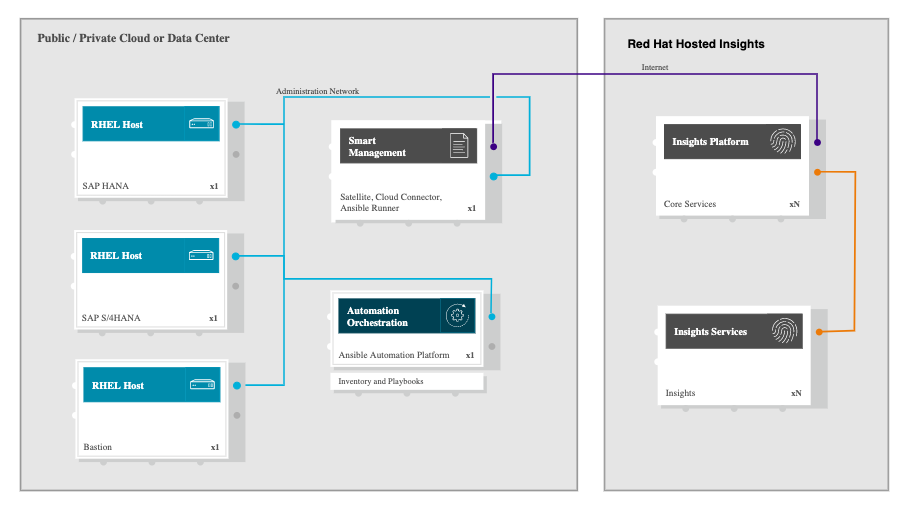
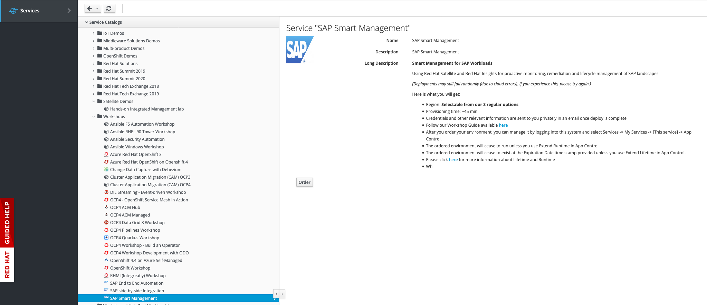
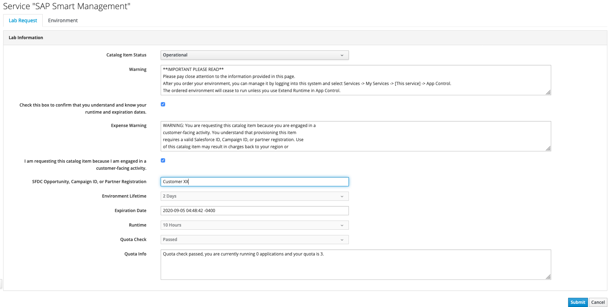
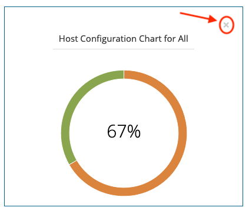
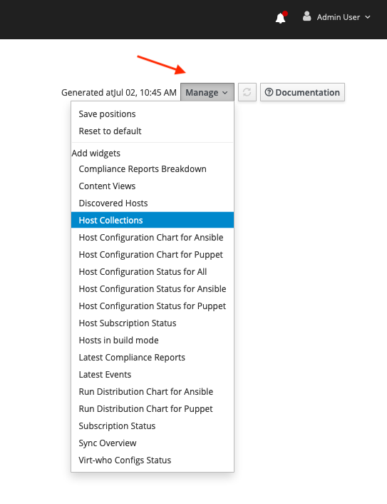
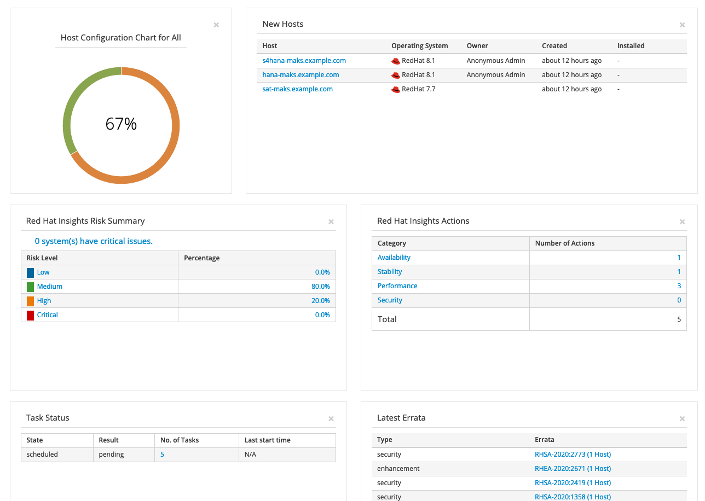
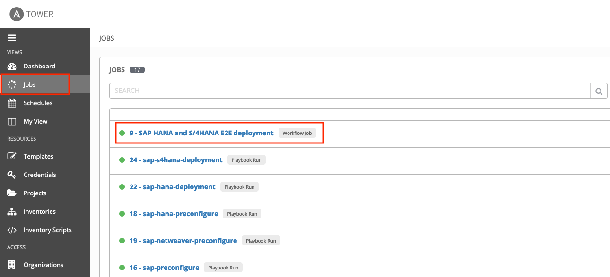
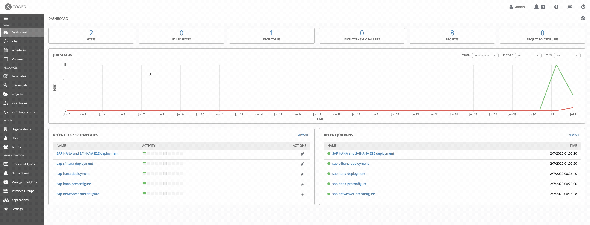
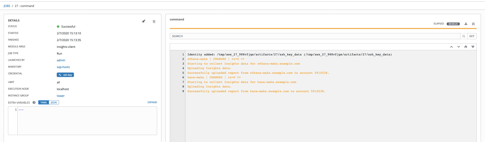

# SAP Smart Management (**WORK IN PROGRESS**)
> Using Red Hat Satellite and Red Hat Insights for SAP landscapes proactive monitoring, remediation and lifecycle management

## Intro

This workshop can be used to demonstrate the Smart Management capabilities for SAP Lansdcapes included as part of the `RHEL for SAP Solutions` subscription. 

## High-level architecture and components

The high-level architecture consists of 4 different RHEL 8.x servers with the following purposes:

- **bastion**: this is meant to be used as the jump host for SSH access to the environment
- **tower**: this is meant to be used as the Ansible and Ansible Tower host where to run the automation from
- **hana**: this is meant to be used as the RHEL server where to deploy SAP HANA
- **s4hana**: this is meant to be used as the RHEL server where to deploy SAP S/4HANA
- **sat**: this is meant to be used as the Red Hat Satellite host where to manage the SAP landscape

## Environment request

This environment is provisioned using the Red Hat internal demo system. We at Red Hat embrace the use of [IaC](https://openpracticelibrary.com/practice/everything-as-code/) (Infrastructure as Code) for any lab/demo set up, that's why we have open-sourced the Framework (based in Ansible) we use for this. If you want to get more information on this topic, check the [AgnosticD](https://github.com/redhat-cop/agnosticd) repository we use to deploy these labs and demos.

### Order catalog item

Login into [Red Hat Product Demo System](https://rhpds.redhat.com) and navigate to `Services --> Catalogs --> All Services --> Workshops`. An item called `SAP Smart Management` will be available.

Click on the **order** button, check the confirmation box and click on **Submit**.

### Environment info and credentials

Once the environment has been provisioned, you will receive an email with some key information:

- SSH information to access the bastion host including:
  - SSH user information
  - Bastion public hostbane information
  - SSH private key to be used
- Ansible Tower information including:
  - Ansible Tower public URL
  - Ansible Tower user
  - Ansible Tower Password
- Satellite host information including:
  - Red Hat Satellite public URL
  - Red Hat Satellite user
  - Red Hat Satellite Password

## How to run the demo/workshop

The goal for this demo is to showcase the management capabilities RHEL for SAP Solutions subscription can offer to SAP customers, helping them to manage SAP landscapes using Red Hat Satellite and Red Hat Insights. Red Hat Satellite can manage the whole lifecycle for you RHEL landscape, but the focus for this demo/workshop will be on the remediation and risk management capabilities from Inisights as well as bug fix and enhancement updates management from Satellite. With this in mind, these are the main points we are going to cover during this demo/workshop:

1. Explore Red Hat Satellite Monitor Dashboard and customize it to show specific widgets
2. Explore Tower and check existing inventory and any running jobs
3. Connect to the RHEL hosts for the given landscape and check what applications are running on those
4. Explore these RHEL hosts from the Satellite interface
5. Check existing erratas that applies to existing Hosts and automatically install those
6. Explore Red Hat Insights from Satellite
7. Explore Red Hat Insights from cloud.redhat.com
8. Create a plan in Insights to auto remediate any existing potential issue

### Customize Satellite Monitor Dashboard

Satellite's Monitor Dashboard can be customized to get in a single view the information that is more important for us. This dashboard is preconfigured with some widgets after Satellite has been deployed. For this workshop we are going to customize that view to get specific information related to this workshop.

To remove existing widgets from the dashboard, we will use the 'x' button on the top right side for each widget.

To add new widgets to the dashboard, we will use the `Manage` button on the top right of the Dashboard screen.

Using remove and add options, we'll configure the dashboard to show the following widgets:

- Host Configuration Chart for All
- New Hosts
- Red Hat Insights Risk Summary
- Red Hay Insights Actions
- Task Status
- Latest Errata

Once we have selected and arranged the widgets in the order we prefer, click on the `Manage` button again and select `Save positions`. Your dashboard should now look like this:

### Explore Ansible Tower, inventories and running jobs

Ansible Tower is not a mandatory piece for this workshop in particular, but is used in the background to set up the hosts that are registered into Satellite. As part of the lab provisioning task, a Tower workflow job is executed that will deploy and configure SAP HANA and SAP S/4HANA on these hosts. In order to be able to demonstrate Satellite and Insights capabilities specifically for SAP workloads, we need to ensure this workflow job has been completed succesfully.

Login into Tower with the information and credentials received via email and select `Jobs` from the left pane. Once selected you will see all the jobs executed in Tower. Find one in particular called `SAP HANA and S/4HANA E2E deployment`.

The green circle will indicate the job has been executed with no errors, but we can see more details if we click on the job name. That will show the whole workflow executed and will allow you to get additional information for every step of the workflow.

Once validated the job workflow has been completed, we are going to use the existing invetory in Tower to send updated information from the Inights client of each server. To do this, select `Inventory` form the left pane. An invenotry called `sap-hosts` will be available. Click on the inventory name, `sap-hosts`, which will show the details for this inventory. Then select `GROUPS` from the top side and a group called `sap` will be shown. Click on the select box right to the `sap` grouo name, and a new button will be available on the top right side, called `RUN COMMANDS`. 

Once clicked on `RUN COMMANDS` a new view will be open (EXECUTE COMMAND) where we will select `command` from the dropdown menu, and we will add `insights-client` in the `ARGUMENTS` input field. Ensure the `ENABLE PRIVILEGE ESCALATION` checkbox is selected as well. Leave the rest of the options with the existing values and use the `LAUNCH` button to execute it.

This will trigger an Ansible task on all the hosts for that Ansible group and will return the output from that command.

Now Insights will contain all the updated information from the instances and we will be able to see Insights Risk summary and remediation recommendation for these hosts.

### Validate connection to RHEL hosts

