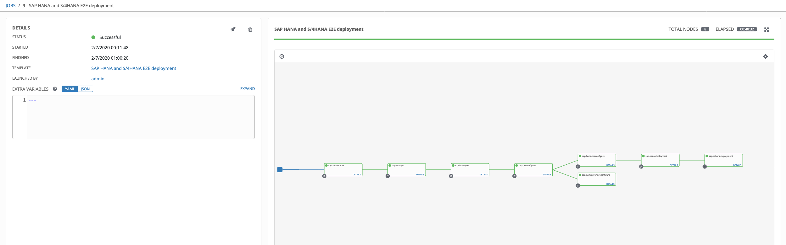
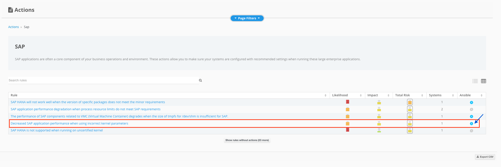

# SAP Smart Management (**WORK IN PROGRESS**)
> Using Red Hat Satellite and Red Hat Insights for SAP landscapes proactive monitoring, remediation and lifecycle management

## Intro

This workshop can be used to demonstrate the Smart Management capabilities for SAP Landscapes included as part of the `RHEL for SAP Solutions` subscription. 

## High-level architecture and components

The high-level architecture consists of 4 different RHEL 8.x servers with the following purposes:

- **bastion**: this is meant to be used as the jump host for SSH access to the environment
- **tower**: this is meant to be used as the Ansible and Ansible Tower host where to run the automation from
- **hana**: this is meant to be used as the RHEL server where to deploy SAP HANA
- **s4hana**: this is meant to be used as the RHEL server where to deploy SAP S/4HANA
- **sat**: this is meant to be used as the Red Hat Satellite host where to manage the SAP landscape

[](https://redhat-sap.github.io/sap-workshops/sap-smart-management/img/infra_layout.png)

## Environment request

This environment is provisioned using the Red Hat internal demo system. We at Red Hat embrace the use of [IaC](https://openpracticelibrary.com/practice/everything-as-code/) (Infrastructure as Code) for any lab/demo set up, that's why we have open-sourced the Framework (based in Ansible) we use for this. If you want to get more information on this topic, check the [AgnosticD](https://github.com/redhat-cop/agnosticd) repository we use to deploy these labs and demos.

### Order catalog item

Login into [Red Hat Product Demo System](https://rhpds.redhat.com) and navigate to `Services --> Catalogs --> All Services --> Workshops`. An item called `SAP Smart Management` will be available.

[](https://redhat-sap.github.io/sap-workshops/sap-smart-management/img/rhpds01.png)

Click on the **order** button, check the confirmation box and click on **Submit**.

[](https://redhat-sap.github.io/sap-workshops/sap-smart-management/img/rhpds02.png)

### Environment info and credentials

Once the environment has been provisioned, you will receive an email with some key information:

- SSH information to access the bastion host including:
  - SSH user information
  - Bastion public hostname information
  - SSH private key to be used
- Ansible Tower information including:
  - Ansible Tower public URL
  - Ansible Tower user
  - Ansible Tower Password
- Satellite host information including:
  - Red Hat Satellite public URL
  - Red Hat Satellite user
  - Red Hat Satellite Password

## How to run the demo/workshop

The goal for this demo is to showcase the management capabilities RHEL for SAP Solutions subscription can offer to SAP customers, helping them to manage SAP landscapes using Red Hat Satellite and Red Hat Insights. Red Hat Satellite can manage the whole lifecycle for you RHEL landscape, but the focus for this demo/workshop will be on the remediation and risk management capabilities from Insights as well as bug fixes and enhancement updates management from Satellite. With this in mind, these are the main points we are going to cover during this demo/workshop:

  1. Explore Red Hat Satellite Monitor Dashboard and customize it to show specific widgets
  2. Explore Tower and check existing inventory and any running jobs
  3. Connect to the RHEL hosts for the given landscape and check what applications are running on those
  4. Explore these RHEL hosts from the Satellite interface
  5. Check existing errata that applies to registered Hosts and automatically install those
  6. Explore Red Hat Insights from Satellite
  7. Explore Red Hat Insights from cloud.redhat.com
  8. Create a plan in Insights to auto remediate any existing potential issue

### Customize Satellite Monitor Dashboard

Satellite's Monitor Dashboard can be customized to get in a single view of the information that is more important for us. This dashboard is preconfigured with some widgets after Satellite has been deployed. For this workshop, we are going to customize that view to get specific information related to this workshop.

To remove existing widgets from the dashboard, we will use the 'x' button on the top right side for each widget.

To add new widgets to the dashboard, we will use the `Manage` button on the top right of the Dashboard screen.

[](https://redhat-sap.github.io/sap-workshops/sap-smart-management/img/remove_widget.png)
[](https://redhat-sap.github.io/sap-workshops/sap-smart-management/img/add_widget.png)

Using remove and add options, we'll configure the dashboard to show the following widgets:

- Host Configuration Chart for All
- New Hosts
- Red Hat Insights Risk Summary
- Red Hay Insights Actions
- Task Status
- Latest Errata

Once we have selected and arranged the widgets in the order we prefer, click on the `Manage` button again and select `Save positions`. Your dashboard should now look like this:

[](https://redhat-sap.github.io/sap-workshops/sap-smart-management/img/dashboard.png)

### Explore Ansible Tower, inventories and running jobs

Ansible Tower is not a mandatory piece for this workshop in particular but is used in the background to set up the hosts that are registered into Satellite. As part of the lab provisioning task, a Tower workflow job is executed that will deploy and configure SAP HANA and SAP S/4HANA on these hosts. To be able to demonstrate Satellite and Insights capabilities specifically for SAP workloads, we need to ensure this workflow job has been completed successfully.

Login into Tower with the information and credentials received via email and select `Jobs` from the left pane. Once selected you will see all the jobs executed in Tower. Find one in particular called `SAP HANA and S/4HANA E2E deployment`.

[](https://redhat-sap.github.io/sap-workshops/sap-smart-management/img/workflow.png)

The green circle will indicate the job has been executed with no errors, but we can see more details if we click on the job name. That will show the whole workflow executed and will allow you to get additional information for every step of the workflow.

[](https://redhat-sap.github.io/sap-workshops/sap-smart-management/img/workflow_detail.png)

Once validated the job workflow has been completed, we are going to use the existing inventory in Tower to send updated information from the Insights client of each server. To do this, select `Inventory` from the left pane. An inventory called `sap-hosts` will be available. Click on the inventory name, `sap-hosts`, which will show the details for this inventory. Then select `GROUPS` from the top side and a group called `sap` will be shown. Click on the select box right to the `sap` group name, and a new button will be available on the top right side, called `RUN COMMANDS`. 

Once clicked on `RUN COMMANDS` a new view will be open (EXECUTE COMMAND) where we will select `command` from the dropdown menu, and we will add `insights-client` in the `ARGUMENTS` input field. Ensure the `ENABLE PRIVILEGE ESCALATION` checkbox is selected as well. Leave the rest of the options with the existing values and use the `LAUNCH` button to execute it.

[](https://redhat-sap.github.io/sap-workshops/sap-smart-management/img/insights_client.gif)

This will trigger an Ansible task on all the hosts for that Ansible group and will return the output from that command.

[](https://redhat-sap.github.io/sap-workshops/sap-smart-management/img/insights_client.png)

Now Insights will contain all the updated information from the instances and we will be able to see Insights Risk summary and remediation recommendation for these hosts.

### Validate connection to RHEL hosts

Use the credentials received via email to connect to the bastion host. Create a new `key` file to store the received SSH key and use the ssh command information from the email to connect to the hosts:

```bash
$ vi /tmp/key (add SSH key information here)
$ chmod 400 /tmp/key
$ ssh -i /tmp/key cloud-user@<bastion-hostname>
```
Once connected to the bastion host, you will be able to jump to HANA and S/4HANA instances:

```bash
[bastion-{guid} 0 ~] ssh hana-{guid}
[cloud-user@hana-{guid} ~]$
...
...
[bastion-{guid} 0 ~] ssh s4hana-{guid}
[cloud-user@s4hana-{guid} ~]$
```

You can move to `root` user at any time doing `sudo -i` on any instance.

### Explore RHEL hosts from Satellite and Errata information

Satellite will give you a lot of information from the registered hosts. Browse `Hosts -- All Hosts` or `Hosts -- Content Hosts` to check this information.

We are going to focus on the Errata information here and how to apply existing security errata that is applicable for each host. To do that, go to `Content -- Errata` where you can see all the existing errata that applies to registered hosts.

[](https://redhat-sap.github.io/sap-workshops/sap-smart-management/img/errata_list.png)

You can get all the information related for each errata selecting any one from the list like related CVEs, description, solution article in access.redhat.com, packages affected and more.

We can now apply any errata to any of the affected hosts directly from Satellite. Click on the errata items you want to apply, and select `Apply Errata` button on the top right. Next, we will select the hosts where we want the errata to be applied and click on `Next` button. After confirming, a new task will be created and that will apply the errata in the background.

[](https://redhat-sap.github.io/sap-workshops/sap-smart-management/img/errata_apply.gif)

Once the task has finished, we will no longer see the errata available on the list if this has been applied to all the affected hosts.

We can manually check on the RHEL host the upgraded packages by the errata. Login via SSH to any of the hosts where the errata has been applied, and check `yum history` to validate these changes.

```
[root@hana-{guid} ~]# yum history
Updating Subscription Management repositories.
ID     | Command line             | Date and time    | Action(s)      | Altered
-------------------------------------------------------------------------------
    12 |                          | 2020-07-02 19:54 | Upgrade        |    3
    11 |                          | 2020-07-02 19:51 | Upgrade        |    1
    10 |                          | 2020-07-01 19:18 | Install        |  126
     9 |                          | 2020-07-01 19:17 | Install        |    3
     8 |                          | 2020-07-01 19:14 | I, U           |  178
     7 |                          | 2020-07-01 19:13 | Install        |    1 EE
     6 |                          | 2020-07-01 19:13 | Install        |   41
     5 |                          | 2020-07-01 19:07 | Install        |   10 EE
     4 |                          | 2020-07-01 19:04 | I, U           |   69 E<
     3 | -C -y remove firewalld - | 2019-10-29 12:33 | Removed        |   11 >E
     2 | -C -y remove linux-firmw | 2019-10-29 12:33 | Removed        |    1
     1 |                          | 2019-10-29 12:26 | Install        |  451 EE
[root@hana-{guid} ~]#
[root@hana-{guid} ~]# yum history info 12
Updating Subscription Management repositories.
Transaction ID : 12
Begin time     : Thu 02 Jul 2020 07:54:18 PM EDT
Begin rpmdb    : 793:75684af6d86d3dc7c26d37707e7ebc97829e69c6
End time       : Thu 02 Jul 2020 07:54:22 PM EDT (4 seconds)
End rpmdb      : 793:51dbec6e0e1b46ce56f6d5259eb313f3524853ac
User           : System <unset>
Return-Code    : Success
Releasever     : 8
Command Line   :
Packages Altered:
    Upgrade  unbound-libs-1.7.3-9.el8_1.x86_64    @rhel-8-for-x86_64-appstream-e4s-rpms
    Upgraded unbound-libs-1.7.3-8.el8.x86_64      @@System
    Upgrade  cloud-init-18.5-7.el8_1.2.noarch     @rhel-8-for-x86_64-appstream-e4s-rpms
    Upgraded cloud-init-18.5-7.el8.noarch         @@System
    Upgrade  python3-unbound-1.7.3-9.el8_1.x86_64 @rhel-8-for-x86_64-appstream-e4s-rpms
    Upgraded python3-unbound-1.7.3-8.el8.x86_64   @@System
```

In this example all the existing errata have been applied, so the Errata information should be empty now.

[](https://redhat-sap.github.io/sap-workshops/sap-smart-management/img/errata_empty.png)

And host information in Satellite will also show that there is no errata to be applied.

[](https://redhat-sap.github.io/sap-workshops/sap-smart-management/img/errata_applied.png)

### Proactive monitoring and automated remediation with Red Hat Insights

Customers will get access to Red Hat Insights as part of the RHEL for SAP Solutions subscription. Red Hat Insights proactively identify and remediate security, compliance, and configuration risks in their Red Hat Enterprise Linux environments.

As part of the workshop/demo, you will be able to show these capabilities. Insights information can be shown both in Satellite for the registered hosts and cloud.redhat.com as part of the SaaS product running in the Cloud.

Let's review first how this information is shown on Satellite. In the very first part of the workshop/demo, you have customized the Dashboard view in the `Monitor` section. Two specific widgets for Insights information have been configured there. Browse to `Monitor -- Dashboard` and you can identify these as `Red Hat Insights Risk Summary` and `Red Hay Insights Actions`.

[](https://redhat-sap.github.io/sap-workshops/sap-smart-management/img/insights_monitor.png)

This will give you a quick overview of the existing issues that can be addressed by Insights remediation and the category these issues are sitting on. You can click on the highlighted information from these widgets to get more detailed information.

Out from this quick summary on the monitoring dashboard, there is a specific section in Satellite for this. On the left pane browse to `Insights` where you will see different sub-menus for this topic.

[](https://redhat-sap.github.io/sap-workshops/sap-smart-management/img/insights_menu.png)

Click on each sub-menu to get familiar with the content reported for each one. As an example, the `Actions` sub-menu will give you similar information to the widgets we configured in the monitoring dashboard with a different view and links to some featured topics like SAP.

[](https://redhat-sap.github.io/sap-workshops/sap-smart-management/img/insights_actions.png)

Let's review now how this information is presented in cloud.redhat.com. Once logged, you will see the Red Hat Insights pane, where you will be able to access to different parts of the service. 

[](https://redhat-sap.github.io/sap-workshops/sap-smart-management/img/insights_saas.png)

Select the `Dashboard` link from the Red Hat Insights service and once in the dashboard, from the left menu select `Inventory` where you will see all the hosts linked to your account. There is a search dialogue where you can filter the information shown. Enter the `GUID` information received by email, and this will filter only the hosts that are related to this particular demo/workshop.

[](https://redhat-sap.github.io/sap-workshops/sap-smart-management/img/insights_saas_inventory.png)

Once the inventory has been filtered, click on any of the hosts to see what kind of information is reported. You will see from general information to proactive advisory information, including existing vulnerabilities applicable to that host or security compliance information when using security policies.

Let's go back to Satellite where we will use the automated remediation Ansible playbooks to address some of the existing actions that apply to our systems. Browse to `Insights -- Actions` and select the `View More` link on the bottom for the SAP featured topic.

[](https://redhat-sap.github.io/sap-workshops/sap-smart-management/img/insights_actions_sap.png)

This will show you all the existing SAP rules that can be applied to your registered hosts. Now, we are going to select one of these rules and use the `Planner` to auto remediate this issue. Select any of the rules from the list, and ensure the Ansible logo on the right is highlighted in blue, which means the rule has Ansible support for auto-remediation. As an example we are using `Decreased SAP application performance when using incorrect kernel parameters` rule here:

[](https://redhat-sap.github.io/sap-workshops/sap-smart-management/img/insights_actions_sap_item.png)

Let's check the information for this particular rule, and how to create a remediation plan to address automatically possible future issues caused by this.

[](https://redhat-sap.github.io/sap-workshops/sap-smart-management/img/insights_remediation.gif)